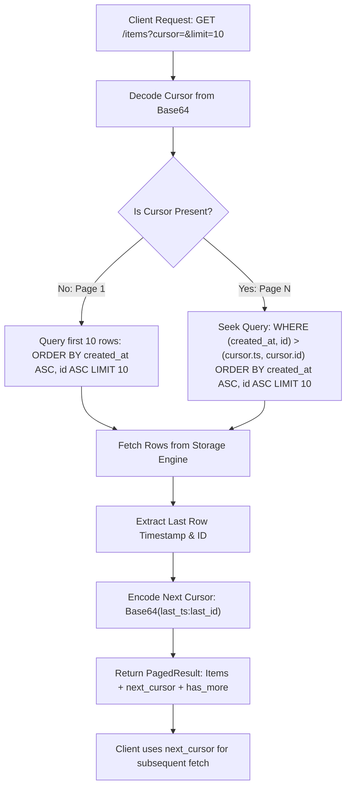

# Keyset Pagination Pattern (Cursor-Based Pagination)

## Overview & Definition
The **Keyset Pagination** pattern (also known as *Cursor-Based Pagination* or *Seek Method*) delivers high-performance, deterministic pagination over large datasets without using standard SQL `OFFSET` clauses.

Instead of asking the database to count and skip $N$ records (`OFFSET 100000`), keyset pagination requests records directly following the last record seen by the client using indexed ordering columns (e.g., `WHERE (created_at, id) > (last_timestamp, last_id) ORDER BY created_at ASC, id ASC LIMIT 20`). The ordering tuple is encoded into an opaque, URL-safe Base64 token (the cursor) passed back and forth between client and server.

---

## Problem Statement (Failure scenarios without this pattern)
Traditional offset-based pagination (`LIMIT 20 OFFSET 50000`) breaks down severely in production systems:
- **$O(N)$ Database Performance Degradation**: For large offsets, databases must physically scan and discard hundreds of thousands of table rows, causing high disk I/O, CPU spikes, and query timeouts.
- **The "Page Drift" Phenomenon (Skipped / Duplicate Records)**: When new records are inserted or deleted while a user navigates between pages, rows shift across page boundaries. Users see identical items twice or miss items completely.
- **Cache Invalidation Storms**: Offset pages frequently shift when new rows arrive, invalidating HTTP and CDN edge response caches.

---

## Architectural Mechanism & Flow



### Cursor Mechanics
- **Tie-Breaker Column**: Pairing a non-unique timestamp (`created_at`) with a guaranteed unique primary key (`id`) ensures a strictly monotonic, deterministic total ordering.
- **URL-Safe Encoding**: Cursors are encoded as Base64 strings (`base64.URLEncoding`) so clients treat them as opaque strings without relying on internal database schema details.

---

## Production Best Practices & Pitfalls

### Best Practices
- **Composite Index Alignment**: Ensure a database B-Tree index exists on the exact cursor ordering columns in matching order: `CREATE INDEX idx_items_created_id ON items (created_at ASC, id ASC)`.
- **Always Include a Unique Tie-Breaker**: Timestamps can collide when multiple items are inserted within the same millisecond/microsecond. Always include the primary key (`id`) as the final sorting column.
- **Cap Maximum Page Limit**: Strictly clamp `limit` values (e.g., maximum 100 items per request) to protect memory and network bandwidth.
- **Opaque Base64 Cursors**: Keep the cursor format opaque to API consumers so you can modify internal sorting criteria without breaking public API contracts.

### Common Pitfalls
- **Using Non-Unique Columns for Cursors**: Paginating on `created_at` alone causes infinite loops or skipped records when multiple rows share the identical timestamp.
- **Missing Database Indexes**: Running keyset queries without a matching composite index results in full table scans, negating the performance benefits.
- **Bidirectional Paging Complexity**: Implementing backward pagination ("previous page") requires inverting the sort direction and flipping comparison operators (`<` instead of `>`).

---

## Code Walkthrough & Usage

The implementation in `keyset_pagination.go` demonstrates cursor encoding, decoding, and stable seeks:

```go
package main

import (
	"log"
	"time"

	"patterns/04_persistence"
)

func main() {
	now := time.Now().UTC()

	// Seed sorted dataset
	items := []persistence.Item{
		{ID: 1, Title: "Item 1", CreatedAt: now.Add(1 * time.Minute)},
		{ID: 2, Title: "Item 2", CreatedAt: now.Add(2 * time.Minute)},
		{ID: 3, Title: "Item 3", CreatedAt: now.Add(3 * time.Minute)},
		{ID: 4, Title: "Item 4", CreatedAt: now.Add(4 * time.Minute)},
		{ID: 5, Title: "Item 5", CreatedAt: now.Add(5 * time.Minute)},
	}

	paginator := persistence.NewKeysetPaginator(items)

	// 1. Fetch Page 1 (Limit: 2 items, no cursor)
	page1, err := paginator.FetchPage("", 2)
	if err != nil {
		log.Fatalf("Page 1 error: %v", err)
	}

	log.Printf("Page 1: Returned %d items. NextCursor: %s, HasMore: %v",
		len(page1.Items), page1.NextCursor, page1.HasMore)
	for _, item := range page1.Items {
		log.Printf(" - ID=%d Title=%s", item.ID, item.Title)
	}

	// 2. Fetch Page 2 using NextCursor
	page2, err := paginator.FetchPage(page1.NextCursor, 2)
	if err != nil {
		log.Fatalf("Page 2 error: %v", err)
	}

	log.Printf("Page 2: Returned %d items. NextCursor: %s, HasMore: %v",
		len(page2.Items), page2.NextCursor, page2.HasMore)
	for _, item := range page2.Items {
		log.Printf(" - ID=%d Title=%s", item.ID, item.Title)
	}
}
```
