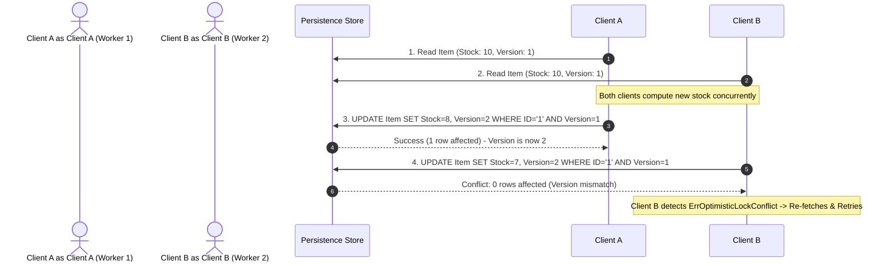

# Optimistic Locking Pattern

## Overview & Definition
The **Optimistic Locking** pattern manages concurrent updates on shared database records without holding long-lived physical database locks (such as `SELECT ... FOR UPDATE`).

Instead of assuming conflicts are frequent and locking records upfront (pessimistic locking), optimistic locking assumes conflicts are rare. Each record maintains an integer `version` (or timestamp). When an update is attempted, the SQL query checks that the record's current version in the database matches the version read at the start of the transaction:
```sql
UPDATE inventory SET stock = 45, version = version + 1 WHERE id = 'item_1' AND version = 5;
```
If another transaction modified the record in the interim, the version will have incremented, the `WHERE` clause matches 0 rows, and the application detects an optimistic locking conflict (`ErrOptimisticLockConflict`), allowing the caller to retry or abort cleanly.

---

## Problem Statement (Failure scenarios without this pattern)
Without concurrency controls on record updates:
- **The "Lost Update" Anomaly**: Alice and Bob both read Inventory Item A with Stock = 10. Alice buys 2 units and writes Stock = 8. Bob buys 3 units and writes Stock = 7. Bob's update silently overwrites Alice's update, losing 2 sold units from inventory records.
- **Pessimistic Locking Deadlocks & Starvation**: Holding exclusive row locks (`FOR UPDATE`) across slow user interaction windows or multi-step checkout processes exhausts database connection pools and causes high lock contention and database deadlocks.

---

## Architectural Mechanism & Flow



### Key Components
1. **Entity Versioning**: Domain entities include a `Version int64` field.
2. **Conditional Mutation**: `UpdateStock(ctx, id, expectedVersion, newStock)` executes a compare-and-swap check.
3. **Domain Conflict Sentinel**: Exposes `ErrOptimisticLockConflict` allowing HTTP middleware to map conflicts to `HTTP 409 Conflict`.

---

## Production Best Practices & Pitfalls

### Best Practices
- **Implement Automatic Retries with Exponential Backoff**: When handling high-contention endpoints (such as ticket booking or flash sales), wrap optimistic updates in a retry loop (e.g. 3 attempts with jittered backoff).
- **Return HTTP 409 Conflict to API Clients**: When an optimistic lock conflict occurs in an interactive user workflow (e.g., editing a wiki page or document), return `409 Conflict` so the UI prompts the user to resolve differences.
- **Use Monotonic Version Integers**: Prefer integer version counters (`version = version + 1`) over timestamps, as clock skews across distributed database nodes can cause false positives.
- **Keep Read-to-Write Windows Small**: Fetch the latest version immediately before making calculations to reduce the probability of conflict.

### Common Pitfalls
- **Ignoring Affected Rows in SQL**: Checking `err == nil` on `db.ExecContext()` without checking `rowsAffected == 1`. If version mismatch occurred, `err` is nil but rows affected is 0.
- **Using Optimistic Locking on Extreme Contention**: Using optimistic locking on a single row modified thousands of times per second (e.g., a global counter); this leads to retry storms. Use message queues or Redis atomic counters instead.
- **Forgetting to Increment Version**: Updating records without incrementing the version column, allowing subsequent stale writes to succeed.

---

## Code Walkthrough & Usage

The implementation in `optimistic_locking.go` shows version verification and conflict detection:

```go
package main

import (
	"context"
	"errors"
	"log"

	"patterns/04_persistence"
)

func main() {
	store := persistence.NewOptimisticInventoryStore()

	// 1. Create initial inventory record (Version 1)
	store.Create(&persistence.InventoryItem{
		ID:    "sku_laptop",
		SKU:   "DELL-XPS-15",
		Stock: 100,
	})

	ctx := context.Background()

	// 2. Client A reads inventory
	itemA, _ := store.Get("sku_laptop")
	log.Printf("Client A read: Stock=%d, Version=%d", itemA.Stock, itemA.Version)

	// 3. Client B reads identical inventory
	itemB, _ := store.Get("sku_laptop")

	// 4. Client A successfully updates stock (Stock -> 95, Version -> 2)
	updatedA, err := store.UpdateStock(ctx, "sku_laptop", itemA.Version, 95)
	if err != nil {
		log.Fatalf("Client A failed: %v", err)
	}
	log.Printf("Client A update succeeded: New Stock=%d, New Version=%d",
		updatedA.Stock, updatedA.Version)

	// 5. Client B attempts update with stale Version 1 -> Fails with Conflict
	_, err = store.UpdateStock(ctx, "sku_laptop", itemB.Version, 90)
	if errors.Is(err, persistence.ErrOptimisticLockConflict) {
		log.Println("Client B detected optimistic lock conflict as expected! Retrying update...")
		
		// Retry logic: Re-fetch latest version and apply delta
		freshItem, _ := store.Get("sku_laptop")
		updatedB, _ := store.UpdateStock(ctx, "sku_laptop", freshItem.Version, freshItem.Stock-10)
		log.Printf("Client B retry succeeded: Final Stock=%d, Version=%d",
			updatedB.Stock, updatedB.Version)
	}
}
```
