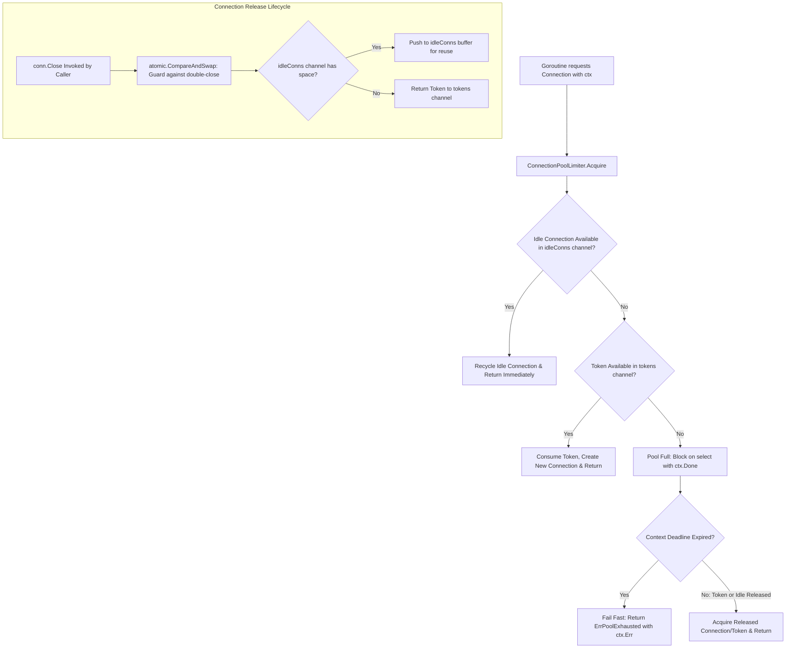

# Connection Pool Limiter Pattern

## Overview & Definition
The **Connection Pool Limiter** pattern enforces strict upper bounds on the number of concurrent active connections opened against a persistence layer (such as PostgreSQL, MySQL, Redis, or gRPC endpoints).

By utilizing bounded buffered Go channels as concurrency token buckets paired with an idle connection recycling queue, the pool limiter ensures that:
1. Active connections never exceed the configured maximum capacity (`maxCapacity`).
2. Goroutines seeking connections wait cleanly against a request `context.Context` deadline.
3. If the pool is exhausted and the context timeout expires, requests fail fast with `ErrPoolExhausted` rather than piling up indefinitely.
4. Connections are safely returned to the idle pool or converted back to tokens upon `Close()`.

---

## Problem Statement (Failure scenarios without this pattern)
Unbounded or poorly managed database connection pools cause catastrophic cascading infrastructure failures:
- **Database Connection Exhaustion (`FATAL: too many connections`)**: Under sudden traffic spikes, thousands of goroutines open individual TCP connections to PostgreSQL, surpassing `max_connections` (e.g., 100), causing the database to reject all application queries.
- **Resource Starvation on Database Server**: Each PostgreSQL backend process consumes memory (RAM) and CPU for connection handling. Spawning hundreds of concurrent queries thrashes CPU context switching, causing database response times to balloon from 5ms to 30 seconds.
- **Connection Leaks on Unreturned Handles**: Goroutines acquiring connections and failing to return them via `defer conn.Close()` permanently leak pool slots, eventually locking the entire application.

---

## Architectural Mechanism & Flow



### Key Components
1. **Token Channel (`chan struct{}`)**: Bounded channel pre-loaded with $N$ tokens representing connection acquisition permits.
2. **Idle Connection Channel (`chan *Connection`)**: Recycles existing TCP/client instances to avoid repetitive handshake overhead.
3. **Atomic Double-Close Guard (`c.released.CompareAndSwap`)**: Prevents duplicate releases from corrupting channel token counts.
4. **Pool Telemetry (`PoolStats`)**: Exposes real-time metrics (`ActiveConns`, `IdleConns`, `TotalWaits`).

---

## Production Best Practices & Pitfalls

### Best Practices
- **Tune Pool Size to Database Core Capacity**: As a rule of thumb from PostgreSQL research, pool capacity is optimally calculated as:
  $$\text{MaxConnections} = (\text{CPU Cores} \times 2) + \text{Effective Spindle Count}$$
  Setting pool sizes to hundreds of connections usually reduces throughput due to lock contention.
- **Always Acquire with Context Deadlines**: Never call blocking connection acquire methods without a bounded timeout (e.g. 500ms–2s) to prevent request goroutine pileups.
- **Enforce Single Release via Atomics**: Use `atomic.Bool` or `sync.Once` in `Connection.Close()` to make sure calling `Close()` multiple times is idempotent and safe.
- **Export Pool Metrics to Prometheus**: Monitor `ActiveConns`, `IdleConns`, and `TotalWaits` to configure autoscaling and alert on saturation.

### Common Pitfalls
- **Setting Excessively Large Connection Pools**: Configuring 500 connections across 10 service replicas (5,000 total connections) will crash standard database instances under load.
- **Forgetting `defer conn.Close()`**: Failing to release connections on error return paths, causing slow connection leaks that lock the pool.
- **Unbounded Wait Times**: Waiting indefinitely for connection availability without context cancellation, hanging user requests when the database slows down.

---

## Code Walkthrough & Usage

The implementation in `pool_limiter.go` demonstrates context-aware connection acquisition and atomic recycling:

```go
package main

import (
	"context"
	"errors"
	"log"
	"time"

	"patterns/04_persistence"
)

func main() {
	// Initialize a bounded pool with max capacity of 2 connections
	pool := persistence.NewConnectionPoolLimiter(2)

	ctx := context.Background()

	// 1. Acquire Connection 1
	conn1, err := pool.Acquire(ctx)
	if err != nil {
		log.Fatalf("Failed to acquire conn1: %v", err)
	}
	log.Printf("Acquired Conn %d. Stats: %+v", conn1.ID, pool.Stats())

	// 2. Acquire Connection 2 (Pool is now full)
	conn2, err := pool.Acquire(ctx)
	if err != nil {
		log.Fatalf("Failed to acquire conn2: %v", err)
	}
	log.Printf("Acquired Conn %d. Stats: %+v", conn2.ID, pool.Stats())

	// 3. Attempting to acquire 3rd connection with 100ms timeout
	timeoutCtx, cancel := context.WithTimeout(ctx, 100*time.Millisecond)
	defer cancel()

	_, err = pool.Acquire(timeoutCtx)
	if errors.Is(err, persistence.ErrPoolExhausted) {
		log.Printf("Third acquire failed fast as expected: %v", err)
	}

	// 4. Release Conn 1 back to pool
	conn1.Close()
	log.Printf("Released Conn 1. Stats: %+v", pool.Stats())

	// 5. Now acquire succeeds immediately by reusing idle connection
	conn3, err := pool.Acquire(ctx)
	if err != nil {
		log.Fatalf("Failed to acquire conn3: %v", err)
	}
	log.Printf("Acquired Conn %d from idle queue. Stats: %+v", conn3.ID, pool.Stats())

	// Cleanup
	conn2.Close()
	conn3.Close()
}
```
