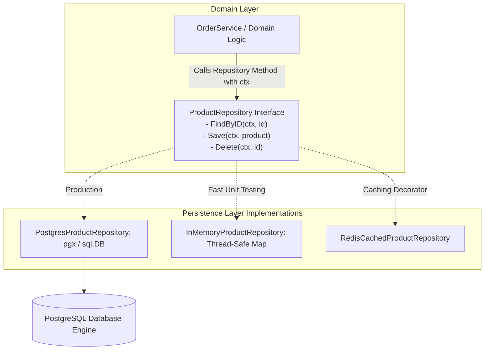

# Repository Pattern

## Overview & Definition
The **Repository Pattern** mediates between the domain/business logic layer and the data persistence layer (PostgreSQL, MySQL, MongoDB, DynamoDB). It exposes a clean collection-like interface for domain entities, completely encapsulating SQL queries, serialization, connection management, and database-specific drivers.

In idiomatic Go, every repository method mandates `context.Context` as its first parameter to propagate request deadlines, timeouts, and cancellation signals across database boundaries.

---

## Problem Statement (Failure scenarios without this pattern)
Embedding raw SQL queries or ORM calls directly inside HTTP handlers and domain services introduces critical production risks:
- **Scattered SQL Queries & Schema Coupling**: Changing a column name or adding an index requires updating dozens of SQL queries scattered across HTTP handlers, leading to missed updates and runtime query errors.
- **Leaked Connection Leaks & Driver Dependencies**: Domain services directly manipulate database connections, making it impossible to switch persistence engines or implement caching layers cleanly.
- **Impossible Unit Testing**: Domain logic cannot be tested without spinning up real database instances, slowing down CI pipelines and complicating local development.
- **Ignoring Cancellation & Context Deadlines**: Handlers calling database queries without `context.Context` allow cancelled or abandoned client requests to keep executing expensive SQL queries in the background, starving database resources.

---

## Architectural Mechanism & Flow



### Key Components
1. **Domain Entity (`Product`)**: Pure domain model independent of database annotations or ORM tags.
2. **Repository Contract (`ProductRepository`)**:
   - `FindByID(ctx context.Context, id string) (*Product, error)`
   - `Save(ctx context.Context, p *Product) error`
   - `Delete(ctx context.Context, id string) error`
3. **Context-Aware Execution**: Every method checks `ctx.Done()` or passes `ctx` to driver queries (`QueryRowContext`, `ExecContext`).
4. **Defensive Copying**: In-memory implementations clone structs when storing and returning to avoid shared pointer data races.

---

## Production Best Practices & Pitfalls

### Best Practices
- **Pass `context.Context` on Every Method**: Ensure database queries abort immediately if an HTTP client disconnects or an upstream timeout triggers.
- **Map Sentinel Persistence Errors**: Map database-specific errors (e.g. `sql.ErrNoRows`, pgx error codes) to clean domain sentinel errors (such as `ErrNotFound`).
- **Use Defensive Copying in Repositories**: Return copies of domain structs so external callers cannot inadvertently mutate repository internal caches or in-memory states.
- **Separate Read Models from Write Models (CQRS)**: For complex reporting or search queries, use dedicated query repository interfaces rather than overloading standard CRUD repositories.

### Common Pitfalls
- **Returning Driver-Specific Types**: Returning `*sql.Rows`, `*sql.Tx`, or ORM-specific structs to domain services, which leaks infrastructure concerns.
- **Ignoring Context Deadlines**: Calling `db.Query()` instead of `db.QueryContext(ctx)`, preventing query cancellation when requests time out.
- **N+1 Query Problems**: Implementing naive repository methods that fetch child relations one query at a time in loops rather than batching queries.

---

## Code Walkthrough & Usage

The implementation in `repository_pattern.go` demonstrates a thread-safe, context-aware in-memory repository implementing `ProductRepository`:

```go
package main

import (
	"context"
	"errors"
	"log"
	"time"

	"patterns/04_persistence"
)

func main() {
	// Initialize repository with a simulated 50ms query delay
	repo := persistence.NewInMemoryProductRepository(50 * time.Millisecond)

	product := &persistence.Product{
		ID:        "prod_1001",
		Name:      "Mechanical Keyboard",
		Price:     12900, // $129.00
		CreatedAt: time.Now().UTC(),
	}

	// 1. Save product with bounded context
	ctx, cancel := context.WithTimeout(context.Background(), 200*time.Millisecond)
	defer cancel()

	if err := repo.Save(ctx, product); err != nil {
		log.Fatalf("Failed to save product: %v", err)
	}

	// 2. Fetch product by ID
	found, err := repo.FindByID(ctx, "prod_1001")
	if err != nil {
		log.Fatalf("Failed to find product: %v", err)
	}
	log.Printf("Found Product: ID=%s Name=%s Price=$%.2f",
		found.ID, found.Name, float64(found.Price)/100.0)

	// 3. Simulated Timeout Scenario
	shortCtx, shortCancel := context.WithTimeout(context.Background(), 10*time.Millisecond)
	defer shortCancel()

	_, err = repo.FindByID(shortCtx, "prod_1001")
	if errors.Is(err, context.DeadlineExceeded) {
		log.Println("Query timed out as expected due to short context deadline")
	}
}
```
