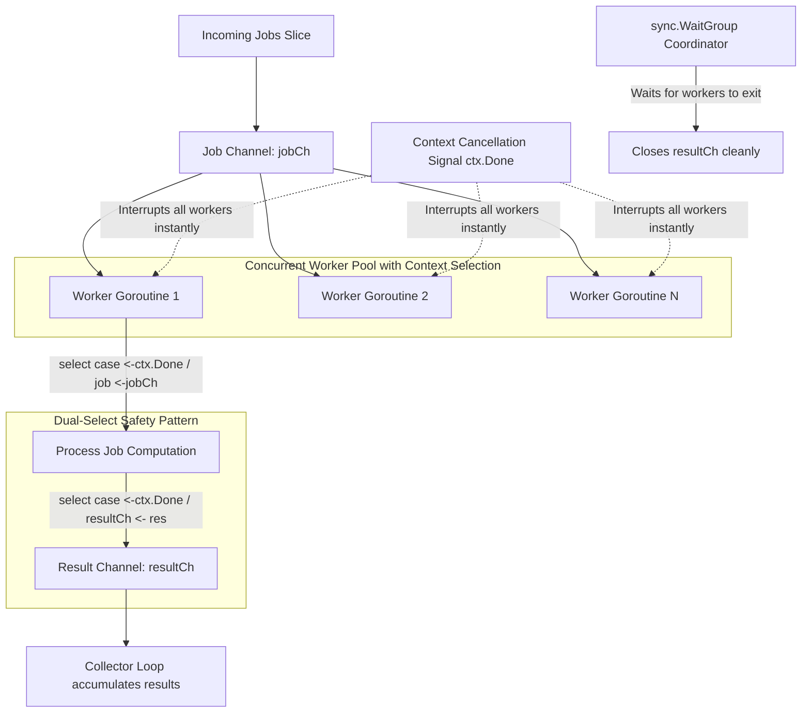

# Cancellation Pipeline Pattern (Concurrent Worker Pool)

## Overview & Definition
The **Cancellation Pipeline** pattern coordinates concurrent data processing pipelines across multiple worker goroutines while guaranteeing immediate, leak-free termination when a `context.Context` is cancelled or times out.

In high-throughput concurrent Go systems, data flows through input channels to a pool of worker goroutines, which push processed items to output channels. The Cancellation Pipeline pattern uses Go's `select` statement at every blocking channel interaction (reading jobs, processing, and sending results) to ensure that no goroutine becomes permanently blocked on a full channel or orphan wait when the parent context aborts.

---

## Problem Statement (Failure scenarios without this pattern)
Naive concurrent worker implementations in Go frequently suffer from severe concurrency bugs:
- **Goroutine Leaks**: A worker goroutine attempts to write a result to an unbuffered or full output channel (`resCh <- result`). If the consumer stops reading due to a request timeout, the worker blocks forever on the send, permanently leaking memory and goroutine stacks.
- **Dangling Channel Writes on Panics / Cancellations**: Workers continue processing large batches of CPU-intensive jobs even after the HTTP client has disconnected, wasting server compute.
- **Deadlocks on Pipeline Teardown**: Waiting on a `sync.WaitGroup` that never decrements because a worker is stuck attempting to send to an unread channel.

---

## Architectural Mechanism & Flow



### The Dual-Select Idiom
To ensure zero goroutine leaks, every worker implements a two-stage `select`:
1. **Stage 1 (Job Ingestion)**:
   ```go
   select {
   case <-ctx.Done():
       return
   case job, ok := <-jobCh:
       if !ok { return }
       // Process job...
   }
   ```
2. **Stage 2 (Result Dispatch)**:
   ```go
   select {
   case <-ctx.Done():
       return
   case resultCh <- result:
   }
   ```

---

## Production Best Practices & Pitfalls

### Best Practices
- **Never Send to a Channel Without `select` on `ctx.Done()`**: Every channel send inside a worker goroutine MUST be guarded with a `case <-ctx.Done():` branch to avoid permanent blocking.
- **Close the Result Channel Exactly Once**: Use a dedicated coordinator goroutine that waits on the `sync.WaitGroup` and closes the output channel (`go func() { wg.Wait(); close(resultCh) }()`).
- **Buffer Channels Appropriately**: Size input and output channel buffers according to batch processing requirements to minimize lock contention.
- **Drain Sinks on Early Return**: Ensure collector loops finish consuming remaining items or that the result channel buffer accommodates in-flight items without deadlock.

### Common Pitfalls
- **Bare Channel Sends (`resultCh <- res`)**: Writing directly to channels without a `select` statement. If the reader exits early on context cancellation, workers leak indefinitely.
- **Closing Channels from Workers**: Attempting to close shared channels from within worker goroutines, leading to `panic: close of closed channel`.
- **Forgetting `wg.Done()` in Defer**: Omitting `defer wg.Done()` at the top of worker goroutines, causing `wg.Wait()` to hang indefinitely if a worker exits early.

---

## Code Walkthrough & Usage

The implementation in `cancellation_pipeline.go` demonstrates leak-free worker pools with context-aware ingestion and dispatch:

```go
package main

import (
	"context"
	"errors"
	"log"
	"time"

	"patterns/05_context"
)

func main() {
	// Prepare a batch of 10 jobs
	jobs := make([]contextpattern.PipelineJob, 10)
	for i := 0; i < 10; i++ {
		jobs[i] = contextpattern.PipelineJob{ID: i + 1, Value: (i + 1) * 2}
	}

	// 1. Scenario 1: Complete processing with 4 workers
	ctx, cancel := context.WithTimeout(context.Background(), 1*time.Second)
	defer cancel()

	results, err := contextpattern.RunCancellationPipeline(ctx, jobs, 4)
	if err != nil {
		log.Fatalf("Pipeline failed: %v", err)
	}
	log.Printf("Successfully processed %d items", len(results))
	for _, res := range results[:3] {
		log.Printf(" - Job %d: Square=%d", res.JobID, res.Square)
	}

	// 2. Scenario 2: Immediate Cancellation Mid-flight
	cancelCtx, abort := context.WithCancel(context.Background())
	abort() // Cancel immediately

	partialResults, err := contextpattern.RunCancellationPipeline(cancelCtx, jobs, 4)
	if errors.Is(err, context.Canceled) {
		log.Printf("Pipeline aborted cleanly on context cancellation. Partial results count: %d",
			len(partialResults))
	}
}
```
