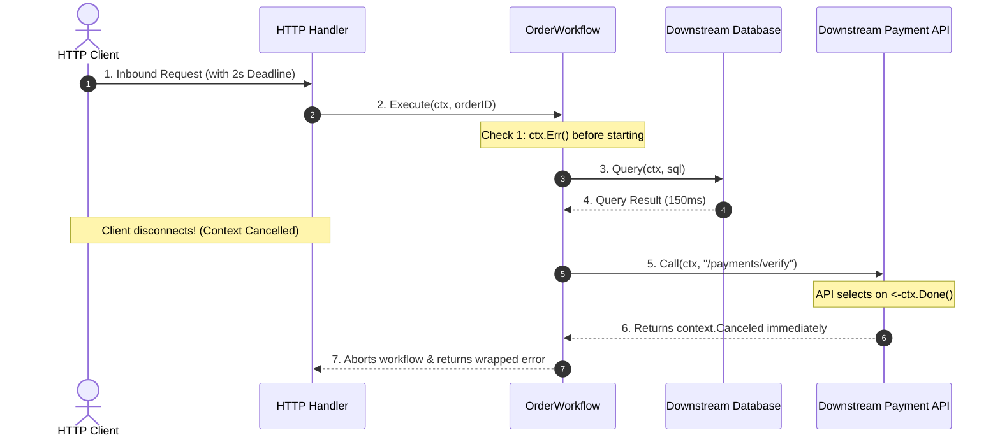

# Context Propagation Pattern

## Overview & Definition
The **Context Propagation** pattern establishes the convention and mechanics of passing `context.Context` explicitly as the first parameter across all function and API boundaries in a Go backend service.

A propagated context serves as the single source of truth for:
1. **Cancellation Signals**: Notifying downstream operations (SQL queries, HTTP client calls, gRPC requests) that an upstream caller has disconnected or cancelled.
2. **Execution Deadlines & Timeouts**: Enforcing end-to-end request SLAs across multi-tier distributed microservice workflows.
3. **Trace Metadata & Request Scopes**: Propagating distributed tracing headers (Traceparent, W3C Baggage), correlation IDs, and tenant identifiers.

---

## Problem Statement (Failure scenarios without this pattern)
Omitting or breaking context propagation across call stacks causes severe distributed system degradation:
- **Zombie Workloads & Resource Waste**: A user closes their browser or cancels an API request. Without propagated context, downstream database queries and third-party microservice calls continue executing to completion, consuming CPU, memory, and database connections for results that will be immediately thrown away.
- **Uncontrolled Latency Cascades**: When downstream services experience slowdowns, callers with no propagated deadlines hang indefinitely, exhausting worker goroutine pools and causing cascading outages.
- **Broken Distributed Tracing**: Dropping context between service layers breaks trace spans, creating fragmented logs where root causes cannot be correlated during production incidents.

---

## Architectural Mechanism & Flow



### Key Rules of Context Propagation
1. **First Parameter Convention**: Context must always be passed explicitly as `ctx context.Context` as the first argument in functions performing I/O or long-running work.
2. **Never Store Context in Structs**: Contexts are request-scoped values tied to the call stack; they must never be stored inside long-lived struct fields.
3. **Pre-flight & Post-flight Checks**: Long workflows should check `if err := ctx.Err(); err != nil` between heavy stages before launching subsequent downstream operations.

---

## Production Best Practices & Pitfalls

### Best Practices
- **Respect Context in All I/O Operations**: Use `db.QueryContext(ctx)` instead of `db.Query()`, and `http.NewRequestWithContext(ctx, ...)` instead of `http.NewRequest(...)`.
- **Pre-check Context in Multi-Stage Workflows**: If Stage 1 took 95% of the allocated budget, check `ctx.Err()` before invoking Stage 2 to avoid starting doomed operations.
- **Use `context.WithoutCancel` for Detached Background Work**: In Go 1.21+, if a background task must outlive the incoming HTTP request (e.g. logging an audit record asynchronously), use `context.WithoutCancel(ctx)` to retain trace values while detaching from the cancellation signal.
- **Propagate Downward Only**: Pass contexts down the call graph; never attempt to pass context state back up via return values.

### Common Pitfalls
- **Passing `context.TODO()` or `context.Background()` Downstream**: Creating a fresh `context.Background()` inside a helper function severes the connection to the parent request's deadline and cancellation signal.
- **Storing Context in Struct Fields**: Placing `type Worker struct { ctx context.Context }`, which causes stale context states and data races when shared across tasks.
- **Ignoring `ctx.Done()` in Custom Channels**: Writing worker loops that read from data channels without selecting on `case <-ctx.Done():`, leading to goroutine leaks.

---

## Code Walkthrough & Usage

The implementation in `context_propagation.go` demonstrates multi-stage workflow execution with context-aware database and API calls:

```go
package main

import (
	"context"
	"errors"
	"log"
	"time"

	"patterns/05_context"
)

func main() {
	// Create mock downstream dependencies with simulated delays
	mockDB := &contextpattern.MockSlowDB{Delay: 50 * time.Millisecond}
	mockAPI := &contextpattern.MockSlowAPI{Delay: 100 * time.Millisecond}

	workflow := contextpattern.NewOrderWorkflow(mockDB, mockAPI)

	// 1. Scenario 1: Workflow completes successfully within generous 300ms budget
	ctxSuccess, cancelSuccess := context.WithTimeout(context.Background(), 300*time.Millisecond)
	defer cancelSuccess()

	res, err := workflow.Execute(ctxSuccess, "ord_9901")
	if err != nil {
		log.Fatalf("Workflow failed: %v", err)
	}
	log.Printf("Successful Execution: %s", res)

	// 2. Scenario 2: Workflow aborted early due to tight 80ms deadline
	ctxTimeout, cancelTimeout := context.WithTimeout(context.Background(), 80*time.Millisecond)
	defer cancelTimeout()

	_, err = workflow.Execute(ctxTimeout, "ord_9902")
	if errors.Is(err, context.DeadlineExceeded) {
		log.Println("Workflow aborted cleanly when payment API stage exceeded deadline")
	}
}
```
