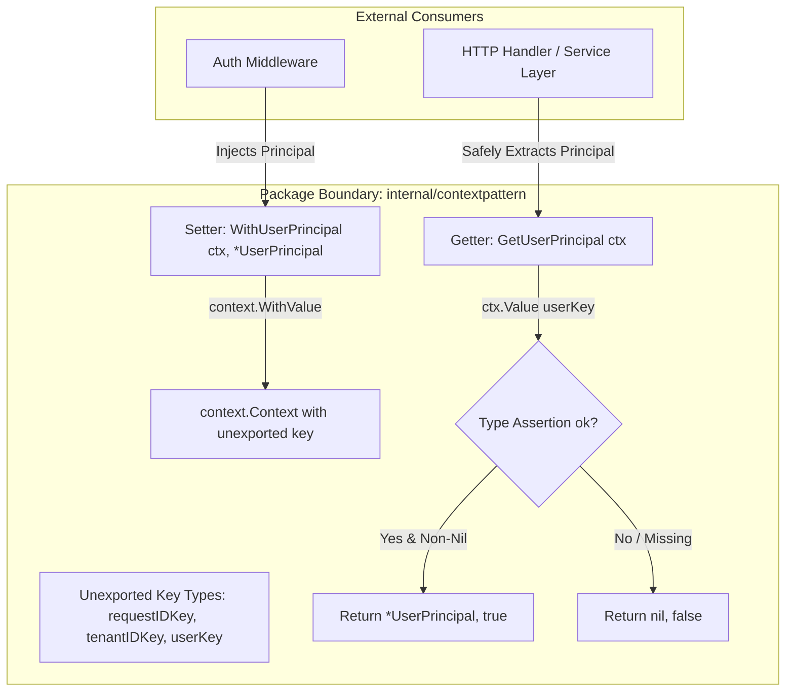

# Typed Context Values Pattern

## Overview & Definition
The **Typed Context Values** pattern defines the safe, collision-free storage and retrieval of request-scoped metadata (Request IDs, Tenant IDs, Authenticated User Principals, Correlation tokens) within `context.Context`.

Because Go's `context.WithValue(parent, key, val)` accepts untyped `any` for both keys and values, storing values using raw string keys (e.g., `context.WithValue(ctx, "user_id", "123")`) creates severe package collision risks. The Typed Context Values pattern eliminates this by:
1. Defining unexported, empty struct types as context keys (`type requestIDKey struct{}`).
2. Providing strongly-typed, package-exported getter and setter helper functions (`WithRequestID`, `GetRequestID`, `WithUserPrincipal`, `GetUserPrincipal`) that encapsulate type assertions and validation.

---

## Problem Statement (Failure scenarios without this pattern)
Improper usage of context values is one of the most common sources of production defects in Go:
- **Context Key Collisions Across Third-Party Packages**: Package A and Package B both write `context.WithValue(ctx, "user", ...)`. Because both use the raw string `"user"`, Package B silently overwrites Package A's data, leading to subtle security and tenant isolation bugs.
- **Runtime Type Assertion Panics**: Calling `ctx.Value("user").(*User)` directly. If another middleware stored a string or `nil`, the naked type assertion panics at runtime during customer requests.
- **Misusing Context as an Argument Bag (Anti-Pattern)**: Passing mandatory function arguments (database connections, parameters) through `context.Value` instead of explicit function parameters, obscuring dependencies and preventing static compile-time type safety.

---

## Architectural Mechanism & Flow



### Key Design Rules
1. **Unexported Struct Keys**: Keys are defined as unexported empty structs (`type userKey struct{}`). Because empty structs allocate zero memory and the type itself is unexported, no external package can forge or collide with the key.
2. **Safe Type Assertions**: Getters always use the comma-ok idiom (`val, ok := ctx.Value(key{}).(*Type)`) to prevent runtime panics.
3. **Restricted to Request-Scoped Metadata**: Context values are strictly reserved for cross-cutting request metadata (tracing, authentication, tenant isolation); never for business function parameters.

---

## Production Best Practices & Pitfalls

### Best Practices
- **Never Export Context Keys**: Keep key types private (`type authKey struct{}`); export only helper functions (`WithAuth`, `GetAuth`).
- **Use Comma-Ok Type Assertions**: Always verify that the retrieved value matches the expected type and is non-nil before returning.
- **Pass Optional Values with Booleans**: Return `(Value, bool)` from getters so callers can differentiate between a zero-value and a missing key.
- **Scope strictly to Request Metadata**: Only store data that is truly request-scoped (Correlation IDs, Client IP, Authenticated Claims, Distributed Trace Spans).

### Common Pitfalls
- **Using Built-In Types as Keys**: Using `context.WithValue(ctx, "userID", id)` or `context.WithValue(ctx, 1, id)`. Linters (`go vet`) flag this as a critical bug.
- **Passing Business Parameters in Context**: Hiding function parameters (e.g. `orderID`, `amount`) inside `context.Value` rather than declaring them as explicit function arguments.
- **Storing Mutable Objects in Context**: Storing a mutable pointer or slice that concurrent goroutines read and write without synchronization, leading to data races.

---

## Code Walkthrough & Usage

The implementation in `typed_context_values.go` demonstrates unexported keys and type-safe accessors:

```go
package main

import (
	"context"
	"log"

	"patterns/05_context"
)

func main() {
	// 1. Initialize root context
	ctx := context.Background()

	// 2. Inject strongly-typed values via exported setters
	ctx = contextpattern.WithRequestID(ctx, "req_abc12345")
	ctx = contextpattern.WithTenantID(ctx, "tenant_acme_corp")

	principal := &contextpattern.UserPrincipal{
		UserID: "usr_99",
		Role:   "admin",
		Email:  "admin@acme.com",
	}
	ctx = contextpattern.WithUserPrincipal(ctx, principal)

	// 3. Retrieve values safely in downstream handlers / services
	reqID := contextpattern.GetRequestID(ctx)
	tenantID, hasTenant := contextpattern.GetTenantID(ctx)
	user, hasUser := contextpattern.GetUserPrincipal(ctx)

	log.Printf("Request ID: %s", reqID)
	if hasTenant {
		log.Printf("Tenant ID: %s", tenantID)
	}
	if hasUser {
		log.Printf("Authenticated User: ID=%s Role=%s Email=%s",
			user.UserID, user.Role, user.Email)
	}

	// 4. Safe retrieval on un-set keys (No panics!)
	emptyCtx := context.Background()
	missingUser, ok := contextpattern.GetUserPrincipal(emptyCtx)
	log.Printf("Missing user check: exists=%v, val=%v", ok, missingUser)
}
```
