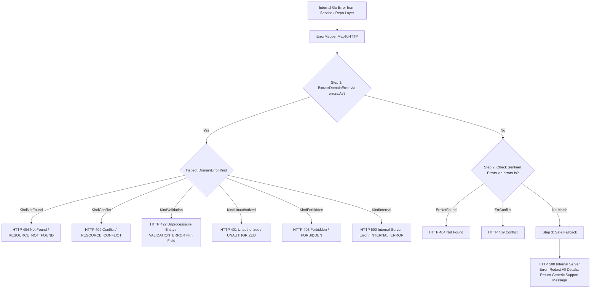

# Error Mapping Pattern (HTTP/RPC Translation)

## Overview & Definition
The **Error Mapping** pattern centralizes the translation of internal Go errors (domain errors, database errors, validation errors, third-party RPC errors) into sanitized public HTTP response payloads and standardized HTTP status codes.

By establishing a centralized translation boundary (`ErrorMapper`), the application guarantees that:
1. Internal implementation details (SQL queries, table names, hostnames, stack traces) are completely redacted from public client responses.
2. Domain error kinds (`KindNotFound`, `KindValidation`, `KindConflict`, etc.) are deterministically mapped to appropriate HTTP status codes (`404`, `422`, `409`, `401`, `403`, `500`).
3. Unknown or unclassified errors default safely to `HTTP 500 Internal Server Error` with a generic, safe client message.

---

## Problem Statement (Failure scenarios without this pattern)
Without a centralized error mapping layer:
- **Information Disclosure (OWASP A04/A05)**: Handlers return raw database error messages directly in HTTP responses (`{"error": "pq: relation 'users_secret' does not exist at character 45"}`), leaking database schema, table names, and query structure to attackers.
- **Inconsistent HTTP Status Codes**: Developer A maps missing records to `HTTP 404 Not Found`, while Developer B maps missing records to `HTTP 400 Bad Request` or `HTTP 200 OK with {error: ...}`, breaking API predictability for frontend and mobile clients.
- **Duplicated Translation Logic**: Every HTTP handler writes repetitive `switch/case` statements to inspect errors, creating maintenance overhead and inconsistent error responses.

---

## Architectural Mechanism & Flow



### Mapping Hierarchy
1. **Tier 1: Typed `DomainError` Inspection**: Checks for structured domain metadata using `ExtractDomainError(err)`.
2. **Tier 2: Sentinel Error Inspection**: Checks standard sentinel errors using `errors.Is(err, ErrNotFound)`.
3. **Tier 3: Safe Fallback**: Treats any unrecognized error as `500 Internal Server Error` with a safe, generic message.

---

## Production Best Practices & Pitfalls

### Best Practices
- **Sanitize Every 500 Response**: Never pass `err.Error()` into the HTTP response body for 500 errors. Log the raw error internally with full stack traces and correlation IDs, but return a generic message to clients.
- **Map Validation Errors to HTTP 422 or 400**: Use `422 Unprocessable Entity` or `400 Bad Request` for syntactic and semantic validation failures, and include the offending `field` name.
- **Centralize in HTTP Middleware / Interceptors**: Execute error mapping in a shared HTTP middleware or recovery handler so individual route handlers simply return standard Go `error` values.
- **Include Machine-Readable Error Codes**: Return a stable uppercase string `code` (e.g. `"RESOURCE_CONFLICT"`, `"VALIDATION_ERROR"`) alongside the HTTP status code to allow frontend applications to perform programmatic internationalization.

### Common Pitfalls
- **Writing `w.Write([]byte(err.Error()))`**: Printing raw internal error strings directly to the HTTP response writer, exposing database credentials and internal file paths.
- **Returning HTTP 200 on Errors**: Returning `HTTP 200 OK` with `{"success": false, "error": "..."}`, which breaks standard HTTP caching proxies, retry policies, and monitoring metrics.
- **Incomplete Switch Statements**: Forgetting a case for `KindForbidden` or `KindUnauthorized`, causing permission errors to fall back to `500 Internal Server Error`.

---

## Code Walkthrough & Usage

The implementation in `error_mapping.go` demonstrates mapping domain errors to HTTP status codes and public JSON payloads:

```go
package main

import (
	"encoding/json"
	"errors"
	"log"
	"net/http"

	"patterns/06_errors"
)

func HandleHTTPError(w http.ResponseWriter, err error) {
	mapper := errorspattern.NewErrorMapper()
	statusCode, publicErr := mapper.MapToHTTP(err)

	w.Header().Set("Content-Type", "application/json")
	w.WriteHeader(statusCode)
	_ = json.NewEncoder(w).Encode(publicErr)
}

func main() {
	mapper := errorspattern.NewErrorMapper()

	// 1. Map Typed Validation Error -> HTTP 422
	valErr := errorspattern.NewValidationError("CreateUser", "password", "must be at least 8 characters")
	code1, payload1 := mapper.MapToHTTP(valErr)
	log.Printf("Validation Error -> Status: %d, Code: %s, Field: %s, Msg: %s",
		code1, payload1.Code, payload1.Field, payload1.Message)

	// 2. Map Sentinel NotFound Error -> HTTP 404
	sentinelErr := errorspattern.WrapOperation("GetUser", errorspattern.ErrNotFound)
	code2, payload2 := mapper.MapToHTTP(sentinelErr)
	log.Printf("Sentinel Error -> Status: %d, Code: %s, Msg: %s",
		code2, payload2.Code, payload2.Message)

	// 3. Map Unknown Database Error -> Sanitized HTTP 500
	unknownErr := errors.New("pq: database disk is full on /var/lib/postgresql/data")
	code3, payload3 := mapper.MapToHTTP(unknownErr)
	log.Printf("Internal DB Error -> Status: %d, Code: %s, Sanitized Msg: %s",
		code3, payload3.Code, payload3.Message)
}
```
