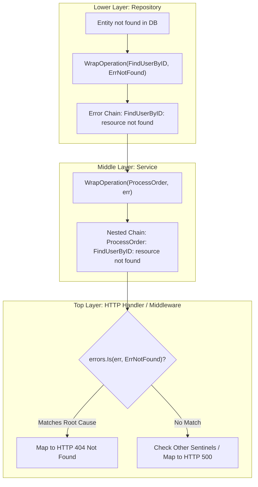

# Sentinel Error Wrapping Pattern

## Overview & Definition
The **Sentinel Error Wrapping** pattern uses predefined, package-level error constants (sentinel errors such as `ErrNotFound`, `ErrConflict`, `ErrUnauthorized`) combined with Go 1.13+ error wrapping (`fmt.Errorf("%s: %w", op, err)`) to maintain both:
1. Rich, contextual diagnostic stack messages for internal logging and debugging.
2. Programmatic inspection of root-cause error identity anywhere up the call stack via `errors.Is`.

Instead of relying on fragile string comparisons (`strings.Contains(err.Error(), "not found")`), callers use `errors.Is(err, ErrNotFound)` to make robust branching decisions while preserving the full operational breadcrumb path.

---

## Problem Statement (Failure scenarios without this pattern)
Ad-hoc error handling and string matching create severe production maintenance hazards:
- **Fragile String Matching in Callers**: Upstream code checks `if err.Error() == "not found"`. If a developer modifies the error message to `"user not found with id 123"`, the equality check silently fails, causing HTTP 500 errors instead of HTTP 404.
- **Lost Context with Bare Sentinels**: Returning bare sentinel errors directly (`return ErrNotFound`) loses all operational context: which function failed? Which table? Which query?
- **Severed Error Chains with `%v`**: Formatting errors with `%v` or `%s` (`fmt.Errorf("find failed: %v", err)`) instead of `%w` destroys the underlying error chain, making `errors.Is` and `errors.As` fail completely.

---

## Architectural Mechanism & Flow



### Key Components
1. **Sentinel Error Declarations**: Predefined package errors initialized with `errors.New()`:
   - `ErrNotFound`
   - `ErrConflict`
   - `ErrUnauthorized`
   - `ErrForbidden`
   - `ErrValidation`
   - `ErrInternalServer`
2. **Context Wrapping Helper (`WrapOperation`)**: Adds the calling operation name `op` while wrapping the target error using the `%w` format verb.
3. **Chain Inspection (`errors.Is`)**: Traverses the error chain recursively to identify the presence of a sentinel error anywhere in the hierarchy.

---

## Production Best Practices & Pitfalls

### Best Practices
- **Always Wrap with `%w`**: Use `fmt.Errorf("%s: %w", op, err)` whenever adding context to an error so the chain remains inspectable via `errors.Is` and `errors.As`.
- **Name Sentinel Errors with `Err` Prefix**: Follow standard Go naming conventions (`ErrNotFound`, `ErrTimeout`, `ErrAlreadyExists`).
- **Keep Sentinel Errors Constant**: Treat sentinel errors as immutable values; never modify their text at runtime.
- **Add Operational Breadcrumbs**: Include function names or subsystem identifiers in the wrap message to produce clear error traces (e.g., `"OrderService.PlaceOrder: PaymentGateway.Charge: ErrTimeout"`).

### Common Pitfalls
- **Accidental Wrapping with `%v`**: Using `%v` breaks the error chain, causing `errors.Is` to return `false`.
- **Defining Too Many Granular Sentinels**: Creating hundreds of hyper-specific sentinel errors instead of a few broad domain categories combined with structured fields.
- **Exporting Mutable Package Variables**: Exporting `var ErrSomething` allows malicious or buggy third-party packages to overwrite the variable in memory.

---

## Code Walkthrough & Usage

The implementation in `sentinel_wrapping.go` demonstrates wrapping sentinel errors with operational context:

```go
package main

import (
	"errors"
	"log"

	"patterns/06_errors"
)

func ProcessUserRequest(id string) error {
	// Call repository which returns wrapped sentinel error
	if err := errorspattern.FindUserByID(id); err != nil {
		return errorspattern.WrapOperation("ProcessUserRequest", err)
	}
	return nil
}

func main() {
	// Test looking up a missing user
	err := ProcessUserRequest("missing")
	if err != nil {
		// 1. Full diagnostic string for internal logs
		log.Printf("Diagnostic Log: %v", err)
		// Output: ProcessUserRequest: FindUserByID: resource not found

		// 2. Programmatic error inspection via errors.Is
		if errors.Is(err, errorspattern.ErrNotFound) {
			log.Println("Successfully identified ErrNotFound via errors.Is -> Returning HTTP 404")
		} else if errors.Is(err, errorspattern.ErrConflict) {
			log.Println("Identified ErrConflict -> Returning HTTP 409")
		} else {
			log.Println("Unclassified error -> Returning HTTP 500")
		}
	}
}
```
