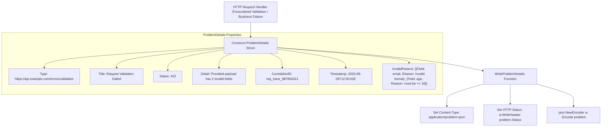

# Structured Error Response Pattern (RFC 7807 Problem Details)

## Overview & Definition
The **Structured Error Response** pattern implements the IETF RFC 7807 (*Problem Details for HTTP APIs*) specification, providing a standardized, machine-readable JSON format for HTTP error responses.

Instead of inventing proprietary, bespoke error JSON structures across different microservices (e.g. `{ "err": "..." }` vs `{ "message": "...", "status": 400 }`), the service returns standard `application/problem+json` documents containing:
- `type`: An absolute or relative URI referencing human-readable documentation for the problem type.
- `title`: A short, human-readable summary of the problem type (e.g., `"Validation Failed"`).
- `status`: The HTTP status code generated by the origin server.
- `detail`: A human-readable explanation specific to this occurrence of the problem.
- `instance`: A URI reference identifying the specific occurrence of the problem.
- `correlation_id`: Distributed tracing identifier for cross-referencing server logs.
- `invalid_params`: A list of specific field violations with reasons.

---

## Problem Statement (Failure scenarios without this pattern)
Non-standard or poorly structured HTTP error formats create major friction across client and backend teams:
- **Client Integration Incompatibility**: Frontend and mobile applications must write different error parsing adapters for every microservice, increasing client bundle size and bug rates.
- **Inability to Automate Field Validation in UIs**: Returning a flat error string like `"Invalid username, password too short"` prevents client form libraries from highlighting the specific input fields with errors.
- **Missing Distributed Tracing Context**: When users encounter an error and contact customer support, there is no correlation ID in the response to search backend logs or OpenTelemetry traces.

---

## Architectural Mechanism & Flow



### RFC 7807 Standard Schema
```json
{
  "type": "https://api.example.com/errors/invalid-params",
  "title": "Invalid Request Parameters",
  "status": 422,
  "detail": "Your request parameters failed validation.",
  "instance": "/v1/users/create",
  "correlation_id": "c7a8b412-4f62-411a",
  "timestamp": "2026-08-29T12:00:00Z",
  "invalid_params": [
    { "field": "email", "reason": "must be a valid email address" },
    { "field": "password", "reason": "must contain at least 8 characters" }
  ]
}
```

---

## Production Best Practices & Pitfalls

### Best Practices
- **Use the Official MIME Type**: Always set `Content-Type: application/problem+json` to comply with RFC 7807.
- **Always Include a Correlation / Trace ID**: Populate `correlation_id` from the incoming request's tracing context (e.g. `X-Request-ID` or OpenTelemetry trace ID).
- **Default `type` to `about:blank`**: If a specific error documentation URI is not yet published, RFC 7807 recommends setting `"type": "about:blank"`.
- **Never Include Stack Traces in Production**: Ensure internal file paths and stack traces are excluded from the `detail` string in production environments.

### Common Pitfalls
- **Setting Standard `application/json` Content-Type**: Omitting `application/problem+json`, which prevents API gateways and automated clients from detecting RFC 7807 responses.
- **Mismatched Status Codes**: Setting `Status: 400` in the JSON body but calling `w.WriteHeader(http.StatusOK)`. The HTTP status header and JSON `status` field must always match.
- **Inconsistent Timestamp Formatting**: Forgetting to format timestamps in ISO 8601 / RFC 3339 UTC format.

---

## Code Walkthrough & Usage

The implementation in `structured_response.go` demonstrates constructing and serializing RFC 7807 problem details:

```go
package main

import (
	"net/http"
	"net/http/httptest"
	"os"
	"time"

	"patterns/06_errors"
)

func CreateUserHandler(w http.ResponseWriter, r *http.Request) {
	// Simulate validation failure on user registration
	problem := errorspattern.ProblemDetails{
		Type:          "https://api.myapp.com/errors/validation",
		Title:         "Invalid Request Body",
		Status:        http.StatusUnprocessableEntity,
		Detail:        "The user registration request contains 2 validation violations",
		Instance:      r.URL.Path,
		CorrelationID: "req_882910fa-1234",
		Timestamp:     time.Now().UTC(),
		InvalidParams: []errorspattern.FieldViolation{
			{Field: "email", Reason: "must be a valid email format"},
			{Field: "age", Reason: "must be greater than or equal to 18"},
		},
	}

	// Write standardized RFC 7807 response
	errorspattern.WriteProblemDetails(w, problem)
}

func main() {
	// Execute handler with test recorder
	req := httptest.NewRequest("POST", "/api/v1/users", nil)
	rec := httptest.NewRecorder()

	CreateUserHandler(rec, req)

	// Dump response to stdout
	_, _ = os.Stdout.Write(rec.Body.Bytes())
}
```
