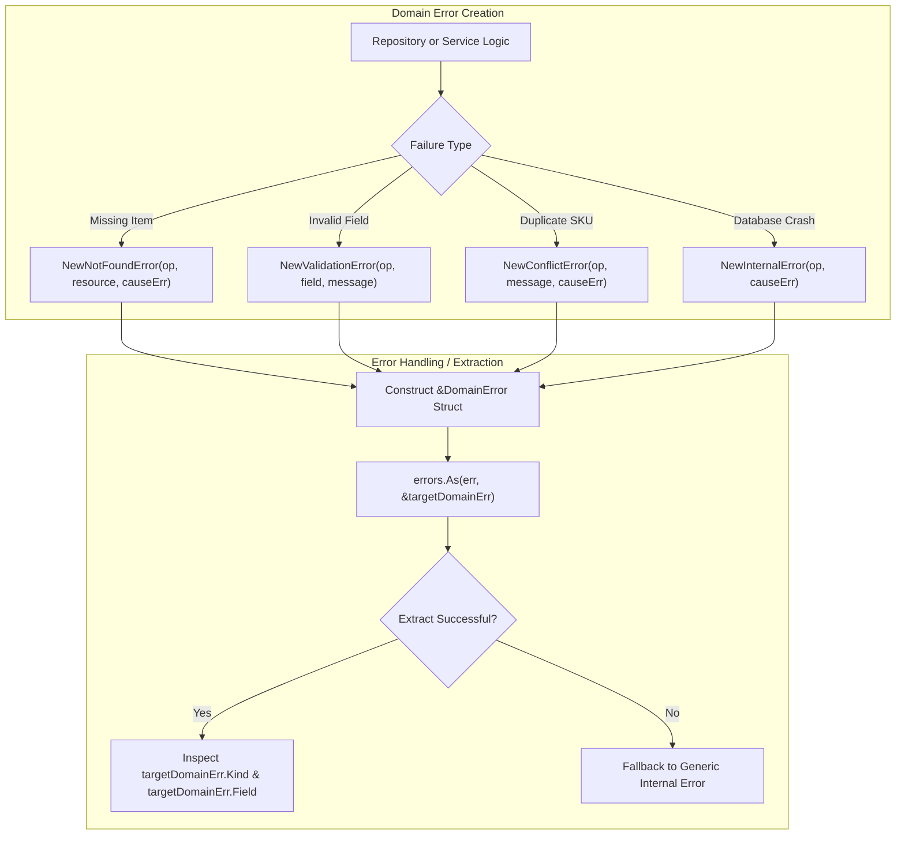

# Typed Domain Errors Pattern

## Overview & Definition
The **Typed Domain Errors** pattern provides rich, structured error objects that encapsulate operational metadata, domain error taxonomy kinds, field-level validation details, and underlying root-cause error chains.

By implementing custom error types (such as `DomainError`) that satisfy both the standard `error` interface (`Error() string`) and the `Unwrap() error` interface, the pattern allows applications to:
1. Classify failures into high-level taxonomy kinds (`NOT_FOUND`, `CONFLICT`, `VALIDATION`, `UNAUTHORIZED`, `FORBIDDEN`, `INTERNAL`).
2. Attach field-specific validation contexts (e.g. `Field: "email"`, `Message: "invalid email format"`).
3. Safely extract typed metadata anywhere up the call stack using `errors.As(err, &domainErr)`.

---

## Problem Statement (Failure scenarios without this pattern)
Relying on flat string errors or untyped error wrappers causes severe architectural issues:
- **Loss of Structured Metadata**: When validation fails on a nested form with 10 fields, a flat string error cannot convey which exact field was invalid, forcing frontend clients to display generic error alerts.
- **Inconsistent Error Classification**: Different developers write slightly different error strings (`"user not found"` vs `"record does not exist"`), making it impossible for HTTP middleware to map errors to standard HTTP status codes reliably.
- **Fragile Type Casting**: Using direct type assertions (`err.(*DomainError)`) panics or fails whenever the error has been wrapped by an intermediate logging or tracing layer.

---

## Architectural Mechanism & Flow



### Struct Anatomy
```go
type DomainError struct {
    Kind    ErrorKind // Taxonomy: NOT_FOUND, CONFLICT, VALIDATION...
    Op      string    // Subsystem/Operation: "UserService.CreateUser"
    Message string    // Human-readable message
    Field   string    // Optional: for validation errors
    Err     error     // Underlying root cause (supports Unwrap)
}
```

---

## Production Best Practices & Pitfalls

### Best Practices
- **Implement the `Unwrap()` Method**: Always implement `Unwrap() error` on custom error structs so `errors.Is` and `errors.As` can continue traversing nested inner errors.
- **Use `errors.As` Instead of Direct Type Assertions**: Never do `err.(*DomainError)`; always use `errors.As(err, &target)` to safely unwrap nested error chains.
- **Standardize Taxonomy via Enums**: Use a dedicated `ErrorKind` enum type to enforce consistent error categories across all domain packages.
- **Include Operational Breadcrumbs (`Op`)**: Set `Op` to the package and function name (`"billing.ChargeCard"`) to simplify log analysis and debugging.

### Common Pitfalls
- **Forgetting Pointer Receivers**: Implementing `Error()` on `*DomainError` but checking `var target DomainError` (value) with `errors.As`, leading to reflection mismatches.
- **Leaking Sensitive Internal Details in `Message`**: Putting raw SQL syntax or database connection strings into `Message` (which might be rendered to end users) instead of storing the internal error in `Err`.
- **Nil Pointer Dereferences in `Error()`**: Writing an `Error()` method that assumes `e.Err` or `e.Field` is non-nil without checking, causing panics during logging.

---

## Code Walkthrough & Usage

The implementation in `typed_errors.go` demonstrates constructing, wrapping, and extracting typed domain errors:

```go
package main

import (
	"errors"
	"log"

	"patterns/06_errors"
)

func ValidateAndRegisterUser(email string) error {
	if email == "" {
		return errorspattern.NewValidationError("ValidateAndRegisterUser", "email", "email cannot be empty")
	}
	if email == "taken@example.com" {
		return errorspattern.NewConflictError("ValidateAndRegisterUser", "email already registered", nil)
	}
	return nil
}

func main() {
	// 1. Validation Error Example
	errVal := ValidateAndRegisterUser("")
	if domainErr, ok := errorspattern.ExtractDomainError(errVal); ok {
		log.Printf("Caught Domain Error: Kind=%s Op=%s Field=%s Msg=%s",
			domainErr.Kind, domainErr.Op, domainErr.Field, domainErr.Message)
		// Output: Caught Domain Error: Kind=VALIDATION Op=ValidateAndRegisterUser Field=email Msg=email cannot be empty
	}

	// 2. Conflict Error Example
	errConflict := ValidateAndRegisterUser("taken@example.com")
	if domainErr, ok := errorspattern.ExtractDomainError(errConflict); ok {
		log.Printf("Caught Domain Error: Kind=%s Op=%s Msg=%s",
			domainErr.Kind, domainErr.Op, domainErr.Message)
		// Output: Caught Domain Error: Kind=CONFLICT Op=ValidateAndRegisterUser Msg=email already registered
	}

	// 3. Inspecting standard error string
	log.Printf("Standard Error String: %v", errVal)
}
```
