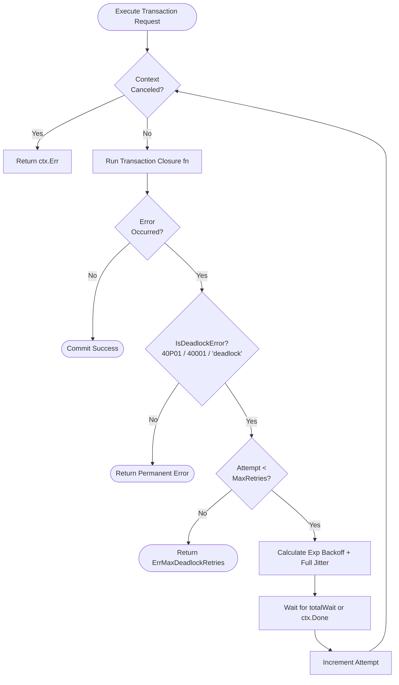

# Deadlock Retry Pattern

## 1. Overview & Concept
The **Deadlock Retry** pattern provides automated, resilient handling of transient concurrency conflicts in relational databases. Under high-throughput concurrent write workloads, relational database engines (such as PostgreSQL, MySQL, CockroachDB, and Oracle) employ multi-version concurrency control (MVCC) and row-level lock managers. When two or more concurrent transactions acquire locks on multiple shared rows or tables in differing orders, or when serializable isolation level detects write skew, the database engine aborts one of the transactions (e.g., PostgreSQL error `40P01` "deadlock detected" or `40001` "could not serialize access").

Rather than bubbling transient database concurrency aborts up to end-users as 500 Internal Server Errors, the Deadlock Retry pattern automatically intercepts these specific errors, applies **exponential backoff with full randomized jitter**, and transparently replays the transactional closure until it succeeds or exhausts a bounded retry budget.

---

## 2. Production Problem & Failure Modes (Why do we need this in high-scale backends?)

### 1. Inevitable Concurrency Collisions Under High Load
Even well-designed relational databases experience deadlocks when concurrent worker goroutines update interdependent entities (e.g., multi-item inventory deductions, bilateral wallet transfers, or concurrent ledger postings). Without automatic retry logic:
- Sudden spikes in checkout traffic cause bursts of 500 error responses to users.
- Background asynchronous workers terminate prematurely, creating poisoned queue states.

### 2. Lock Thundering Herd (Synchronized Retry Collisions)
If two competing transactions deadlock and both retry immediately at fixed intervals (e.g., exactly after 50ms), they re-enter the database at the exact same millisecond, re-acquire the conflicting locks in lockstep, and deadlock repeatedly until retries are exhausted.

### 3. Masking Permanent Fatal Errors
A naive retry loop that catches generic `error` values will repeatedly retry non-retryable errors (e.g., foreign key violations `23503`, unique constraint violations `23505`, or syntax errors `42601`), wasting database CPU and delaying error reporting.

---

## 3. Architecture & Mechanism (Text/ASCII diagram or sequence)



### ASCII Mechanism Overview
```text
+-------------------------------------------------------------------------------+
|                       ExecuteWithDeadlockRetry Loop                           |
|                                                                               |
|  Attempt 1: Run fn(ctx) ----[Deadlock 40P01]----> Check: IsDeadlockError?    |
|                                                          | Yes                |
|  Calculate Backoff: delay = base * 2^(0) + jitter        v                    |
|  Sleep(25ms)                                      [Attempt < MaxRetries]      |
|                                                          |                    |
|  Attempt 2: Run fn(ctx) ----[Deadlock 40P01]----> Check: IsDeadlockError?    |
|                                                          | Yes                |
|  Calculate Backoff: delay = base * 2^(1) + jitter        v                    |
|  Sleep(55ms)                                      [Attempt < MaxRetries]      |
|                                                          |                    |
|  Attempt 3: Run fn(ctx) ------------------------> [Success / Commit]          |
+-------------------------------------------------------------------------------+
```

---

## 4. Production Hardening & Trade-offs (Edge cases, pitfalls, performance considerations)

### Production Hardening Strategies
1. **Accurate SQLSTATE Classification**: Match specific error codes rather than substring checking alone. In PostgreSQL, look for `40P01` (deadlock_detected) and `40001` (serialization_failure). In MySQL, check for error `1213` (ER_LOCK_DEADLOCK) and `1205` (ER_LOCK_WAIT_TIMEOUT).
2. **Exponential Backoff with Full Jitter**:
   $$\text{delay} = \text{baseDelay} \times 2^{\text{attempt}-1}$$
   $$\text{jitter} = \text{random}(0, \text{delay})$$
   $$\text{totalWait} = \text{delay} + \text{jitter}$$
   This formula guarantees temporal dispersion among competing workers.
3. **Strict Closure Idempotency**: Ensure the retry closure `fn(ctx)` does NOT contain non-idempotent in-memory side effects (such as appending to an external slice or mutating global state) without resetting state between attempts.
4. **Deterministic Lock Ordering**: Where possible, sort resource identifiers before locking (e.g., `SELECT * FROM accounts WHERE id IN (1, 2) ORDER BY id FOR UPDATE`) to reduce deadlock likelihood at design time.

### Trade-offs & Pitfalls
- **Increased Latency for Deadlocked Queries**: Replaying transactions adds several tens of milliseconds to p99 latency for affected requests.
- **Context Deadline Awareness**: If the parent context has a 500ms timeout, multiple retries must respect `ctx.Done()` rather than blindly sleeping.

---

## 5. Implementation Reference & Code Usage (Grounded in the repository's Go code)

In `patterns/13_database/deadlock_retry.go`, `ExecuteWithDeadlockRetry` combines SQLSTATE classification with exponential backoff and randomized jitter:

```go
package database

import (
	"context"
	"errors"
	"fmt"
	"math/rand/v2"
	"strings"
	"time"
)

var (
	ErrDeadlockDetected     = errors.New("pq: deadlock detected (SQLSTATE 40P01)")
	ErrSerializationFailure = errors.New("pq: could not serialize access (SQLSTATE 40001)")
	ErrMaxDeadlockRetries   = errors.New("transaction failed: maximum deadlock retries exceeded")
)

func IsDeadlockError(err error) bool {
	if err == nil {
		return false
	}
	if errors.Is(err, ErrDeadlockDetected) || errors.Is(err, ErrSerializationFailure) {
		return true
	}
	errStr := strings.ToLower(err.Error())
	return strings.Contains(errStr, "deadlock") || strings.Contains(errStr, "could not serialize")
}

func ExecuteWithDeadlockRetry(ctx context.Context, maxRetries int, baseDelay time.Duration, fn func(ctx context.Context) error) error {
	if maxRetries <= 0 {
		maxRetries = 3
	}
	if baseDelay <= 0 {
		baseDelay = 20 * time.Millisecond
	}

	var lastErr error
	for attempt := 1; attempt <= maxRetries; attempt++ {
		select {
		case <-ctx.Done():
			return ctx.Err()
		default:
		}

		err := fn(ctx)
		if err == nil {
			return nil
		}

		lastErr = err
		if !IsDeadlockError(err) {
			// Permanent error -> Return immediately without retry
			return err
		}

		if attempt >= maxRetries {
			break
		}

		// Randomized backoff to break the deadlock cycle between competing transactions
		delay := baseDelay * time.Duration(1<<uint(attempt-1))
		jitter := time.Duration(rand.Int64N(int64(delay)))
		totalWait := delay + jitter

		select {
		case <-ctx.Done():
			return ctx.Err()
		case <-time.After(totalWait):
		}
	}

	return fmt.Errorf("%w: %v", ErrMaxDeadlockRetries, lastErr)
}
```

### Usage Example
```go
err := database.ExecuteWithDeadlockRetry(ctx, 3, 25*time.Millisecond, func(ctx context.Context) error {
    tx, err := db.BeginTx(ctx, &sql.TxOptions{Isolation: sql.LevelSerializable})
    if err != nil {
        return err
    }
    defer tx.Rollback()

    if _, err := tx.ExecContext(ctx, "UPDATE inventory SET stock = stock - 1 WHERE id = $1", itemID); err != nil {
        return err
    }
    return tx.Commit()
})
```
