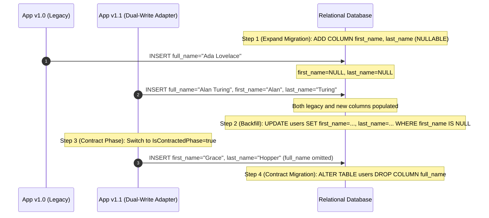

# Expand and Contract (Parallel Run) Migration Pattern

## 1. Overview & Concept
The **Expand and Contract** pattern (also known as the **Parallel Change** pattern) is the industry standard architectural technique for executing **zero-downtime database schema migrations** in production environments.

In modern distributed deployments (e.g., Kubernetes rolling updates, blue/green deployments, or canary rollouts), old and new versions of an application run concurrently for a period of minutes or hours. Directly altering or dropping a database column, renaming a table, or changing data formats in a single instantaneous step causes instant runtime crashes for active instances running the previous codebase version.

Expand and Contract breaks schema evolution into 3 non-breaking phases:
1. **Expand Phase**: Add new columns/tables in database, deploy application that **dual-writes** to both legacy and new structures while reading from new structures with fallback to old.
2. **Backfill Phase**: Asynchronously backfill historical legacy data into new structures.
3. **Contract Phase**: Cut over reads/writes entirely to new structures, remove legacy column references from application code, and finally drop legacy columns/tables from the database.

---

## 2. Production Problem & Failure Modes (Why do we need this in high-scale backends?)

### 1. Rolling Deployment Breakage
Suppose a table has `full_name VARCHAR`, and an engineer wants to split it into `first_name` and `last_name`. If a migration renames or drops `full_name` at `10:00 AM`:
- Pods running version `v1.0` immediately fail with `column full_name does not exist` on every query.
- Rollback becomes impossible without restoring database backups.

### 2. High-Lock DDL Table Freezes
In large tables (>100M rows), running `ALTER TABLE users DROP COLUMN old_col, ADD COLUMN new_col NOT NULL` acquires an exclusive access lock (`AccessExclusiveLock` in PostgreSQL), blocking all reads and writes for hours.

---

## 3. Architecture & Mechanism (Text/ASCII diagram or sequence)



### ASCII 3-Phase State Table
```text
+-------------------+----------------------------+----------------------------+
| Phase             | Application Writes         | Application Reads          |
+-------------------+----------------------------+----------------------------+
| 1. Expand         | Dual-write (Old + New)     | Read New -> Fallback Old   |
| 2. Backfill       | Background async backfill  | Dual-write continues       |
| 3. Contract       | Write New columns only     | Read New columns only      |
| 4. Cleanup        | Remove adapter/dual-write  | Drop Old DB column/table   |
+-------------------+----------------------------+----------------------------+
```

---

## 4. Production Hardening & Trade-offs (Edge cases, pitfalls, performance considerations)

### Production Hardening Strategies
1. **Always Make New Columns Nullable Initially**: When adding columns in the Expand phase, never add `NOT NULL` without a default value or backfill, as previous application versions will insert rows without providing values for the new column.
2. **Chunked Background Backfills**: Backfill large tables in bounded batches (e.g., `1,000` rows per transaction with `WHERE id > last_seen_id LIMIT 1000`) with sleep pauses to avoid database replication lag and buffer pool eviction.
3. **Feature Flags for Phase Cutover**: Use runtime configuration or feature flags (`IsContractedPhase`) to toggle between Expand and Contract phases without redeploying binaries.
4. **Data Verification Audits**: Run reconciliation scripts to verify parity between old and new columns before dropping the legacy schema.

### Trade-offs & Pitfalls
- **Multi-Step Deployment Cycle**: A single logical schema change requires at least two deployments and two migrations separated in time.
- **Write Amplification in Expand**: Dual-writing increases network payload and database index update overhead temporarily during the Expand window.

---

## 5. Implementation Reference & Code Usage (Grounded in the repository's Go code)

In `patterns/13_database/expand_contract.go`, `ExpandContractUserAdapter` encapsulates the translation logic across migration phases:

```go
package database

import (
	"strings"
)

type UserTableSchema struct {
	ID        string
	FullName  string // Old column (to be deprecated)
	FirstName string // New column
	LastName  string // New column
}

type ExpandContractUserAdapter struct {
	// Phase 1 (Expand): Dual-write to both old and new columns. Read from new, fallback to old.
	// Phase 2 (Contract): Read/write new columns only.
	IsContractedPhase bool
}

type DomainUser struct {
	ID        string
	FirstName string
	LastName  string
}

func (a *ExpandContractUserAdapter) ToDatabaseRow(u DomainUser) UserTableSchema {
	if a.IsContractedPhase {
		// Contract phase: Only write to new columns
		return UserTableSchema{
			ID:        u.ID,
			FirstName: u.FirstName,
			LastName:  u.LastName,
		}
	}

	// Expand phase: Dual-write to both legacy and new columns for zero-downtime rolling deploys
	return UserTableSchema{
		ID:        u.ID,
		FullName:  strings.TrimSpace(u.FirstName + " " + u.LastName),
		FirstName: u.FirstName,
		LastName:  u.LastName,
	}
}

func (a *ExpandContractUserAdapter) ToDomainUser(row UserTableSchema) DomainUser {
	// If new columns are populated, use them
	if row.FirstName != "" || row.LastName != "" {
		return DomainUser{
			ID:        row.ID,
			FirstName: row.FirstName,
			LastName:  row.LastName,
		}
	}

	// Fallback to legacy column during transition
	parts := strings.SplitN(row.FullName, " ", 2)
	first := parts[0]
	last := ""
	if len(parts) > 1 {
		last = parts[1]
	}

	return DomainUser{
		ID:        row.ID,
		FirstName: first,
		LastName:  last,
	}
}
```

### Usage Example
```go
// Phase 1: Expand (Dual-write active)
adapter := &database.ExpandContractUserAdapter{IsContractedPhase: false}
row := adapter.ToDatabaseRow(database.DomainUser{ID: "1", FirstName: "Ada", LastName: "Lovelace"})
// row.FullName == "Ada Lovelace", row.FirstName == "Ada", row.LastName == "Lovelace"

// Phase 2: Contract (After historical data backfill completes)
adapter.IsContractedPhase = true
contractedRow := adapter.ToDatabaseRow(database.DomainUser{ID: "2", FirstName: "Alan", LastName: "Turing"})
// contractedRow.FullName == "", contractedRow.FirstName == "Alan", contractedRow.LastName == "Turing"
```
