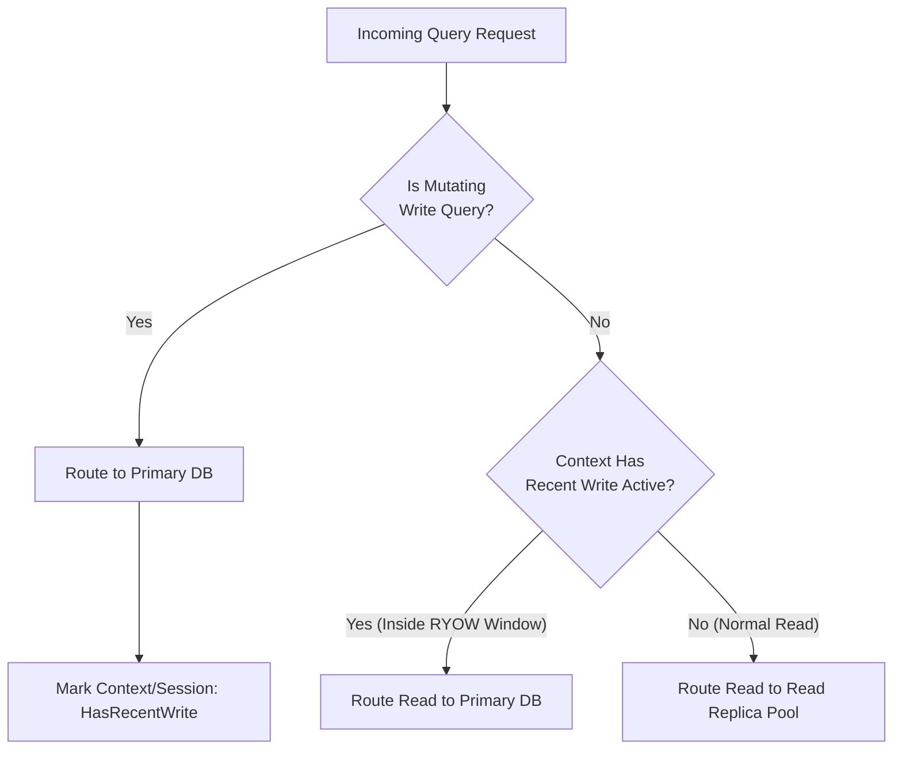

# Read-Write Splitter Pattern (with Replica Lag Awareness)

## 1. Overview & Concept
The **Read-Write Splitter** pattern distributes database traffic across a primary (master) write database and one or more read replicas. While all mutating queries (`INSERT`, `UPDATE`, `DELETE`, `DDL`) are routed directly to the primary, read-only queries (`SELECT`) are offloaded to read replicas, scaling read throughput horizontally.

However, standard asynchronous replication between primary and replicas introduces **replication lag** (ranging from a few milliseconds to several seconds under load). If a user creates a new record and immediately redirects to a view page, reading from a lagging replica results in a "ghost" missing record. The **Replica-Lag-Aware Read-Write Splitter** solves this by implementing **Read-Your-Own-Writes (RYOW) consistency**, dynamically routing reads to the primary database for a configured time window following any write operation within that user session.

---

## 2. Production Problem & Failure Modes (Why do we need this in high-scale backends?)

### 1. Primary Database Overload
Without splitting, the primary database handles 100% of all queries. In typical web and mobile workloads with a 90:10 or 95:5 read-to-write ratio, analytical queries and listing operations consume CPU, buffer memory, and IOPS on the primary, starving write transactions.

### 2. The Replication Lag "Disappearing Data" Bug (RYOW Inconsistency)
With naive read-write splitting:
1. User submits a new comment (`INSERT INTO comments ...` on Primary).
2. Server responds `302 Found` redirecting to `/post/123`.
3. Client issues `GET /post/123` (`SELECT * FROM comments` on Replica).
4. Replica has not yet replayed the write stream ($lag \approx 50\text{ms}$).
5. User sees their comment missing, assumes an error occurred, and re-submits repeatedly.

---

## 3. Architecture & Mechanism (Text/ASCII diagram or sequence)



### ASCII Mechanism Overview
```text
+-------------------------------------------------------------------------------+
|                             ReadWriteRouter                                   |
|                                                                               |
|  Write Query (INSERT/UPDATE) -------------> [Primary DB Node]                 |
|                                                    |                          |
|                                        (Async Replication Stream)             |
|                                                    v                          |
|  Read Query (Normal) ---------------------> [Replica DB Node]                 |
|                                                                               |
|  Read Query (with WithRecentWrite context) -> [Primary DB Node] (RYOW Safe)   |
+-------------------------------------------------------------------------------+
```

---

## 4. Production Hardening & Trade-offs (Edge cases, pitfalls, performance considerations)

### Production Hardening Strategies
1. **Session-Sticky Sticky Windows**: Propagate recent write markers via HTTP session cookies, JWT claims, or context values (e.g., pin reads to primary for 2–5 seconds after a mutation).
2. **Replication Lag Health Probes**: Monitor replication lag metrics (e.g., `pg_stat_replication.replay_lag` in PostgreSQL or `Seconds_Behind_Master` in MySQL). If a replica exceeds maximum tolerable lag (e.g., >2s), automatically drain traffic from that replica.
3. **Transaction Routing**: Any read executed inside a write transaction must stay strictly on the primary connection to preserve transactional snapshot consistency.
4. **Replica Load Balancing**: Distribute reads across multiple replica endpoints using round-robin or least-connections algorithms with health checks.

### Trade-offs & Pitfalls
- **Primary Load from Overly Long RYOW Windows**: Setting sticky windows too long (e.g., 60s) causes excessive read volume to remain on the primary, degrading the benefit of read replicas.
- **Failover Handling**: In active-passive failover scenarios, the router must update connection pointers gracefully without dropping in-flight transactions.

---

## 5. Implementation Reference & Code Usage (Grounded in the repository's Go code)

In `patterns/13_database/read_write_splitter.go`, the router combines endpoint abstraction with context-based recent write tracking:

```go
package database

import (
	"context"
	"errors"
	"sync"
	"time"
)

type DBEndpointType string

const (
	EndpointPrimary DBEndpointType = "PRIMARY"
	EndpointReplica DBEndpointType = "REPLICA"
)

type recentWriteCtxKey struct{}

func WithRecentWrite(ctx context.Context, duration time.Duration) context.Context {
	expiry := time.Now().Add(duration)
	return context.WithValue(ctx, recentWriteCtxKey{}, expiry)
}

func hasRecentWrite(ctx context.Context) bool {
	if val, ok := ctx.Value(recentWriteCtxKey{}).(time.Time); ok {
		return time.Now().Before(val)
	}
	return false
}

type DBExecutor interface {
	Exec(ctx context.Context, query string) error
	Query(ctx context.Context, query string) (string, error)
}

type ReadWriteRouter struct {
	primary DBExecutor
	replica DBExecutor
	mu      sync.RWMutex
}

func NewReadWriteRouter(primary, replica DBExecutor) *ReadWriteRouter {
	return &ReadWriteRouter{
		primary: primary,
		replica: replica,
	}
}

func (r *ReadWriteRouter) Write(ctx context.Context, query string) error {
	if r.primary == nil {
		return errors.New("primary DB unavailable")
	}
	return r.primary.Exec(ctx, query)
}

func (r *ReadWriteRouter) Read(ctx context.Context, query string) (endpoint DBEndpointType, result string, err error) {
	if hasRecentWrite(ctx) {
		// Read-your-own-writes consistency: route to Primary to avoid replica lag
		res, err := r.primary.Query(ctx, query)
		return EndpointPrimary, res, err
	}

	// Normal read: route to Replica
	res, err := r.replica.Query(ctx, query)
	return EndpointReplica, res, err
}
```

### Usage Example
```go
router := database.NewReadWriteRouter(primaryDB, replicaDB)

// 1. Mutating operation on Primary:
_ = router.Write(ctx, "INSERT INTO orders (id, total) VALUES ('101', 500)")

// 2. Mark context with 3-second RYOW window:
ctxWithStickyWrite := database.WithRecentWrite(ctx, 3*time.Second)

// 3. Immediate subsequent read routes safely to Primary:
endpoint, res, err := router.Read(ctxWithStickyWrite, "SELECT * FROM orders WHERE id = '101'")
// endpoint == database.EndpointPrimary
```
