# Transaction Boundary Pattern

## 1. Overview & Concept
The **Transaction Boundary** pattern dictates the precise structural scope and lifecycle boundaries where relational database transactions begin, execute, and commit. Its fundamental rule is that a database transaction must be as **short and localized as possible**, containing exclusively database operations (e.g., SQL queries, row updates, index manipulations) and strictly excluding external network calls (such as third-party payment gateways, HTTP APIs, external RPCs, or message broker publications).

In high-scale Go backend systems, misuse of transaction boundaries is one of the leading root causes of database connection pool exhaustion, elevated query latency, severe row lock contention, and cascading service outages. By strictly constraining transaction boundaries to local database operations, backend systems maximize connection pool availability and minimize lock holding times.

---

## 2. Production Problem & Failure Modes (Why do we need this in high-scale backends?)

### 1. Connection Pool Exhaustion via External Network Latency
When an external network call (e.g., Stripe, PayPal, or an internal microservice) is executed inside an active database transaction:
```text
[Begin Tx (Acquires DB Conn)] -> [HTTP Request to Payment Gateway (1500ms)] -> [Commit Tx (Releases DB Conn)]
```
If the external gateway experiences latency degradation (e.g., p99 latency spikes from 50ms to 2.5s), every in-flight transaction holds its database connection open for the entire duration. With a standard connection pool limit of 25–50 connections (`sql.DB.SetMaxOpenConns`), 50 concurrent requests will completely saturate the connection pool within milliseconds. Unrelated database queries across the entire application block and fail with `context deadline exceeded` or `driver: bad connection`.

### 2. Prolonged Row and Table Lock Contention
Database transactions hold exclusive locks (`RowExclusiveLock`, `X-locks`, `SELECT ... FOR UPDATE`) on modified rows until `COMMIT` or `ROLLBACK`. Holding locks while waiting on non-deterministic external I/O creates massive lock queues, deadlocks, and serialization failures across concurrent workers accessing overlapping database partitions or customer records.

### 3. Distributed Inconsistency on Rollback (Dual-Write Failure)
If an external API call succeeds (e.g., a customer's credit card is charged) but a subsequent database statement fails causing a `ROLLBACK`, the external state and internal database state diverge irrecoverably. Without complex manual reconciliation or saga compensation, the customer is billed while the internal system records no completed order.

---

## 3. Architecture & Mechanism (Text/ASCII diagram or sequence)

The Transaction Boundary pattern divides orchestration into four distinct operational phases:
1. **Pre-Validation**: In-memory input validation, payload sanitation, and invariant preconditions.
2. **External Network Operations**: Untransactioned external network calls utilizing idempotency keys.
3. **Ultra-Short Database Transaction**: Atomic state persistence and invariant checks within minimal wall-clock time (<5ms).
4. **Post-Commit Actions**: Async notifications, event publishing, or metrics collection.

```mermaid
sequenceDiagram
    autonumber
    actor Client
    participant Coordinator as OrderCheckoutCoordinator
    participant Gateway as ExternalPaymentGateway (Stripe)
    participant DB as Relational Database (TxScope)

    Client->>Coordinator: Checkout(order, productID, qty)
    Note over Coordinator: Phase 1: In-memory Pre-validation
    Coordinator->>Gateway: ProcessPayment(orderID, amount) (HTTP/TLS)
    Note over Gateway: Phase 2: Network I/O outside DB Tx
    Gateway-->>Coordinator: paymentTxnID (200 OK)
    
    rect rgb(30, 45, 60)
        Note over Coordinator,DB: Phase 3: Minimal DB Transaction Window (<5ms)
        Coordinator->>DB: BEGIN TX
        Coordinator->>DB: SaveOrder(order: PAID)
        Coordinator->>DB: DeductInventory(productID, qty)
        Coordinator->>DB: COMMIT TX
    end

    Note over Coordinator: Phase 4: Post-Commit Notifications
    Coordinator-->>Client: Success (Order Confirmed)
```



### ASCII Flow Representation
```text
+-------------------------------------------------------------------------------+
|                         OrderCheckoutCoordinator                              |
|                                                                               |
|  [Step 1: In-Memory Validation] -> (order != nil && amount > 0)               |
|                                                                               |
|  [Step 2: External Network Call] -> ProcessPayment(orderID, amount)           |
|                                     (Holds NO DB Connection, NO Locks)        |
|                                                                               |
|  [Step 3: Short DB Transaction]  -> BEGIN                                     |
|                                     - SaveOrder(order: PAID)                  |
|                                     - DeductInventory(productID, qty)         |
|                                     COMMIT (<5ms duration)                    |
|                                                                               |
|  [Step 4: Post-Commit Actions]   -> Emit Metrics / Async Notifications        |
+-------------------------------------------------------------------------------+
```

---

## 4. Production Hardening & Trade-offs (Edge cases, pitfalls, performance considerations)

### Production Hardening Strategies
1. **Idempotency on External Calls**: Always pass a deterministic idempotency key (e.g., `order.ID`) to external gateways so network retries do not result in duplicate credit card charges.
2. **Post-Payment Compensation**: If the database transaction fails after the external charge has succeeded, record a compensation task (e.g., an automated refund or alert to the reconciliation engine) to resolve dual-write discrepancies.
3. **Database Timeout Scoping**: Use tight context deadlines (`context.WithTimeout(ctx, 3*time.Second)`) specifically for the database transaction execution closure.
4. **Connection Pool Sizing**: Align connection pool maximums (`SetMaxOpenConns`) with database engine CPU core capacity ($Connections = (CoreCount \times 2) + EffectiveSpindleCount$).

### Trade-offs & Pitfalls
- **Window for Compensation**: Moving the external call before the DB transaction means a database failure requires an explicit compensation/refund flow, whereas placing it inside would have rolled back the DB atomically (at the catastrophic cost of connection pool starvation).
- **Outbox Coordination**: For publishing events after commit, pair this pattern with the Transactional Outbox pattern so event publication occurs inside the local DB transaction without external broker network calls.

---

## 5. Implementation Reference & Code Usage (Grounded in the repository's Go code)

In `patterns/13_database/transaction_boundary.go`, the `OrderCheckoutCoordinator` enforces this strict architectural separation:

```go
package database

import (
	"context"
	"errors"
	"fmt"
)

type PaymentOrder struct {
	ID     string
	Amount int64
	Status string
}

type PaymentTxScope interface {
	SaveOrder(ctx context.Context, order *PaymentOrder) error
	DeductInventory(ctx context.Context, productID string, quantity int) error
}

type ExternalPaymentGateway interface {
	ProcessPayment(ctx context.Context, orderID string, amount int64) (string, error)
}

type OrderCheckoutCoordinator struct {
	gateway ExternalPaymentGateway
}

func NewOrderCheckoutCoordinator(gw ExternalPaymentGateway) *OrderCheckoutCoordinator {
	return &OrderCheckoutCoordinator{gateway: gw}
}

func (c *OrderCheckoutCoordinator) Checkout(
	ctx context.Context,
	order *PaymentOrder,
	productID string,
	qty int,
	execTx func(ctx context.Context, fn func(tx PaymentTxScope) error) error,
) error {
	// Step 1: Pre-validation (In-memory)
	if order == nil || order.Amount <= 0 {
		return errors.New("invalid order amount")
	}

	// Step 2: NETWORK CALL OUTSIDE TRANSACTION
	// CRITICAL RULE: NEVER hold a DB connection across external HTTP/RPC calls!
	paymentTxnID, err := c.gateway.ProcessPayment(ctx, order.ID, order.Amount)
	if err != nil {
		return fmt.Errorf("external payment declined: %w", err)
	}

	// Step 3: SHORT TRANSACTION BOUNDARY (Pure DB operations only)
	err = execTx(ctx, func(tx PaymentTxScope) error {
		order.Status = "PAID"
		if err := tx.SaveOrder(ctx, order); err != nil {
			return err
		}
		return tx.DeductInventory(ctx, productID, qty)
	})

	if err != nil {
		// Log compensation necessity for reconciliation
		return fmt.Errorf("db transaction failed after payment txn %s: %w", paymentTxnID, err)
	}

	return nil
}
```

### Usage Example
```go
coordinator := database.NewOrderCheckoutCoordinator(paymentGateway)
order := &database.PaymentOrder{ID: "ord_1001", Amount: 4999}

err := coordinator.Checkout(ctx, order, "prod_99", 1, func(ctx context.Context, fn func(tx database.PaymentTxScope) error) error {
    tx, err := db.BeginTx(ctx, nil)
    if err != nil {
        return err
    }
    defer tx.Rollback()

    if err := fn(sqlTxScope{tx: tx}); err != nil {
        return err
    }
    return tx.Commit()
})
```
