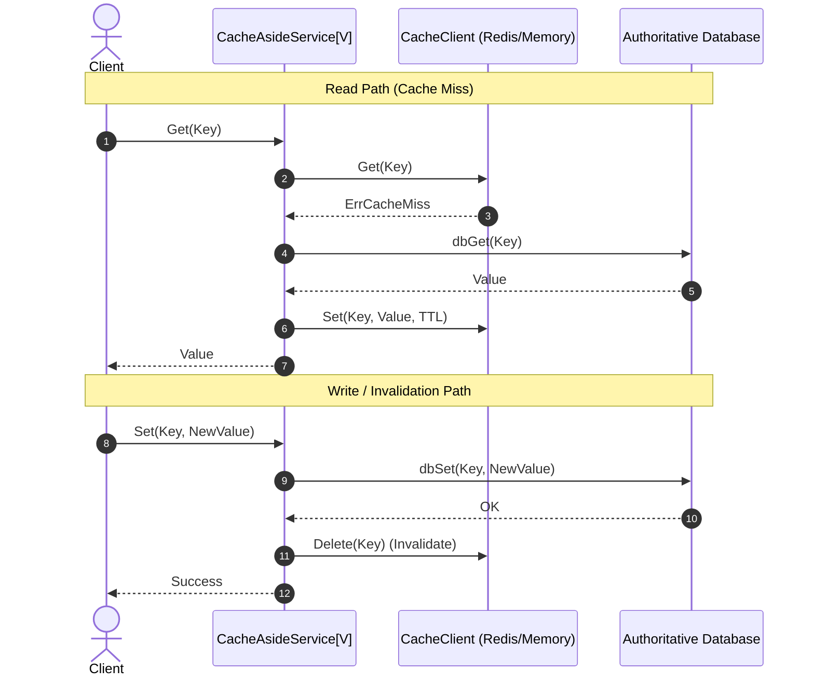

# Cache-Aside (Lazy Loading) Pattern

## 1. Overview & Concept
The **Cache-Aside** pattern (also known as **Lazy Loading**) is the foundational caching design pattern for distributed backend and microservice architectures. In this pattern, the application code directly orchestrates interactions between the cache (e.g., Redis, Memcached, or an in-memory cache) and the authoritative database.

When reading data, the application queries the cache first:
- **Cache Hit**: The cached value is returned immediately, bypassing the database.
- **Cache Miss**: The application loads the authoritative data from the database, stores it in the cache with a Time-To-Live (TTL), and returns the result.

When mutating data (`INSERT`, `UPDATE`, `DELETE`), the application writes directly to the primary database and **invalidates (deletes)** the corresponding cache key rather than attempting to update the cache in place.

---

## 2. Production Problem & Failure Modes (Why do we need this in high-scale backends?)

### 1. Database Bottlenecks on High Read Volume
Without a caching layer, every read operation hits the relational database. Under heavy traffic (e.g., thousands of requests per second for hot product or user records), disk I/O, CPU, and connection pool capacity are quickly exhausted, leading to high p99 latency spikes and cascading outages.

### 2. The Write-Update Race Condition (Stale Overwrites)
If an application attempts to update the cache on writes (`cache.Set(key, newVal)`) instead of invalidating it (`cache.Delete(key)`), concurrent writes create irrecoverable race conditions:
```text
Thread 1 (Write A): Writes A to DB --------------> Writes A to Cache (Delayed)
Thread 2 (Write B): Writes B to DB -> Writes B to Cache
Result: DB has B, but Cache has A (Stale forever until TTL expiration)!
```

---

## 3. Architecture & Mechanism (Text/ASCII diagram or sequence)



### ASCII Mechanism Overview
```text
+-------------------------------------------------------------------------------+
|                             Cache-Aside Flow                                  |
|                                                                               |
|  [Read Request]                                                               |
|         |                                                                     |
|         v                                                                     |
|    Check Cache ----- Hit ------> Return Cached Value                          |
|         |                                                                     |
|       Miss                                                                    |
|         v                                                                     |
|    Read from DB -> Write to Cache (with TTL) -> Return Value                  |
|                                                                               |
|  [Write Request]                                                              |
|         |                                                                     |
|         v                                                                     |
|    Write to DB -> Delete Key from Cache (Invalidate) -> Return Success        |
+-------------------------------------------------------------------------------+
```

---

## 4. Production Hardening & Trade-offs (Edge cases, pitfalls, performance considerations)

### Production Hardening Strategies
1. **Invalidate (Delete) on Write**: Always delete the cache key rather than updating it during mutations to prevent write-race inconsistencies.
2. **Deterministic Error Handling**: Treat cache operational failures (e.g., Redis timeout) as graceful cache misses rather than failing the client request, allowing reads to fall back to the database.
3. **Bounded TTLs**: Always set an explicit TTL on every cached item to prevent abandoned keys from consuming cache RAM indefinitely.
4. **Post-Commit Invalidation**: Ensure cache invalidation executes after the database transaction has successfully committed; otherwise, a rolled-back transaction would leave the cache invalidated, or a fast concurrent read could repopulate the cache with stale pre-commit data.

### Trade-offs & Pitfalls
- **Cold Start Latency**: On initial deployment or key expiration, the first request experiences cache miss latency while fetching from the database.
- **Cache Eviction Pressure**: Cache instances must have appropriately configured memory limits and eviction policies (e.g., `allkeys-lru`).

---

## 5. Implementation Reference & Code Usage (Grounded in the repository's Go code)

In `patterns/14_caching/cache_aside.go`, `CacheAsideService[V]` manages type-safe cache-aside operations:

```go
package caching

import (
	"context"
	"errors"
	"fmt"
	"sync"
	"time"
)

var ErrCacheMiss = errors.New("cache miss")

type CacheClient[V any] interface {
	Get(ctx context.Context, key string) (V, error)
	Set(ctx context.Context, key string, value V, ttl time.Duration) error
	Delete(ctx context.Context, key string) error
}

type CacheAsideService[V any] struct {
	cache CacheClient[V]
	dbGet func(ctx context.Context, key string) (V, error)
	dbSet func(ctx context.Context, key string, val V) error
	ttl   time.Duration
}

func NewCacheAsideService[V any](
	cache CacheClient[V],
	ttl time.Duration,
	dbGet func(ctx context.Context, key string) (V, error),
	dbSet func(ctx context.Context, key string, val V) error,
) *CacheAsideService[V] {
	return &CacheAsideService[V]{
		cache: cache,
		ttl:   ttl,
		dbGet: dbGet,
		dbSet: dbSet,
	}
}

func (s *CacheAsideService[V]) Get(ctx context.Context, key string) (V, error) {
	if val, err := s.cache.Get(ctx, key); err == nil {
		return val, nil
	}

	// Cache miss -> Fetch from DB
	val, err := s.dbGet(ctx, key)
	if err != nil {
		var zero V
		return zero, fmt.Errorf("db fetch error: %w", err)
	}

	// Populate cache
	_ = s.cache.Set(ctx, key, val, s.ttl)

	return val, nil
}

func (s *CacheAsideService[V]) Set(ctx context.Context, key string, val V) error {
	if err := s.dbSet(ctx, key, val); err != nil {
		return fmt.Errorf("db update failed: %w", err)
	}

	// Invalidate cache
	return s.cache.Delete(ctx, key)
}
```

### Usage Example
```go
memCache := caching.NewMemoryCache[UserProfile]()
service := caching.NewCacheAsideService[UserProfile](
    memCache,
    15*time.Minute,
    func(ctx context.Context, key string) (UserProfile, error) {
        return fetchUserFromSQL(ctx, key)
    },
    func(ctx context.Context, key string, val UserProfile) error {
        return updateUserInSQL(ctx, key, val)
    },
)

user, err := service.Get(ctx, "user_42")
```
