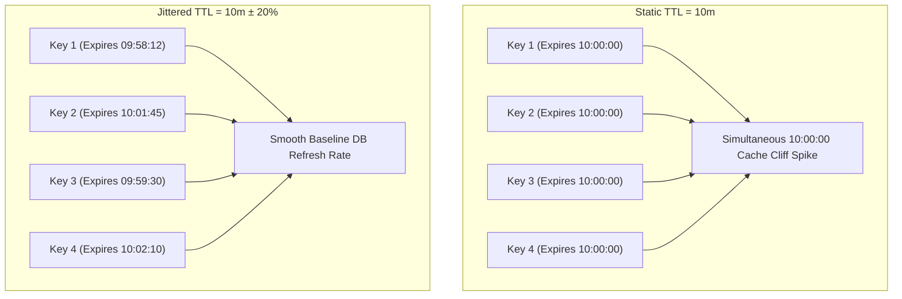

# Jittered TTL (Cache Expiration Desynchronization) Pattern

## 1. Overview & Concept
The **Jittered TTL** pattern applies randomized variation (jitter) to the Time-To-Live expiration durations of cached items. Instead of assigning a static, deterministic TTL (e.g., exactly `10 * time.Minute`) to every cache entry, the application calculates a randomized delta around the base duration (e.g., `baseTTL ± 20%`).

In high-scale distributed backend architectures, background warmers, bulk ingestion pipelines, or service restarts frequently insert tens of thousands of records into Redis or Memcached within a short time window. If all these entries share an identical static TTL, they will all expire simultaneously in a synchronized burst. Jittered TTL desynchronizes key expirations, smoothing out database query volume into a flat, predictable baseline.

---

## 2. Production Problem & Failure Modes (Why do we need this in high-scale backends?)

### 1. The Synchronized Cache Expiration Cliff
Imagine a deployment where a cron job warms the cache for 100,000 active catalog items at `04:00:00 AM` with a static TTL of 60 minutes.
- Between `04:00:00` and `04:59:59`: 99.9% cache hit rate. Database CPU sits at 5%.
- At `05:00:00 AM`: All 100,000 keys expire at the exact same second.
- At `05:00:01 AM`: Database is hit with 100,000 concurrent cache misses. Database CPU spikes to 100%, queries stall, connection pools exhaust, and services fail health checks.

### 2. Cyclical Traffic Oscillations
Without jitter, systems experience recurring "sawtooth" load patterns: periods of zero database load followed by periodic catastrophic spikes every $N$ minutes matching the cache TTL.

---

## 3. Architecture & Mechanism (Text/ASCII diagram or sequence)



### ASCII Mechanism Overview
```text
+-------------------------------------------------------------------------------+
|                       CalculateJitteredTTL Mechanism                          |
|                                                                               |
|  Formula:                                                                     |
|    maxDelta = baseTTL * jitterRatio (e.g., 10m * 0.20 = 2m)                   |
|    randomDelta in range [-maxDelta, +maxDelta]                                |
|    JitteredTTL = baseTTL + randomDelta -> Uniformly in [8m, 12m]               |
|                                                                               |
|  Load Profile:                                                                |
|  Static TTL Load:   |               |               |  (Dangerous Spikes)     |
|                     +---------------+---------------+                         |
|  Jittered TTL Load: ~~~~~~~~~~~~~~~~~~~~~~~~~~~~~~~ (Smooth Constant Load)    |
+-------------------------------------------------------------------------------+
```

---

## 4. Production Hardening & Trade-offs (Edge cases, pitfalls, performance considerations)

### Production Hardening Strategies
1. **Optimal Jitter Ratio**: A jitter ratio between `10%` and `25%` (e.g., `0.10` to `0.25`) is standard; it provides sufficient temporal dispersion without causing items to expire prematurely or linger excessively.
2. **Hard Upper Bound on Jitter**: Bound maximum allowed jitter ratio (e.g., capping at `0.50`) to prevent misconfigurations from causing negative TTLs or 2x over-caching.
3. **Minimum Expiration Floor**: Ensure the jittered duration never falls below a safe minimum floor (e.g., `time.Second`), preventing immediate zero-second key eviction.
4. **Use Modern Fast PRNG**: Utilize fast, concurrent pseudo-random number generators (such as Go 1.22+ `math/rand/v2`) that avoid global lock contention across goroutines.

### Trade-offs & Pitfalls
- **Slight Temporal Stutter**: Some cache entries expire slightly earlier than the nominal base TTL, while others linger slightly longer, which must be acceptable to the application's consistency requirements.

---

## 5. Implementation Reference & Code Usage (Grounded in the repository's Go code)

In `patterns/14_caching/jittered_ttl.go`, `CalculateJitteredTTL` provides a bounded mathematical calculation:

```go
package caching

import (
	"math/rand/v2"
	"time"
)

func CalculateJitteredTTL(baseTTL time.Duration, jitterRatio float64) time.Duration {
	if baseTTL <= 0 {
		return 0
	}
	if jitterRatio <= 0 {
		return baseTTL
	}
	if jitterRatio > 0.5 {
		jitterRatio = 0.5 // Bound max jitter to ±50%
	}

	maxDelta := float64(baseTTL) * jitterRatio
	// Random float between [-maxDelta, +maxDelta]
	delta := (rand.Float64()*2.0 - 1.0) * maxDelta

	jittered := float64(baseTTL) + delta
	if jittered < float64(time.Second) {
		return time.Second
	}

	return time.Duration(jittered)
}
```

### Usage Example
```go
// Calculate jittered duration around 15 minutes with 20% variance (12m to 18m)
ttl := caching.CalculateJitteredTTL(15*time.Minute, 0.20)

// Store in distributed Redis cache:
_ = redisClient.Set(ctx, "catalog:category_12", categoryData, ttl).Err()
```
