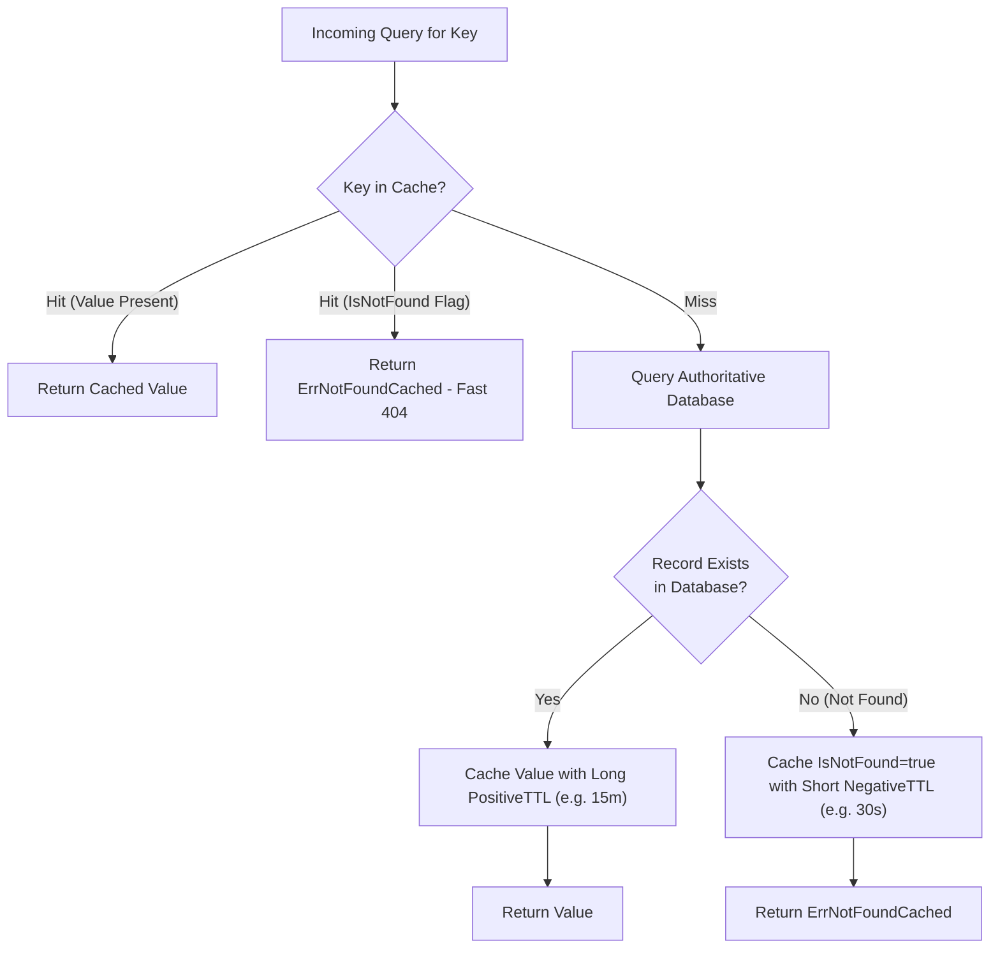

# Negative Caching (Cache Penetration Defense) Pattern

## 1. Overview & Concept
The **Negative Caching** pattern caches the **non-existence** (i.e., "Not Found" / 404 results) of requested resources alongside normal positive cache entries.

In standard caching architectures, when a client queries a key that does not exist in the database, the cache records a "miss", the database returns `sql.ErrNoRows` (or equivalent), and nothing is written to the cache. If malicious actors, scraping bots, or buggy clients repeatedly query non-existent IDs (e.g., `user:random_uuid_999`), 100% of these requests bypass the cache completely and hit the underlying database. This vulnerability is known as **Cache Penetration**.

Negative caching prevents cache penetration by storing a sentinel "not found" record in the cache for missing keys, protected by an **asymmetric, short TTL** (e.g., 30 seconds vs. 15 minutes for real data).

---

## 2. Production Problem & Failure Modes (Why do we need this in high-scale backends?)

### 1. Cache Penetration Denial-of-Service (DoS)
An attacker writes a script generating millions of random non-existent account IDs, product slugs, or authentication tokens. Because none of these keys exist in the cache or the database, the cache provides 0% hit rate, forcing the relational database to perform full index scans for every request until CPU and connection pools are completely saturated.

### 2. High-Frequency Misses on Normal Operations
During viral social spikes or brute-force user search operations, repeated lookups for invalid handles or deleted items repeatedly hit the storage layer unless missing results are cached.

---

## 3. Architecture & Mechanism (Text/ASCII diagram or sequence)



### ASCII Mechanism Overview
```text
+-------------------------------------------------------------------------------+
|                       Negative Caching Storage Model                          |
|                                                                               |
|  Key: "user:valid_101"   -> { Value: UserData, IsNotFound: false } (TTL: 15m) |
|  Key: "user:invalid_999" -> { Value: nil,      IsNotFound: true  } (TTL: 30s) |
|                                                                               |
|  Subsequent request for "user:invalid_999":                                   |
|  -> Cache Hit with IsNotFound=true -> Returns ErrNotFoundCached (0 DB Hits!)  |
+-------------------------------------------------------------------------------+
```

---

## 4. Production Hardening & Trade-offs (Edge cases, pitfalls, performance considerations)

### Production Hardening Strategies
1. **Asymmetric Short TTL for Negative Hits**: Keep the negative TTL substantially shorter (e.g., 15s to 60s) than positive TTL (e.g., 10m to 24h). This limits database load during spikes while minimizing the stale 404 window if an entity with that key is legitimately created shortly afterward.
2. **Proactive Invalidation on Creation**: When a new resource is created (`POST /users/invalid_999`), explicitly delete or overwrite any cached negative entry to eliminate even the short 30-second stale 404 window.
3. **Pair with Bloom Filters**: For massive keyspaces, use a **Bloom Filter** at the API gateway layer to filter out 99%+ of non-existent IDs before they even reach the negative cache or database.

### Trade-offs & Pitfalls
- **Cache Memory Consumption**: Caching millions of random non-existent keys can consume significant cache memory. Always combine negative caching with a Bounded LRU cache or maxmemory-eviction policy.

---

## 5. Implementation Reference & Code Usage (Grounded in the repository's Go code)

In `patterns/14_caching/negative_caching.go`, `NegativeCache[T]` wraps generic values with existence metadata and asymmetric TTL management:

```go
package caching

import (
	"context"
	"errors"
	"time"
)

var ErrNotFoundCached = errors.New("resource not found (cached)")

type CacheEntry[T any] struct {
	Value      T
	IsNotFound bool
}

type NegativeCache[T any] struct {
	cache       CacheClient[CacheEntry[T]]
	positiveTTL time.Duration
	negativeTTL time.Duration
}

func NewNegativeCache[T any](cache CacheClient[CacheEntry[T]], positiveTTL, negativeTTL time.Duration) *NegativeCache[T] {
	if positiveTTL <= 0 {
		positiveTTL = 10 * time.Minute
	}
	if negativeTTL <= 0 {
		negativeTTL = 30 * time.Second
	}

	return &NegativeCache[T]{
		cache:       cache,
		positiveTTL: positiveTTL,
		negativeTTL: negativeTTL,
	}
}

func (c *NegativeCache[T]) GetOrFetch(
	ctx context.Context,
	key string,
	fetchFn func(ctx context.Context) (val T, notFound bool, err error),
) (T, error) {
	entry, err := c.cache.Get(ctx, key)
	if err == nil {
		if entry.IsNotFound {
			var zero T
			return zero, ErrNotFoundCached
		}
		return entry.Value, nil
	}

	// Fetch from source
	val, notFound, err := fetchFn(ctx)
	if err != nil {
		var zero T
		return zero, err
	}

	if notFound {
		// Store negative entry with short TTL
		_ = c.cache.Set(ctx, key, CacheEntry[T]{IsNotFound: true}, c.negativeTTL)
		var zero T
		return zero, ErrNotFoundCached
	}

	// Store positive entry with standard TTL
	_ = c.cache.Set(ctx, key, CacheEntry[T]{Value: val, IsNotFound: false}, c.positiveTTL)
	return val, nil
}
```

### Usage Example
```go
memCache := caching.NewMemoryCache[caching.CacheEntry[*UserProfile]]()
negCache := caching.NewNegativeCache[*UserProfile](memCache, 15*time.Minute, 30*time.Second)

user, err := negCache.GetOrFetch(ctx, "user_nonexistent_99", func(ctx context.Context) (*UserProfile, bool, error) {
    u, err := db.FindUser(ctx, "user_nonexistent_99")
    if errors.Is(err, sql.ErrNoRows) {
        return nil, true, nil // notFound = true
    }
    return u, false, err
})
// err == caching.ErrNotFoundCached on subsequent lookups within 30s
```
