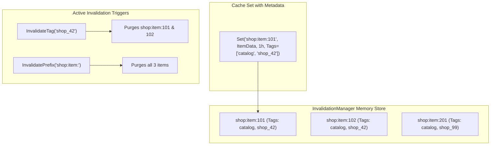

# TTL and Tag-Based Cache Invalidation Pattern

## 1. Overview & Concept
Cache Invalidation is famously one of the two hardest problems in Computer Science. While passive Time-To-Live (**TTL**) expiration guarantees that stale data is eventually evicted after a temporal deadline, modern high-throughput backends require **active, fine-grained invalidation**.

The **TTL & Invalidation Pattern** combines proactive expiration with **Prefix-based** and **Tag-based (Surrogate Key)** invalidation. Instead of brute-force clearing an entire cache or guessing individual keys across complex relational graphs (e.g., clearing all cached comments, likes, and profile widgets when a user updates their account), cache items are assigned semantic metadata tags at insertion time. Mutating operations can then purge hundreds of interdependent cache entries instantaneously with a single tag invalidation call.

---

## 2. Production Problem & Failure Modes (Why do we need this in high-scale backends?)

### 1. The Long-Tail Stale Data Window
With passive TTL-only caching, if an administrator updates a mission-critical system policy or product price with a 2-hour TTL, users continue seeing incorrect or legally non-compliant prices for up to 120 minutes.

### 2. The Granularity Paradox
- **Too Coarse (`FLUSHALL`)**: Flushing the entire cache causes an instantaneous 100% cache miss spike, collapsing the database under thundering herd load.
- **Too Fine (Single Key Delete)**: Deleting only `user:42` leaves `user:42:orders`, `user:42:profile`, and `tenant:10:users` stale across the distributed cache.

---

## 3. Architecture & Mechanism (Text/ASCII diagram or sequence)



### ASCII Structure Overview
```text
+-------------------------------------------------------------------------------+
|                       InvalidationManager Cache Table                         |
|                                                                               |
|  Key: "post:100:comment:1"  -> Value | TTL: +1h | Tags: ["post_100", "user_5"]|
|  Key: "post:100:comment:2"  -> Value | TTL: +1h | Tags: ["post_100", "user_8"]|
|  Key: "post:100:metadata"   -> Value | TTL: +1h | Tags: ["post_100"]          |
|                                                                               |
|  Trigger: InvalidateTag("post_100") -> Atomically deletes all 3 keys!         |
|  Trigger: InvalidatePrefix("post:100:") -> Atomically deletes comment keys!   |
+-------------------------------------------------------------------------------+
```

---

## 4. Production Hardening & Trade-offs (Edge cases, pitfalls, performance considerations)

### Production Hardening Strategies
1. **Hierarchical Key Namespaces**: Structure cache keys using consistent semantic namespaces delimited by colons (`<namespace>:<resource_id>:<subresource>`, e.g., `shop:tenant_42:product:991`). This enables clean `InvalidatePrefix("shop:tenant_42:")` upon tenant data events.
2. **Reverse Tag Indexing**: In distributed stores (like Redis), maintain secondary sets (`SADD tag:shop_42 key1 key2`) or use Redis versioned keys / hash-tags so tag invalidation executes in $O(M)$ time rather than full keyspace scans ($O(N)$).
3. **Passive TTL Defense-in-Depth**: Always keep a baseline TTL (e.g., 1–24 hours) even with active tag invalidation, guaranteeing that orphaned keys from missed events eventually clean themselves up.

### Trade-offs & Pitfalls
- **Metadata Memory Overhead**: Storing tag slices with every cache entry increases RAM usage per key by roughly 15–30%.
- **Lock Contention on Invalidation**: Iterating maps during mass invalidation must be fast to avoid stalling concurrent readers.

---

## 5. Implementation Reference & Code Usage (Grounded in the repository's Go code)

In `patterns/14_caching/ttl_invalidation.go`, `InvalidationManager` manages TTL checking, prefix matching, and tag invalidation:

```go
package caching

import (
	"strings"
	"sync"
	"time"
)

type taggedItem struct {
	value     any
	tags      []string
	expiresAt time.Time
}

type InvalidationManager struct {
	mu    sync.RWMutex
	items map[string]*taggedItem
}

func NewInvalidationManager() *InvalidationManager {
	return &InvalidationManager{
		items: make(map[string]*taggedItem),
	}
}

func (m *InvalidationManager) Set(key string, val any, ttl time.Duration, tags ...string) {
	m.mu.Lock()
	defer m.mu.Unlock()

	m.items[key] = &taggedItem{
		value:     val,
		tags:      tags,
		expiresAt: time.Now().Add(ttl),
	}
}

func (m *InvalidationManager) Get(key string) (any, bool) {
	m.mu.RLock()
	defer m.mu.RUnlock()

	item, ok := m.items[key]
	if !ok || time.Now().After(item.expiresAt) {
		return nil, false
	}
	return item.value, true
}

func (m *InvalidationManager) InvalidatePrefix(prefix string) int {
	m.mu.Lock()
	defer m.mu.Unlock()

	count := 0
	for k := range m.items {
		if strings.HasPrefix(k, prefix) {
			delete(m.items, k)
			count++
		}
	}
	return count
}

func (m *InvalidationManager) InvalidateTag(tag string) int {
	m.mu.Lock()
	defer m.mu.Unlock()

	count := 0
	for k, item := range m.items {
		for _, t := range item.tags {
			if t == tag {
				delete(m.items, k)
				count++
				break
			}
		}
	}
	return count
}
```

### Usage Example
```go
mgr := caching.NewInvalidationManager()

// Store products with category tags
mgr.Set("product:101", ProductData{Name: "Keyboard"}, 2*time.Hour, "electronics", "peripherals")
mgr.Set("product:102", ProductData{Name: "Mouse"}, 2*time.Hour, "electronics", "peripherals")

// When category 'peripherals' updates, purge all related items instantly:
deletedCount := mgr.InvalidateTag("peripherals") // deletes product:101 and product:102
```
