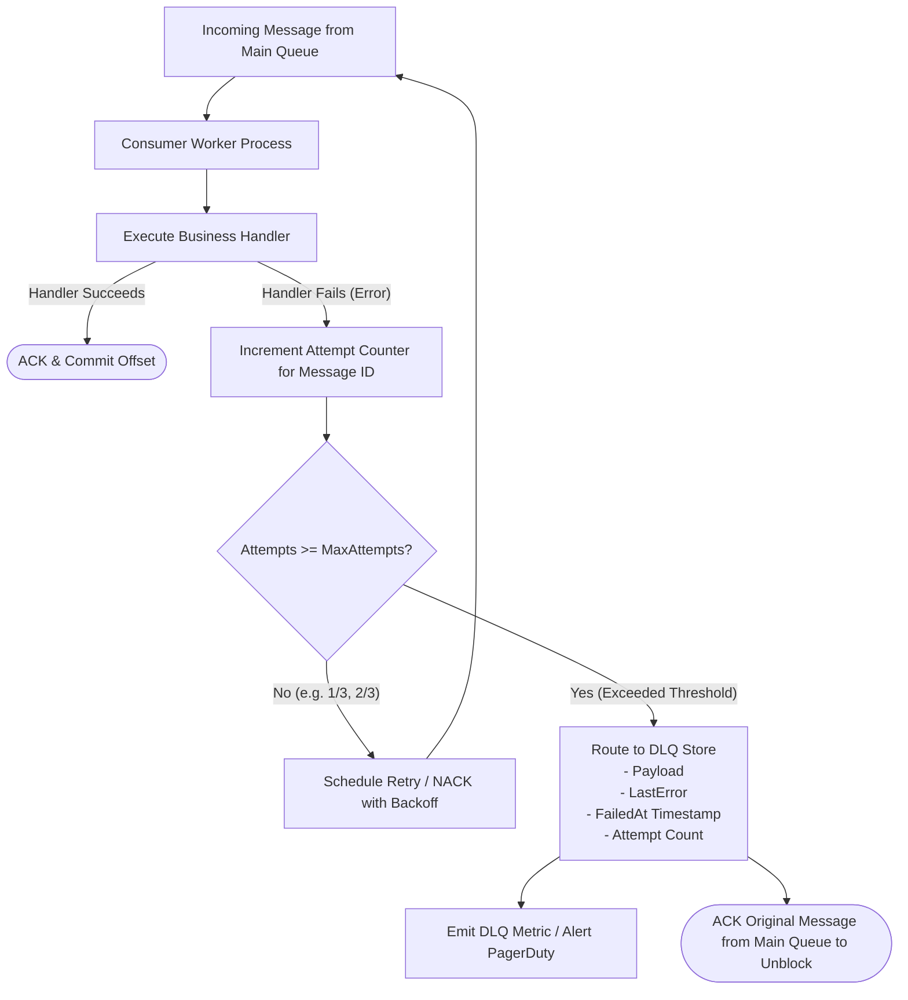

# Dead-Letter Queue (DLQ) & Poison Pill Isolation Pattern

## Overview & Definition
The **Dead-Letter Queue (DLQ)** pattern provides a fault-tolerant safety mechanism for asynchronous message processing pipelines. A "poison pill" message is an invalid, unparseable, or systematically failing message (e.g., malformed JSON schema, negative currency values violating domain constraints, or corrupted data payloads) that triggers an unhandled error or panic every time a consumer attempts to process it.

Without a DLQ, consumer workers that reject or NACK poison messages enter an infinite loop: the message is immediately redelivered, fails again, is redelivered again, and creates **Head-of-Line (HoL) blocking**, halting the processing of all valid messages behind it. 

The Dead-Letter Queue pattern tracks processing attempts per message. Once a message exceeds a predefined retry threshold (`maxAttempts`), the system automatically diverts the message and its failure diagnostic metadata into an isolated quarantine queue (the DLQ), unblocking the main pipeline.

---

## Problem Statement (Failure Scenarios Without This Pattern)

### 1. Head-of-Line (HoL) Blocking and Queue Stalling
In strictly ordered message partitions (e.g., Kafka partitions or FIFO SQS queues), if a consumer encounters a malformed payload on message #42, it cannot advance its commit offset to #43. The entire partition stalls completely, blocking thousands of subsequent valid customer orders.

### 2. Consumer Crash Loops and Resource Exhaustion
If a poison pill message triggers an unhandled memory allocation panic or CPU-spinning regex failure, every worker pod that pulls the message crashes immediately. As Kubernetes restarts each pod, they all repeatedly pull the same fatal message, causing the entire consumer deployment to enter `CrashLoopBackOff`.

---

## Architectural Mechanism & Flow



---

## Production Best Practices & Pitfalls

### Best Practices
- **Rich Failure Context in DLQ**: When routing a message to the DLQ, preserve the original payload, message headers, stack trace, timestamp, and target consumer version in the dead-letter envelope.
- **Alerting on DLQ Ingestion**: Set up proactive Prometheus alerts on the rate of DLQ ingestion (`rate(dlq_messages_total[5m]) > 0`) to immediately notify engineers of upstream schema drift or downstream outages.
- **Automated DLQ Replay Tools**: Build administrative CLI tooling or automated replay scripts to allow engineers to re-inject fixed DLQ messages back into the main queue once bugs or schema mismatches are resolved.
- **Exponential Backoff on Retries**: Apply exponential backoff and jitter between retry attempts prior to DLQ routing to allow transient downstream service outages to recover.

### Pitfalls to Avoid
- **Routing Transient Errors to DLQ on First Failure**: Ensure the retry budget (`maxAttempts = 3` to `5`) is utilized for transient network hiccups before permanently banishing a message to the DLQ.
- **Ignoring DLQ Message Retention**: Ensure the DLQ itself has an adequate retention policy (e.g., 14 days on SQS/Kafka DLQs) so messages are not silently purged before engineers can inspect them.

---

## Code Walkthrough & Usage

In `patterns/15_messaging/dead_letter_queue.go`, `DLQManager` handles bounded retries and isolation:

```go
type DeadLetterEntry struct {
    Message   Message
    LastError string
    Attempts  int
    FailedAt  time.Time
}

type DLQManager struct {
    mu          sync.Mutex
    maxAttempts int
    dlqStore    []DeadLetterEntry
    attempts    map[string]int
}

func NewDLQManager(maxAttempts int) *DLQManager {
    if maxAttempts <= 0 {
        maxAttempts = 3
    }
    return &DLQManager{
        maxAttempts: maxAttempts,
        dlqStore:    make([]DeadLetterEntry, 0),
        attempts:    make(map[string]int),
    }
}
```

### Poison Pill Detection & Routing
```go
func (d *DLQManager) ProcessWithDLQ(
    ctx context.Context,
    msg Message,
    handler func(ctx context.Context, m Message) error,
) error {
    d.mu.Lock()
    d.attempts[msg.ID]++
    currAttempts := d.attempts[msg.ID]
    d.mu.Unlock()

    err := handler(ctx, msg)
    if err == nil {
        d.mu.Lock()
        delete(d.attempts, msg.ID) // Clear attempt tracking on success
        d.mu.Unlock()
        return nil
    }

    // Check if message reached maximum allowable retry attempts
    if currAttempts >= d.maxAttempts {
        d.mu.Lock()
        defer d.mu.Unlock()

        // Quarantine poison message into DLQ with diagnostic error details
        d.dlqStore = append(d.dlqStore, DeadLetterEntry{
            Message:   msg,
            LastError: err.Error(),
            Attempts:  currAttempts,
            FailedAt:  time.Now(),
        })
        delete(d.attempts, msg.ID)

        return fmt.Errorf("message %s exceeded max retries (%d) and was routed to DLQ: %w", msg.ID, d.maxAttempts, err)
    }

    return fmt.Errorf("processing attempt %d/%d failed: %w", currAttempts, d.maxAttempts, err)
}
```
