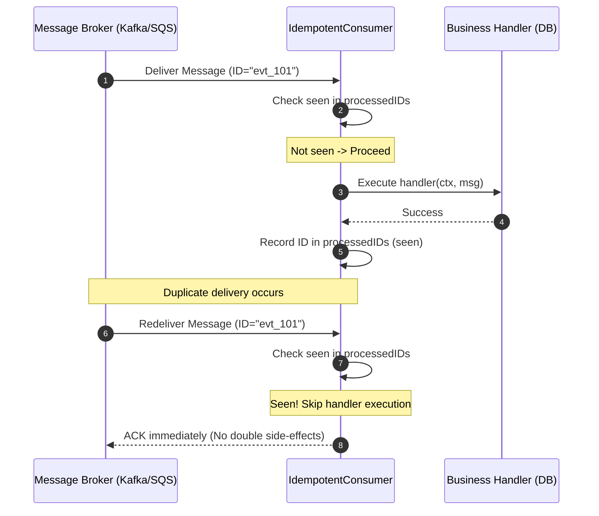

# Idempotent Consumer Pattern

## 1. Overview & Concept
The **Idempotent Consumer** pattern guarantees that processing a message multiple times produces the exact same system state as processing it exactly once ($f(f(x)) = f(x)$).

In distributed message brokers (such as Apache Kafka, RabbitMQ, AWS SQS, and NATS JetStream), message delivery guarantees are almost universally **at-least-once**. Network retries, consumer group rebalances, TCP disconnections during ACK delivery, and broker leader failovers routinely result in identical messages being delivered two or more times to consumer instances.

The Idempotent Consumer pattern introduces a deterministic deduplication mechanism (using unique message IDs, natural business idempotency keys, or database constraint tables) to safely identify and ignore duplicate deliveries without re-executing non-idempotent side effects.

---

## 2. Production Problem & Failure Modes (Why do we need this in high-scale backends?)

### 1. Financial and Domain State Corruption via Duplicate Execution
Consider a payment processing consumer handling `ChargePaymentEvent`:
1. Consumer receives event for Order #101, charges the customer $100 via Stripe, and inserts a ledger record.
2. Consumer attempts to ACK Kafka, but a transient network hiccup causes an ACK timeout.
3. Kafka redelivers `ChargePaymentEvent` (Order #101) to a second consumer pod.
4. **Without Idempotency**: The customer is charged a second time ($200 total), and duplicate inventory is deducted.

### 2. Phantom Inventory Deductions & Event Cascades
If inventory deduction events are replayed without deduplication, available stock drops below zero or reserves units that were never purchased.

---

## 3. Architecture & Mechanism (Text/ASCII diagram or sequence)



### ASCII Mechanism Overview
```text
+-------------------------------------------------------------------------------+
|                           IdempotentConsumer Flow                             |
|                                                                               |
|  Incoming Message: ID="evt_abc"                                               |
|         |                                                                     |
|         v                                                                     |
|    IsProcessed("evt_abc")?                                                    |
|         |                                                                     |
|         +-- Yes (Duplicate) --> Log info & ACK broker immediately (Skip)      |
|         |                                                                     |
|         +-- No (First Time)                                                   |
|                 |                                                             |
|                 v                                                             |
|         Execute handler(ctx, msg)                                             |
|                 |                                                             |
|                 v (On Success)                                                |
|         Mark "evt_abc" as processed -> ACK broker                             |
+-------------------------------------------------------------------------------+
```

---

## 4. Production Hardening & Trade-offs (Edge cases, pitfalls, performance considerations)

### Production Hardening Strategies
1. **Natural Business Keys vs UUIDs**: Prefer deterministic business keys (e.g., `order_id + event_type + version`) over random message UUIDs generated by client loggers.
2. **Distributed Deduplication Storage**: In production clusters, back the deduplication store with Redis (`SET key "1" NX EX 86400`) or relational database uniqueness constraints (`INSERT INTO processed_events (event_id) VALUES ($1) ON CONFLICT DO NOTHING`) rather than in-memory maps alone.
3. **Deduplication Key TTL (Retention Window)**: Retain processed message IDs for a bounded retention window (e.g., 7 days) matching or exceeding the message broker's maximum retention period.
4. **Atomic Processing with Inbox Pattern**: For mission-critical database mutations, execute the business insert and the idempotency check within the **same local database transaction**.

### Trade-offs & Pitfalls
- **Storage Overhead**: Tracking processed IDs requires storage capacity proportional to event throughput ($N \text{ events/day} \times \text{Key Size} \times \text{Retention Days}$).

---

## 5. Implementation Reference & Code Usage (Grounded in the repository's Go code)

In `patterns/15_messaging/idempotent_consumer.go`, `IdempotentConsumer` provides concurrency-safe deduplication checking and recording:

```go
package messaging

import (
	"context"
	"sync"
	"time"
)

type Message struct {
	ID        string
	Payload   string
	Timestamp time.Time
}

type IdempotentConsumer struct {
	mu           sync.RWMutex
	processedIDs map[string]time.Time
}

func NewIdempotentConsumer() *IdempotentConsumer {
	return &IdempotentConsumer{
		processedIDs: make(map[string]time.Time),
	}
}

func (c *IdempotentConsumer) ProcessMessage(ctx context.Context, msg Message, handler func(ctx context.Context, m Message) error) error {
	c.mu.Lock()
	if _, seen := c.processedIDs[msg.ID]; seen {
		c.mu.Unlock()
		// Duplicate delivery detected: skip processing idempotently
		return nil
	}
	c.mu.Unlock()

	// Execute business logic
	if err := handler(ctx, msg); err != nil {
		return err
	}

	// Mark as processed
	c.mu.Lock()
	c.processedIDs[msg.ID] = time.Now()
	c.mu.Unlock()

	return nil
}

func (c *IdempotentConsumer) IsProcessed(id string) bool {
	c.mu.RLock()
	defer c.mu.RUnlock()
	_, seen := c.processedIDs[id]
	return seen
}
```

### Usage Example
```go
consumer := messaging.NewIdempotentConsumer()

msg := messaging.Message{
    ID:        "order_created_1001",
    Payload:   `{"order_id": "1001", "amount": 2500}`,
    Timestamp: time.Now(),
}

// First delivery executes business handler:
err := consumer.ProcessMessage(ctx, msg, func(ctx context.Context, m messaging.Message) error {
    return processOrder(ctx, m.Payload)
})

// Duplicate delivery skips handler cleanly:
_ = consumer.ProcessMessage(ctx, msg, func(ctx context.Context, m messaging.Message) error {
    return processOrder(ctx, m.Payload) // NEVER reached
})
```
