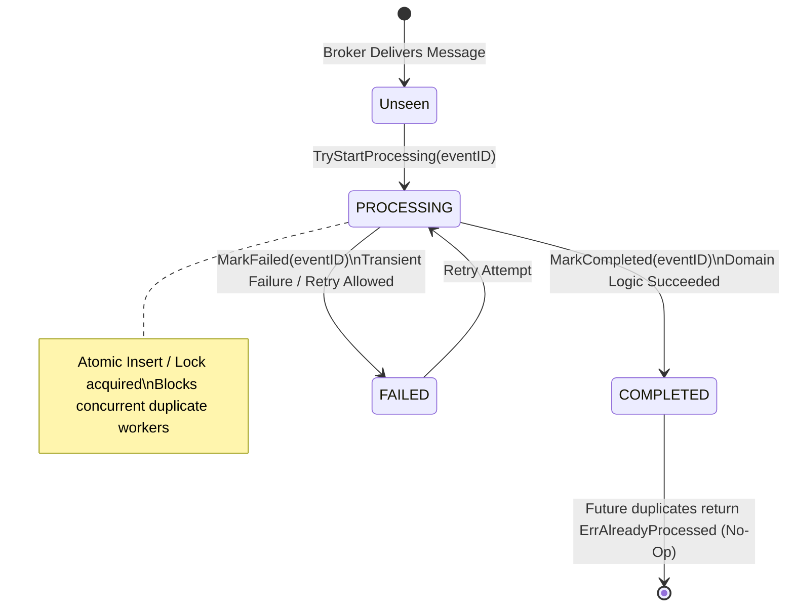

# Transactional Inbox Pattern

## Overview & Definition
The **Transactional Inbox Pattern** is the consumer-side counterpart to the Transactional Outbox pattern. It provides robust, database-backed deduplication and state machine tracking for incoming asynchronous events delivered via at-least-once message brokers (e.g., Apache Kafka, RabbitMQ, SQS).

When a message broker redelivers an event or when multiple concurrent consumer instances pick up duplicate deliveries of the same message simultaneously, the Inbox Pattern uses an `inbox` table with atomic state transitions (`PROCESSING`, `COMPLETED`, `FAILED`). This guarantees that incoming messages are processed **exactly once** at the domain level, prevents concurrent race conditions across competing workers, and provides clean failure recovery semantics.

---

## Problem Statement (Failure Scenarios Without This Pattern)

### 1. Concurrent Duplicate Execution Race Condition
Consider two worker pods (`Pod A` and `Pod B`) that simultaneously receive duplicate copies of `PaymentSettledEvent(InvoiceID=42)`:
1. `Pod A` checks its local in-memory deduplication cache: "Not seen".
2. `Pod B` checks its local in-memory deduplication cache: "Not seen".
3. Both pods run the business logic simultaneously and issue two separate invoice settlement credits to the customer's ledger.

### 2. Failure Recovery and Zombie Retries
If an in-memory deduplication map marks an event as "seen" at the start of execution, but the worker crashes halfway through due to an Out-of-Memory error:
- The broker redelivers the message to a surviving worker.
- If the state was not transactionally tracked, the surviving worker may either skip the partially processed message (causing data loss) or execute from the beginning without knowing what prior steps completed.

---

## Architectural Mechanism & Flow



---

## Production Best Practices & Pitfalls

### Best Practices
- **Atomic Database Locks**: Implement `TryStartProcessing` using relational database uniqueness constraints:
  ```sql
  INSERT INTO inbox (event_id, status, processed_at)
  VALUES ($1, 'PROCESSING', NOW())
  ON CONFLICT (event_id) DO NOTHING;
  ```
- **Stale Processing Heartbeats / Leases**: If a worker crashes while a message is in the `PROCESSING` state, the record might remain locked indefinitely. Include a lease expiration (`last_heartbeat < NOW() - INTERVAL '5 minutes'`) allowing other workers to safely adopt stalled jobs.
- **Transactional Domain Mutation**: Perform domain entity updates and update `inbox.status = 'COMPLETED'` in the **same database transaction**.
- **Retention and Pruning**: Clean up historical completed inbox records older than your broker's maximum retention window (e.g., 14 days) via background vacuum jobs.

### Pitfalls to Avoid
- **In-Memory-Only Inbox Stores**: In-memory maps lose all deduplication state across pod restarts or redeployments; always back the inbox with a persistent datastore (PostgreSQL, MySQL, CockroachDB, or Redis).
- **Ignoring Transient vs Poison Failures**: Transition to `FAILED` for transient network errors (allowing retries) but route to a DLQ when non-retryable domain validation errors occur.

---

## Code Walkthrough & Usage

In `patterns/15_messaging/inbox_pattern.go`, `InboxStore` orchestrates the lifecycle states of incoming events:

```go
type InboxStatus string

const (
    InboxProcessing InboxStatus = "PROCESSING"
    InboxCompleted  InboxStatus = "COMPLETED"
    InboxFailed     InboxStatus = "FAILED"
)

type InboxRecord struct {
    EventID     string
    Status      InboxStatus
    ProcessedAt time.Time
}

type InboxStore struct {
    mu      sync.Mutex
    records map[string]*InboxRecord
}
```

### State-Machine Verification
```go
// TryStartProcessing locks the event ID into PROCESSING state
func (s *InboxStore) TryStartProcessing(ctx context.Context, eventID string) error {
    s.mu.Lock()
    defer s.mu.Unlock()

    rec, exists := s.records[eventID]
    if exists {
        if rec.Status == InboxCompleted {
            return ErrAlreadyProcessed // Skip: already successfully completed
        }
        if rec.Status == InboxProcessing {
            return ErrCurrentlyLocked // Skip: actively processed by another worker
        }
    }

    s.records[eventID] = &InboxRecord{
        EventID:     eventID,
        Status:      InboxProcessing,
        ProcessedAt: time.Now().UTC(),
    }
    return nil
}

// MarkCompleted marks successful business logic execution
func (s *InboxStore) MarkCompleted(ctx context.Context, eventID string) error {
    s.mu.Lock()
    defer s.mu.Unlock()

    rec, ok := s.records[eventID]
    if !ok {
        return errors.New("inbox record not found")
    }

    rec.Status = InboxCompleted
    rec.ProcessedAt = time.Now().UTC()
    return nil
}

// MarkFailed resets the record to FAILED to allow subsequent retries
func (s *InboxStore) MarkFailed(ctx context.Context, eventID string) {
    s.mu.Lock()
    defer s.mu.Unlock()

    if rec, ok := s.records[eventID]; ok {
        rec.Status = InboxFailed
    }
}
```
