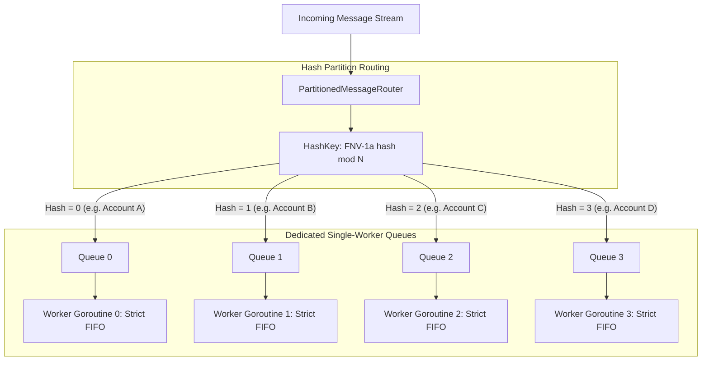

# Partitioned Message Ordering Pattern

## Overview & Definition
The **Partitioned Message Ordering Pattern** provides strict **per-key FIFO (First-In, First-Out) processing guarantees** in high-throughput concurrent systems.

In distributed backend architectures, global message ordering across an entire system is practically impossible to achieve without reducing the processing throughput to a single bottlenecked thread. However, business systems rarely require global ordering; they require **causal ordering per entity** (e.g., all state updates for `User Account #101` or `Order #4002` must be processed strictly in sequence, but `Order #4002` and `Order #8899` can be processed concurrently in any order).

This pattern hashes an entity's `PartitionKey` using a deterministic hashing algorithm (such as FNV-1a or MurmurHash3) to route all messages sharing the same key to a dedicated single-threaded worker queue, achieving high concurrency across independent partitions while preserving 100% deterministic sequence per key.

---

## Problem Statement (Failure Scenarios Without This Pattern)

### 1. The Out-of-Order Entity State Hazard
Consider an account management stream with two rapid consecutive events:
1. `Event 1 (Seq 1)`: `AccountCreated(Status="Active")`
2. `Event 2 (Seq 2)`: `AccountSuspended(Status="Suspended")`

If both events are dispatched to a generic, shared worker pool of 10 concurrent goroutines:
- Worker B picks up `Event 2` and sets status to `Suspended`.
- Worker A experiences a brief GC pause, picks up `Event 1`, and sets status to `Active`.
- **Result**: The suspended account is permanently re-activated due to race condition inversions.

### 2. Global Lock Contention Bottlenecks
Attempting to enforce order by putting a single global mutex across the entire message processor limits total system throughput to a few hundred messages per second, failing to utilize multi-core server hardware.

---

## Architectural Mechanism & Flow



---

## Production Best Practices & Pitfalls

### Best Practices
- **Consistent Partition Keying**: Choose a domain key with high cardinality (e.g., `account_id`, `customer_id`, `device_id`) as the partition key. Avoid low-cardinality keys (e.g., `country_code`), which cause **hot partition skew** where one worker is pegged at 100% CPU while other workers remain idle.
- **Explicit Sequence Numbers in Messages**: Attach monotonic sequence numbers (`Sequence: int64`) or logical clocks to message envelopes so consumers can detect and reject dropped or duplicate frames.
- **Sized Partition Queues**: Assign buffered channels to each partition worker (`make(chan OrderedMessage, 100)`) to absorb temporary processing jitter without blocking the main router.
- **Graceful Partition Shutdown**: Ensure stopping the router closes each partition channel and waits on `sync.WaitGroup` so in-flight ordered messages are fully processed in sequence prior to shutdown.

### Pitfalls to Avoid
- **Reordering Inside the Handler**: Never spawn additional background goroutines *inside* a partition worker handler (`go handle(msg)`), as doing so immediately destroys the strict sequential ordering within that partition.
- **Dynamic Partition Resizing Without Rebalancing**: Changing the number of partitions at runtime without draining queues changes hash modulo results (`hash % N`), causing messages for the same key to momentarily route to two different active workers simultaneously.

---

## Code Walkthrough & Usage

In `patterns/15_messaging/message_ordering.go`, `PartitionedMessageRouter` routes keyed messages to dedicated partition worker loops:

```go
type OrderedMessage struct {
    PartitionKey string
    Sequence     int64
    Payload      string
}

type partitionWorker struct {
    queue chan OrderedMessage
}

type PartitionedMessageRouter struct {
    partitions    []*partitionWorker
    numPartitions int
    wg            sync.WaitGroup
    ctx           context.Context
    cancel        context.CancelFunc
}
```

### Partition Worker Initialization
```go
func NewPartitionedMessageRouter(
    parentCtx context.Context,
    numPartitions int,
    handler func(ctx context.Context, msg OrderedMessage) error,
) *PartitionedMessageRouter {
    if numPartitions <= 0 {
        numPartitions = 4
    }

    ctx, cancel := context.WithCancel(parentCtx)
    router := &PartitionedMessageRouter{
        partitions:    make([]*partitionWorker, numPartitions),
        numPartitions: numPartitions,
        ctx:           ctx,
        cancel:        cancel,
    }

    for i := range numPartitions {
        worker := &partitionWorker{
            queue: make(chan OrderedMessage, 100),
        }
        router.partitions[i] = worker

        router.wg.Add(1)
        go func(w *partitionWorker) {
            defer router.wg.Done()
            for {
                select {
                case <-ctx.Done():
                    return
                case msg, ok := <-w.queue:
                    if !ok {
                        return
                    }
                    // Processed synchronously one-by-one per partition
                    _ = handler(ctx, msg)
                }
            }
        }(worker)
    }

    return router
}
```

### Consistent Key Routing
```go
func (r *PartitionedMessageRouter) Route(msg OrderedMessage) {
    idx := r.hashKey(msg.PartitionKey) % r.numPartitions
    r.partitions[idx].queue <- msg
}

func (r *PartitionedMessageRouter) hashKey(key string) int {
    h := fnv.New32a()
    _, _ = h.Write([]byte(key))
    return int(h.Sum32())
}
```
