# Transactional Outbox Pattern

## Overview & Definition
The **Transactional Outbox Pattern** is the canonical solution for achieving reliable, dual-write consistency across relational databases and asynchronous message brokers (e.g., Apache Kafka, RabbitMQ, AWS SQS) without requiring fragile distributed two-phase commit (2PC) transactions.

In modern event-driven and microservice architectures, a business operation must simultaneously mutate the local relational database (e.g., insert an `orders` row) and publish an event to a message broker (e.g., emit `OrderCreatedEvent`). 

Attempting to update the database and then publish directly to Kafka creates a dangerous **dual-write failure scenario**: if the process crashes or network fails between the two steps, the database commits while the event is lost forever (or vice versa).

The Transactional Outbox pattern solves this by writing the event payload directly into an `outbox` table in the **exact same database transaction** as the business mutation. A dedicated asynchronous background process (or Change Data Capture / Debezium engine) then polls or streams the outbox table, reliably publishes the events to the broker, and updates their status to `PUBLISHED`.

---

## Problem Statement (Failure Scenarios Without This Pattern)

### 1. The Dual-Write Split-Brain
Consider what happens without an outbox table:
```text
Begin Tx -> INSERT into orders -> Commit Tx -> Network blip / Process crash -> Publish to Kafka FAILS
```
- The customer's credit card is charged and the order is saved in the database.
- However, the downstream fulfillment, shipping, and notification microservices never receive the `OrderCreatedEvent`. The order is lost in limbo, requiring manual database reconciliation.

### 2. Phantom Event Publishing (Publish Before Commit)
If an engineer attempts to fix this by publishing to Kafka *before* committing the database transaction:
```text
Publish to Kafka -> Commit Tx FAILS (Unique constraint or DB crash)
```
- Kafka consumers immediately receive the event and attempt to ship the package, but the database transaction rolled back and the order does not exist.

---

## Architectural Mechanism & Flow

```mermaid
sequenceDiagram
    autonumber
    actor Client
    participant Service as Order Service
    participant DB as Relational Database
    participant Relay as OutboxRelayPublisher
    participant Broker as Message Broker (Kafka)

    rect rgb(20, 40, 60)
        Note over Service,DB: 1. ATOMIC LOCAL TRANSACTION
        Client->>Service: CreateOrder(orderData)
        Service->>DB: BEGIN TRANSACTION
        Service->>DB: INSERT INTO orders VALUES (...)
        Service->>DB: INSERT INTO outbox (id, event_type, payload, status='PENDING')
        Service->>DB: COMMIT TRANSACTION (Both saved atomically)
        Service-->>Client: 201 Created
    end

    rect rgb(40, 40, 20)
        Note over Relay,Broker: 2. ASYNC BACKGROUND RELAY
        loop Background Poller / CDC
            Relay->>DB: SELECT * FROM outbox WHERE status='PENDING' LIMIT 50
            DB-->>Relay: Return pending events
            Relay->>Broker: Publish message to Kafka topic
            Broker-->>Relay: Broker ACK (200 OK)
            Relay->>DB: UPDATE outbox SET status='PUBLISHED', published_at=NOW() WHERE id=...
        end
    end
```



---

## Production Best Practices & Pitfalls

### Best Practices
- **Use Change Data Capture (CDC) for Ultra-High Scale**: At high event throughput (>5,000 events/sec), polling an outbox table (`SELECT ... FOR UPDATE SKIP LOCKED`) creates database index bloat. Replace polling relays with log-based CDC tools like **Debezium** reading the PostgreSQL Write-Ahead Log (WAL) or MySQL binlog.
- **Enforce At-Least-Once Delivery**: Because network failures during the `UPDATE outbox SET status='PUBLISHED'` step can cause the relay to publish the same event twice, ensure all downstream consumers implement the **Idempotent Consumer** pattern.
- **Outbox Table Partitioning / Cleanup**: Continuously archive or purge published outbox records (`DELETE FROM outbox WHERE status='PUBLISHED' AND created_at < NOW() - INTERVAL '7 days'`) to maintain compact table and index sizes.
- **JSON / Avro / Protobuf Payloads**: Store standardized serialized binary or JSON schemas with an explicit schema version string in the outbox table.

### Pitfalls to Avoid
- **Holding DB Transactions Open During Broker Publish**: Never try to publish to Kafka inside the local database transaction block. Always write to the outbox table and commit first.
- **Missing Monitoring on Outbox Backlog**: Set alerts on the age of the oldest `PENDING` outbox event (`MAX(NOW() - created_at) > 1 minute`).

---

## Code Walkthrough & Usage

In `patterns/15_messaging/outbox_pattern.go`, `TransactionalOutboxStore` and `OutboxRelayPublisher` illustrate this atomic coordination:

```go
type OutboxStatus string

const (
    StatusPending   OutboxStatus = "PENDING"
    StatusPublished OutboxStatus = "PUBLISHED"
)

type OutboxEvent struct {
    ID            string
    AggregateType string
    AggregateID   string
    EventType     string
    Payload       string
    Status        OutboxStatus
    CreatedAt     time.Time
    PublishedAt   *time.Time
}
```

### Atomic Outbox Persistence
```go
// SaveTx atomically writes the outbox event alongside domain mutations
func (s *TransactionalOutboxStore) SaveTx(ctx context.Context, event *OutboxEvent) error {
    s.mu.Lock()
    defer s.mu.Unlock()

    event.Status = StatusPending
    event.CreatedAt = time.Now().UTC()
    s.outboxEvents[event.ID] = event
    return nil
}
```

### Asynchronous Outbox Relay Publisher
```go
type OutboxRelayPublisher struct {
    store     *TransactionalOutboxStore
    publishFn func(ctx context.Context, event *OutboxEvent) error
}

func (p *OutboxRelayPublisher) Flush(ctx context.Context) (int, error) {
    // 1. Fetch pending batch
    events := p.store.GetPendingEvents(ctx, 50)
    publishedCount := 0

    // 2. Publish each event to message broker
    for _, e := range events {
        if err := p.publishFn(ctx, e); err != nil {
            return publishedCount, err // Abort and retry on next tick
        }
        
        // 3. Mark as published on successful broker confirmation
        _ = p.store.MarkPublished(ctx, e.ID)
        publishedCount++
    }

    return publishedCount, nil
}
```
