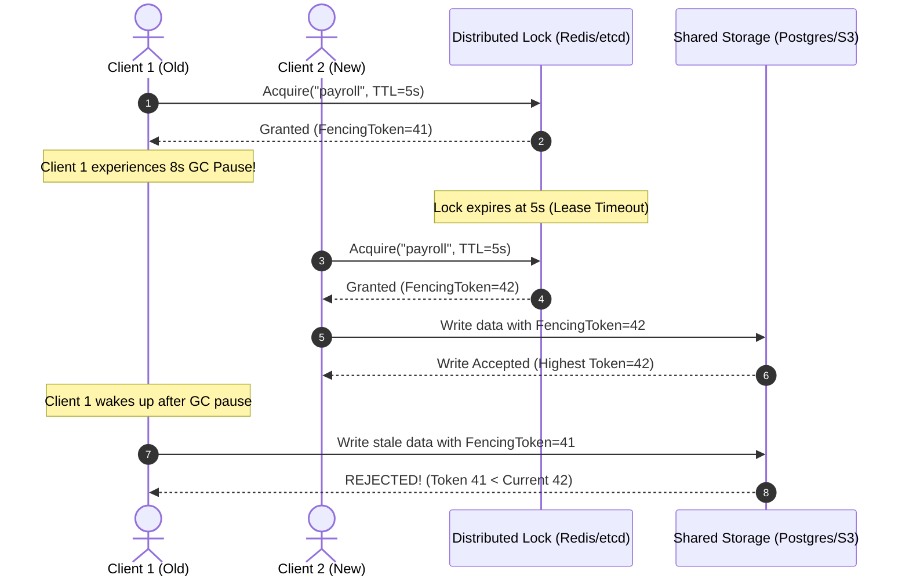

# Distributed Lock (with Fencing Tokens) Pattern

## Overview & Definition
The **Distributed Lock Pattern** coordinates mutual exclusion (mutex) access to shared resources across multiple independent processes, nodes, or Kubernetes pods. In single-process Go programs, `sync.Mutex` protects shared memory. In distributed architectures, however, nodes do not share memory; they must coordinate exclusive access via a distributed consensus datastore (e.g., Redis, etcd, or Consul).

Distributed locks rely on **time-bounded leases (TTL)** to ensure that if a lock holder crashes, network partitions, or is terminated, the lock automatically releases after expiration. Crucially, to defend against Martin Kleppmann's famous distributed lock race conditions (where a client pauses during a long GC cycle or network delay, its lease expires, another client acquires the lock, and the paused client wakes up and executes a conflicting mutation), the lock manager issues **monotonically increasing Fencing Tokens**. The storage layer rejects any mutation carrying an outdated fencing token.

---

## Problem Statement (Failure Scenarios Without This Pattern)

### 1. Concurrent Worker Race Conditions on Critical Jobs
Suppose a cron trigger fires a "Monthly Payroll Settlement" job. In a cluster with 10 pods, if there is no distributed lock, all 10 pods pick up the scheduled task simultaneously, running duplicate wire transfers and corrupting bank ledgers.

### 2. The GC Pause / Network Lag Race Hazard (Why Fencing Tokens Are Critical)
Consider two nodes (`Client 1` and `Client 2`) without fencing tokens:
```text
1. Client 1 acquires Lock (Lease = 10s).
2. Client 1 enters a severe Stop-The-World (STW) GC pause for 15s.
3. At second 10, the lock lease expires.
4. Client 2 acquires Lock and writes to Storage (e.g. Storage Version = 2).
5. At second 15, Client 1 wakes from GC pause, oblivious to the fact that its lease expired.
6. Client 1 writes its stale mutation, overwriting Client 2's authoritative write!
```



---

## Production Best Practices & Pitfalls

### Best Practices
- **Monotonic Fencing Tokens**: Always propagate a monotonically increasing sequence token (`atomic.Int64` or etcd `mod_revision`) from the lock manager to the target storage engine. The storage layer must enforce `WHERE fencing_token > last_fencing_token`.
- **Lock Heartbeat (Renewal Goroutine)**: For operations with uncertain execution times, spawn a background goroutine that periodically extends the lease TTL while the main worker is actively making progress.
- **Safe Release with Ownership Verification**: When releasing a lock, verify that the caller still owns the lock lease before deleting the key (e.g., using Redis Lua script: `if redis.call('get', KEYS[1]) == ARGV[1] then return redis.call('del', KEYS[1]) else return 0 end`).
- **Context-Aware Acquisition**: Support context timeouts and cancellations (`ctx.Done()`) during lock acquisition to avoid blocking callers indefinitely.

### Pitfalls to Avoid
- **Unbounded Operations Inside Locks**: Avoid executing long-running external HTTP API calls inside a distributed lock.
- **Assuming Lock Guarantees Isolation Without Storage Enforcement**: A distributed lock alone cannot protect against split-brain writes during GC pauses without fencing token verification at the storage layer.

---

## Code Walkthrough & Usage

In `patterns/16_distributed/distributed_lock.go`, `DistributedLockManager` enforces lease expiration and atomic fencing tokens:

```go
type LockLease struct {
    Resource     string
    Owner        string
    FencingToken int64
    ExpiresAt    time.Time
}

type DistributedLockManager struct {
    mu           sync.Mutex
    locks        map[string]*LockLease
    fencingToken atomic.Int64
}
```

### Acquiring with Fencing Token Generation
```go
func (m *DistributedLockManager) Acquire(
    ctx context.Context,
    resource, owner string,
    ttl time.Duration,
) (*LockLease, error) {
    m.mu.Lock()
    defer m.mu.Unlock()

    now := time.Now()
    existing, ok := m.locks[resource]
    // If actively held by another owner and not expired, reject
    if ok && now.Before(existing.ExpiresAt) && existing.Owner != owner {
        return nil, ErrLockHeldByOther
    }

    // Generate strictly monotonic fencing token
    fencing := m.fencingToken.Add(1)
    lease := &LockLease{
        Resource:     resource,
        Owner:        owner,
        FencingToken: fencing,
        ExpiresAt:    now.Add(ttl),
    }
    m.locks[resource] = lease

    return lease, nil
}
```

### Safe Ownership Release
```go
func (m *DistributedLockManager) Release(ctx context.Context, resource, owner string) error {
    m.mu.Lock()
    defer m.mu.Unlock()

    existing, ok := m.locks[resource]
    if !ok || existing.Owner != owner {
        // Already expired, adopted, or released by another
        return nil
    }

    delete(m.locks, resource)
    return nil
}
```
