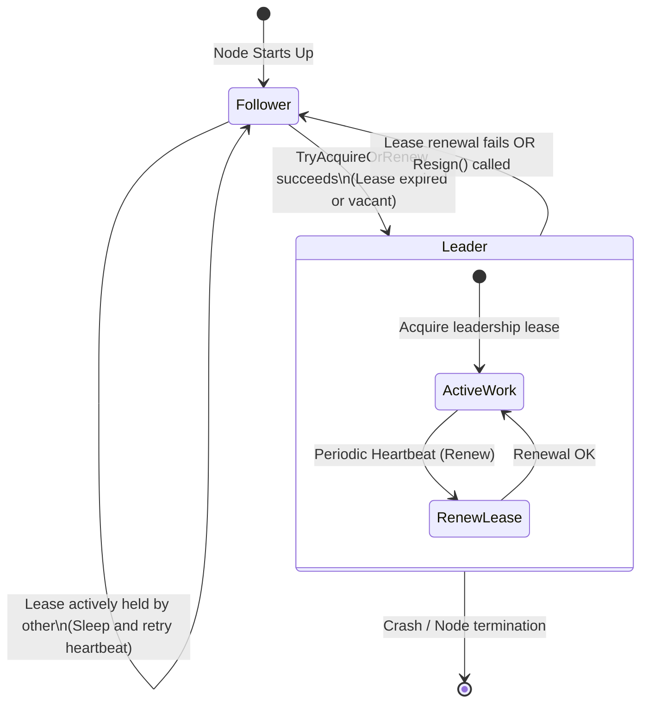

# Lease-Based Leader Election Pattern

## Overview & Definition
The **Leader Election Pattern** designates a single coordinator or primary worker node (the "Leader") among a cluster of homogeneous distributed application instances (the "Followers" or "Candidates"). 

In many backend systems, certain critical workloads cannot be partitioned or run concurrently (e.g., global cron scheduler triggers, database migration orchestrators, stream repartition coordinators, and active-passive failover controllers). 

Rather than deploying a fragile Single Point of Failure (SPOF) with a single instance, teams deploy a highly available multi-node cluster (e.g., 3–5 Kubernetes pods) and use **Lease-Based Leader Election**. The elected leader holds a time-bounded lease that it periodically renews via heartbeats. If the leader crashes, network partitions, or shuts down, the remaining nodes detect lease expiration and elect a new leader automatically.

---

## Problem Statement (Failure Scenarios Without This Pattern)

### 1. The Single Point of Failure (SPOF) Anti-Pattern
If a singleton cron worker pod is deployed with `replicas: 1`, whenever Kubernetes upgrades the node or restarts the container, the entire scheduling pipeline is offline until the new pod completes startup.

### 2. The Split-Brain Dual-Leader Hazard
If election relies on static IP configurations or uncoordinated state without leases, a network partition can cause two different nodes to both believe they are the active leader, executing conflicting mutations simultaneously against external APIs.

---

## Architectural Mechanism & Flow



---

## Production Best Practices & Pitfalls

### Best Practices
- **Lease Duration vs Heartbeat Ratio**: Configure the heartbeat renewal interval to be roughly $\frac{1}{3}$ of the total `leaseDuration` (e.g., heartbeat every 3 seconds for a 10-second lease). This gives the active leader multiple retry attempts to overcome temporary network hiccups before losing leadership.
- **Voluntary Resignation on Graceful Shutdown**: During application shutdown (`SIGTERM`), call `Resign(candidateID)` to immediately clear the lease and allow standby nodes to take over within milliseconds rather than waiting for the lease TTL to expire.
- **Back by Consensus Systems in Production**: In production Kubernetes clusters, back the lease mechanism using Kubernetes `Lease` API (`coordination.k8s.io/v1`), etcd, or Consul sessions with strong consistency.
- **Leader Step-Down Action**: Ensure all leader-only background goroutines listen on a cancellation channel (`<-leaderCtx.Done()`) so they abort immediately when leadership is lost.

### Pitfalls to Avoid
- **Blocking Long Tasks in Heartbeat Goroutines**: Ensure the heartbeat loop runs in an independent goroutine that cannot be blocked by slow business I/O.
- **Split-Brain Writes Without Fencing**: Always pair leader election with fencing tokens or database version constraints if the leader performs mutating storage writes.

---

## Code Walkthrough & Usage

In `patterns/16_distributed/leader_election.go`, `LeaderElector` coordinates lease renewal, leadership checks, and resignation:

```go
type LeaderElector struct {
    mu            sync.RWMutex
    currentLeader string
    leaseExpiry   time.Time
}

func NewLeaderElector() *LeaderElector {
    return &LeaderElector{}
}
```

### Acquiring or Renewing Leadership
```go
func (e *LeaderElector) TryAcquireOrRenew(candidateID string, leaseDuration time.Duration) bool {
    e.mu.Lock()
    defer e.mu.Unlock()

    now := time.Now()

    // 1. Current active leader renews its own lease
    if e.currentLeader == candidateID {
        e.leaseExpiry = now.Add(leaseDuration)
        return true
    }

    // 2. Unclaimed or expired lease: candidate claims leadership
    if e.currentLeader == "" || now.After(e.leaseExpiry) {
        e.currentLeader = candidateID
        e.leaseExpiry = now.Add(leaseDuration)
        return true
    }

    // 3. Active lease held by another candidate
    return false
}
```

### Checking Leadership and Voluntary Resignation
```go
func (e *LeaderElector) IsLeader(candidateID string) bool {
    e.mu.RLock()
    defer e.mu.RUnlock()

    return e.currentLeader == candidateID && time.Now().Before(e.leaseExpiry)
}

// Resign clears leadership immediately during graceful shutdown
func (e *LeaderElector) Resign(candidateID string) {
    e.mu.Lock()
    defer e.mu.Unlock()

    if e.currentLeader == candidateID {
        e.currentLeader = ""
        e.leaseExpiry = time.Time{}
    }
}
```
