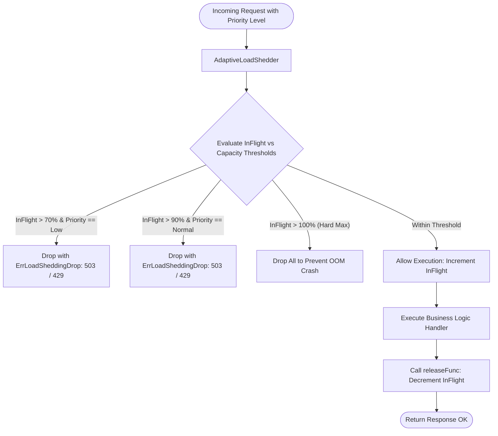

# Adaptive Load Shedding Pattern

## Overview & Definition
The **Adaptive Load Shedding Pattern** protects backend services from catastrophic failure and cascading collapse when incoming traffic exceeds the server's maximum computational capacity.

Under normal load, a backend server processes requests within a predictable latency window (e.g., 50ms). When request volume surges beyond capacity, queue depths grow, memory and CPU saturate, context-switch overhead skyrockets, and response latency increases exponentially (e.g., 10+ seconds). At this point, the system's **goodput** (the rate of successfully completed requests within SLA) plummets to near zero as upstream clients time out.

Load shedding actively monitors server health (such as in-flight requests, CPU usage, or p99 queue latency) and **proactively rejects (drops)** non-critical incoming requests with fast HTTP `503 Service Unavailable` or `429 Too Many Requests` status codes. By shedding excess load, the server maintains optimal goodput for high-priority and critical business transactions.

---

## Problem Statement (Failure Scenarios Without This Pattern)

### 1. The Catastrophic System Collapse Curve
Without load shedding, as offered concurrency increases past saturation, the system spends all its CPU cycles switching contexts, managing GC pauses, and queuing requests rather than doing useful work:

```text
Throughput ^
           |     /--- Optimal Goodput Window
           |    /   \
           |   /     \ (Catastrophic Collapse without Shedding)
           |  /       \
           | /         \__________ Goodput drops to ~0%
           +----------------------------------------> Offered Load
```

### 2. High-Priority Revenue Starvation by Background Traffic
During a traffic spike, low-priority background requests (e.g., analytics telemetry, marketing email webhooks, avatar rendering) compete equally for thread pools and database connections with critical revenue-generating requests (e.g., user checkout and payment authorization), causing payment requests to time out.

---

## Architectural Mechanism & Flow



---

## Production Best Practices & Pitfalls

### Best Practices
- **Priority Classification at API Gateway / Middleware**: Tag incoming requests into explicit priority tiers:
  - `PriorityCritical`: User checkouts, authentication, health probes.
  - `PriorityNormal`: Standard browsing, search, profile queries.
  - `PriorityLow`: Analytics tracking, batch syncs, background pre-fetches.
- **Fast Rejection Without Work**: Drop shed requests immediately at the earliest possible middleware layer before allocating buffers, decoding large JSON bodies, or opening database connections.
- **Atomic Non-Blocking Counters**: Use Go's `sync/atomic` types (`atomic.Int64`) to track in-flight requests without creating mutex contention on the fast path.
- **Provide Retry-After Headers**: Return HTTP `503 Service Unavailable` with a `Retry-After: <seconds>` header so well-behaved clients back off instead of immediately retrying in a tight loop.

### Pitfalls to Avoid
- **Dropping Liveness / Readiness Probes**: Never drop Kubernetes health probes (`/healthz`, `/readyz`); doing so will cause Kubernetes to falsely believe the pod has deadlocked and kill it, exacerbating the outage.
- **Missing Resource Cleanup via Release Functions**: Always invoke the returned `releaseFunc()` in a `defer` block to guarantee in-flight counters decrement even if handlers panic.

---

## Code Walkthrough & Usage

In `patterns/16_distributed/load_shedder.go`, `AdaptiveLoadShedder` implements atomic capacity checks and tiered thresholds:

```go
type Priority int

const (
    PriorityLow Priority = iota
    PriorityNormal
    PriorityCritical
)

type AdaptiveLoadShedder struct {
    maxInFlight     int64
    currentInFlight atomic.Int64
    lowThreshold    int64 // 70% Capacity
    normalThreshold int64 // 90% Capacity
}

func NewAdaptiveLoadShedder(maxInFlight int64) *AdaptiveLoadShedder {
    if maxInFlight <= 0 {
        maxInFlight = 100
    }
    return &AdaptiveLoadShedder{
        maxInFlight:     maxInFlight,
        lowThreshold:    int64(float64(maxInFlight) * 0.70),
        normalThreshold: int64(float64(maxInFlight) * 0.90),
    }
}
```

### Fast-Path Permission & Automatic Release
```go
func (s *AdaptiveLoadShedder) Allow(p Priority) (releaseFunc func(), err error) {
    current := s.currentInFlight.Add(1)

    shouldDrop := false
    switch p {
    case PriorityLow:
        if current > s.lowThreshold {
            shouldDrop = true
        }
    case PriorityNormal:
        if current > s.normalThreshold {
            shouldDrop = true
        }
    case PriorityCritical:
        if current > s.maxInFlight {
            shouldDrop = true
        }
    }

    if shouldDrop {
        s.currentInFlight.Add(-1) // Revert counter immediately
        return nil, ErrLoadSheddingDrop
    }

    // Return RAII-style release closure
    return func() {
        s.currentInFlight.Add(-1)
    }, nil
}
```
