# Saga Orchestrator Pattern

## Overview & Definition
The **Saga Orchestrator Pattern** coordinates multi-service distributed transactions without relying on blocking, fragile distributed Two-Phase Commit (2PC) protocols. 

In microservice and event-driven architectures, a single business workflow spans multiple independent databases and remote services (e.g., an e-commerce checkout involving `OrderService`, `PaymentService`, `InventoryService`, and `NotificationService`). 

A Saga decomposes the distributed transaction into a sequence of local transactions represented as **Saga Steps**. Each step consists of a forward **Action** and a backward **Compensating Action** (which semantically undoes the effect of the forward action). The central `SagaOrchestrator` executes the forward steps sequentially; if any step fails, the orchestrator halts forward execution and executes the compensating actions of all previously completed steps in **reverse chronological order (LIFO)**, returning the distributed system to an eventually consistent, clean state.

---

## Problem Statement (Failure Scenarios Without This Pattern)

### 1. Inconsistent Multi-Service State on Partial Failure
Consider an order checkout flow without a Saga orchestrator:
1. `OrderService`: Creates order in database (Success).
2. `PaymentService`: Deducts \$150 from user card (Success).
3. `InventoryService`: Fails due to insufficient warehouse stock (Failure).
4. **Failure**: The customer's card has been charged \$150, the order is marked failed, and the user's money is lost in limbo without an automatic refund.

### 2. The Deadlock Hazard of Distributed 2PC
Traditional distributed locking and 2PC protocols hold database row locks across remote network boundaries for the entire duration of the multi-service transaction. If any service is slow or partitions, all participating databases freeze and lock up their connection pools.

---

## Architectural Mechanism & Flow

```mermaid
sequenceDiagram
    autonumber
    participant Orch as SagaOrchestrator
    participant Order as Order Service
    participant Pay as Payment Service
    participant Inv as Inventory Service

    Note over Orch: Forward Execution Phase
    Orch->>Order: Step 1: CreateOrder()
    Order-->>Orch: Success (Step 1 Completed)

    Orch->>Pay: Step 2: ChargePayment()
    Pay-->>Orch: Success (Step 2 Completed)

    Orch->>Inv: Step 3: ReserveInventory()
    Inv-->>Orch: FAILED (Out of Stock Error!)

    rect rgb(45, 25, 25)
        Note over Orch: Backward Compensation Phase (LIFO Order)
        Orch->>Pay: Compensate Step 2: RefundPayment()
        Pay-->>Orch: Refund Confirmed
        
        Orch->>Order: Compensate Step 1: CancelOrder()
        Order-->>Orch: Order Cancelled
    end

    Orch-->>Orch: Saga Failed but Fully Compensated
```



---

## Production Best Practices & Pitfalls

### Best Practices
- **Idempotent Compensations**: Compensating actions must be strictly **idempotent**. Network retries may cause a compensation to execute more than once; it must produce the same end result without throwing errors.
- **Pivot Steps**: Identify the "Pivot Step" in the saga workflow (the point of no return, after which the transaction cannot be cancelled and must proceed forward to completion).
- **Persistent Saga Execution Log**: In mission-critical production systems, record the execution state of each saga step to a persistent database or workflow engine (e.g., Temporal, Cadence, or AWS Step Functions) so that if the orchestrator process crashes midway, a surviving worker can resume the compensation flow.
- **Semantic Compensations vs Physical Rollbacks**: Compensations are semantic business reversals (e.g., creating a credit memo or issuing a refund) rather than physical database rollbacks.

### Pitfalls to Avoid
- **Failing Compensating Actions**: A failing compensation puts the system in an inconsistent state. Compensating actions should be heavily retried, and if they permanently fail, trigger an urgent alert for human operator intervention.
- **Lack of Read Isolation (Dirty Reads)**: Because intermediate states are visible to other services before the saga completes, use semantic flags (e.g., `Order.Status = "PENDING_CHECKOUT"`) so other readers understand the transaction is in flight.

---

## Code Walkthrough & Usage

In `patterns/16_distributed/saga_orchestrator.go`, `SagaOrchestrator` executes forward actions and coordinates backward LIFO compensations:

```go
type SagaStep struct {
    Name       string
    Action     func(ctx context.Context) error
    Compensate func(ctx context.Context) error
}

type SagaOrchestrator struct {
    steps []SagaStep
}

func NewSagaOrchestrator(steps ...SagaStep) *SagaOrchestrator {
    return &SagaOrchestrator{
        steps: steps,
    }
}
```

### Forward Execution and Backward Compensation Loop
```go
func (s *SagaOrchestrator) Execute(ctx context.Context) error {
    var completedSteps []SagaStep

    for _, step := range s.steps {
        if err := step.Action(ctx); err != nil {
            // Forward step failed: trigger compensation rollbacks in reverse order
            compErr := s.compensate(ctx, completedSteps)
            if compErr != nil {
                return fmt.Errorf("saga step '%s' failed (%w); compensation error: %v", step.Name, err, compErr)
            }
            return fmt.Errorf("saga step '%s' failed and successfully compensated: %w", step.Name, err)
        }
        completedSteps = append(completedSteps, step)
    }

    return nil
}

func (s *SagaOrchestrator) compensate(ctx context.Context, steps []SagaStep) error {
    var compErrors []error
    // Execute backward compensations in reverse order (LIFO)
    for i := len(steps) - 1; i >= 0; i-- {
        step := steps[i]
        if step.Compensate != nil {
            if err := step.Compensate(ctx); err != nil {
                compErrors = append(compErrors, fmt.Errorf("compensation '%s' failed: %w", step.Name, err))
            }
        }
    }

    if len(compErrors) > 0 {
        return fmt.Errorf("compensation failures: %v", compErrors)
    }
    return nil
}
```
