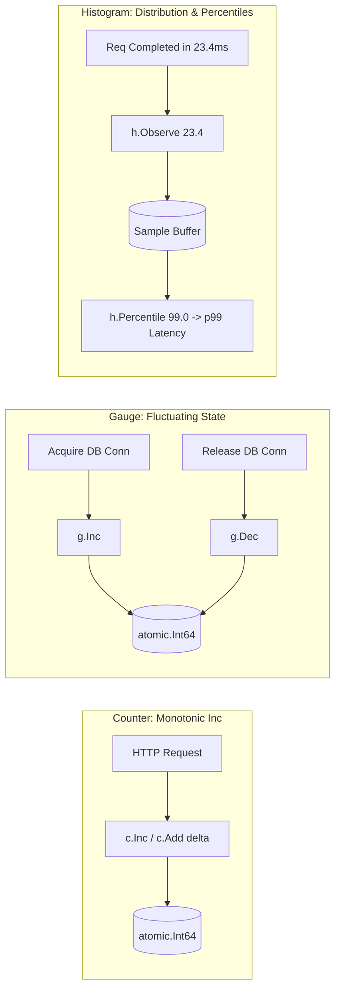

# Metrics Collector (Counters, Gauges & Histograms) Pattern

## Overview & Definition
The **Metrics Collector Pattern** provides low-overhead, in-memory instrumentation primitives for measuring system performance, throughput, error rates, and resource utilization. In production backend systems (monitored via Prometheus, OpenTelemetry, Datadog, or StatsD), metrics form the first line of defense for alerting, anomaly detection, and automated scaling.

Metrics are classified into three primary mathematical types:
1. **Counter**: A monotonically increasing 64-bit integer (e.g., total HTTP requests, error counts, bytes transferred). It only increments or resets to zero on process restart.
2. **Gauge**: An instantaneous value that can increase or decrease arbitrarily (e.g., active database connections, current goroutines, memory usage, queue depth).
3. **Histogram**: A collection of statistical observations (e.g., request latency in milliseconds or payload sizes in kilobytes) used to compute critical **Percentile distributions** ($p50$, $p90$, $p95$, $p99$, $p999$).

---

## Problem Statement (Failure Scenarios Without This Pattern)

### 1. The "Average Latency" Lie
A common pitfall is calculating the *mean (average)* response time instead of percentiles:
- If 99 requests take 10ms and 1 request takes 10,000ms (10s), the average is ~110ms (looks acceptable on dashboards).
- However, 1 out of 100 users experiences a completely unusable 10-second freeze.
- **Solution**: Histograms compute $p99$ percentile latency, immediately exposing tail-latency degradation.

### 2. Lock Contention Bottlenecks in Telemetry
If incrementing a global request counter acquires a shared `sync.Mutex`, concurrent goroutines across 64 CPU cores spend more time waiting on the telemetry lock than processing business logic. Using lock-free `sync/atomic.Int64` primitives eliminates lock contention entirely.

---

## Architectural Mechanism & Flow



---

## Production Best Practices & Pitfalls

### Best Practices
- **Atomic Operations on the Hot Path**: Use `sync/atomic.Int64` for Counters and Gauges. Atomic operations execute in single-digit nanoseconds without yielding the CPU thread.
- **Fixed Bucket Boundaries for Distributed Histograms**: In distributed Prometheus scrapers, use pre-allocated exponential or linear histogram buckets (e.g., `[5ms, 10ms, 25ms, 50ms, 100ms, 250ms, 500ms, 1s, 2.5s, 5s]`) rather than unbounded floating-point slices to bound memory consumption.
- **Label Cardinality Limits**: Keep dimensional labels (e.g., `status_code="200"`, `method="POST"`) small. Never put high-cardinality fields like `user_id`, `email`, or `uuid` into metric label tags, as doing so leads to metric store memory explosion.
- **Standard RED and USE Methods**:
  - **RED**: Rate (requests/sec), Errors (failed/sec), Duration (latency histogram).
  - **USE**: Utilization (CPU/RAM %), Saturation (queue depth gauge), Errors (hardware/OS errors).

### Pitfalls to Avoid
- **Unbounded Memory Retention in Histograms**: Ensure in-memory sample slices have a bounded buffer or periodic reset window to prevent continuous memory growth over time.

---

## Code Walkthrough & Usage

In `patterns/17_observability/metrics_collector.go`, atomic types and quantile sorting provide production primitives:

```go
// Counter represents a monotonically increasing 64-bit integer counter.
type Counter struct {
    val atomic.Int64
}

func (c *Counter) Inc()            { c.val.Add(1) }
func (c *Counter) Add(delta int64) { c.val.Add(delta) }
func (c *Counter) Value() int64    { return c.val.Load() }

// Gauge represents a value that can go up and down.
type Gauge struct {
    val atomic.Int64
}

func (g *Gauge) Set(val int64)     { g.val.Store(val) }
func (g *Gauge) Inc()              { g.val.Add(1) }
func (g *Gauge) Dec()              { g.val.Add(-1) }
func (g *Gauge) Value() int64      { return g.val.Load() }
```

### Histogram and Percentile Calculation
```go
type Histogram struct {
    mu      sync.RWMutex
    samples []float64
}

func NewHistogram() *Histogram {
    return &Histogram{
        samples: make([]float64, 0, 1000),
    }
}

func (h *Histogram) Observe(value float64) {
    h.mu.Lock()
    defer h.mu.Unlock()
    h.samples = append(h.samples, value)
}

// Percentile calculates the p-th percentile (e.g. 50.0 for p50, 95.0 for p95, 99.0 for p99)
func (h *Histogram) Percentile(p float64) float64 {
    h.mu.RLock()
    defer h.mu.RUnlock()

    if len(h.samples) == 0 {
        return 0
    }

    // Sort a snapshot of collected samples
    sorted := make([]float64, len(h.samples))
    copy(sorted, h.samples)
    sort.Float64s(sorted)

    if p <= 0 {
        return sorted[0]
    }
    if p >= 100 {
        return sorted[len(sorted)-1]
    }

    idx := int(float64(len(sorted)-1) * (p / 100.0))
    return sorted[idx]
}
```
