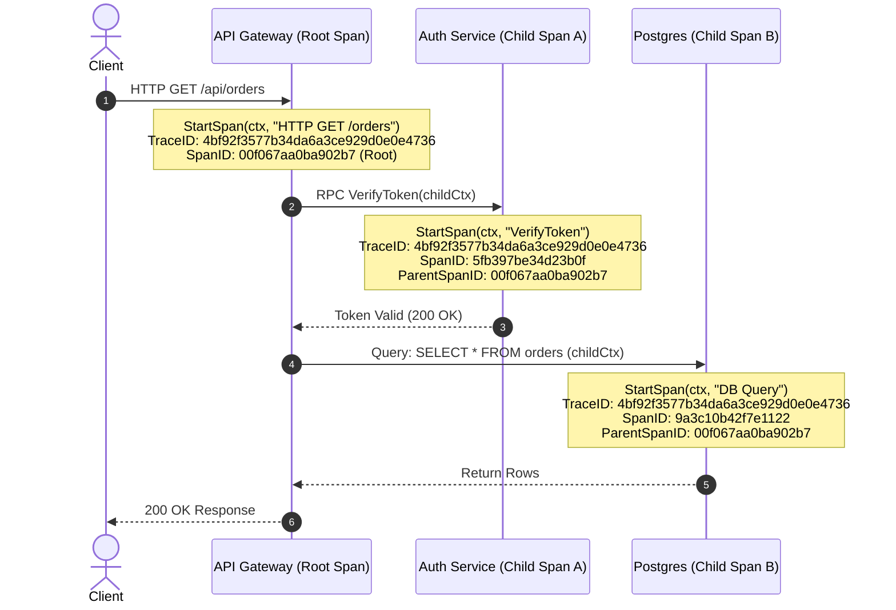

# Distributed Tracer Pattern (Spans & Context Propagation)

## Overview & Definition
The **Distributed Tracer Pattern** provides end-to-end visibility into the lifecycle of a request as it traverses multiple functions, goroutines, databases, and microservice network boundaries. Based on the Dapper model and standardized by **OpenTelemetry (OTel)** and **W3C TraceContext**, distributed tracing tracks the exact execution graph and latency breakdown of distributed transactions.

The tracing model consists of two core concepts:
1. **Trace**: A directed acyclic graph (DAG) representing the entire end-to-end journey of a request across the distributed system. Identified by a globally unique 128-bit **TraceID**.
2. **Span**: A single contiguous unit of execution within that trace (e.g., executing an HTTP handler, running a database query, or calling an external API). Each span contains a unique 64-bit **SpanID**, an optional **ParentSpanID**, a operation name, timestamps, custom semantic **Tags (Attributes)**, and discrete milestone **Span Events**.

---

## Problem Statement (Failure Scenarios Without This Pattern)

### 1. The "Needle in a Distributed Haystack" Debugging Nightmare
In a microservice mesh of 30 services, an end-user experiences a 4-second API latency spike. Without distributed tracing:
- Looking at aggregated logs across 30 services produces millions of unrelated log lines.
- Engineers cannot determine which specific downstream service (or database query) accounted for the 4-second delay.

### 2. Broken Context Propagation Across Goroutines
In Go backend services, spawning asynchronous background goroutines (`go process()`) without explicitly passing a linked tracing context breaks the causal link, creating orphaned telemetry spans that cannot be linked back to the originating user request.

---

## Architectural Mechanism & Flow



---

## Production Best Practices & Pitfalls

### Best Practices
- **W3C `traceparent` Header Propagation**: When making outbound HTTP or gRPC calls, inject the standard W3C `traceparent` header (`00-<trace-id>-<parent-id>-<trace-flags>`) so downstream services seamlessly attach their child spans to the active trace.
- **Span Lifecycle with `defer span.Finish()`**: Always invoke `defer span.Finish()` immediately after `StartSpan` to guarantee accurate duration calculation even if functions exit early or return errors.
- **Semantic Conventions for Tags**: Follow OpenTelemetry semantic conventions for span tags:
  - `http.method`: `"POST"`
  - `http.status_code`: `200`
  - `db.system`: `"postgresql"`
  - `db.statement`: `"SELECT * FROM users WHERE id = ?"`
- **Add Discrete Events for Milestones**: Use `span.AddEvent("cache_miss")` to record point-in-time state changes without creating separate span overhead.

### Pitfalls to Avoid
- **Logging High-Cardinality Secrets in Tags**: Never put sensitive passwords, tokens, or PII into span tags.
- **Creating Overly Granular Spans**: Avoid creating spans for tiny helper functions that take sub-microsecond time; trace at architectural boundaries (HTTP, DB, RPC, Message Broker).

---

## Code Walkthrough & Usage

In `patterns/17_observability/tracer.go`, `StartSpan` and `SpanFromContext` manage trace hierarchy and propagation:

```go
type SpanEvent struct {
    Name      string
    Timestamp time.Time
}

type Span struct {
    TraceID      string
    SpanID       string
    ParentSpanID string
    Name         string
    StartTime    time.Time
    EndTime      time.Time
    Tags         map[string]string
    Events       []SpanEvent
    mu           sync.Mutex
}
```

### Context-Aware Span Creation
```go
func StartSpan(ctx context.Context, name string) (*Span, context.Context) {
    var parentSpanID string
    traceID := generateHexID(16) // 128-bit Trace ID

    // Check if an active parent span exists in incoming context
    if parent := SpanFromContext(ctx); parent != nil {
        traceID = parent.TraceID        // Inherit TraceID across hierarchy
        parentSpanID = parent.SpanID    // Link Parent Span ID
    }

    spanID := generateHexID(8) // 64-bit unique Span ID
    span := &Span{
        TraceID:      traceID,
        SpanID:       spanID,
        ParentSpanID: parentSpanID,
        Name:         name,
        StartTime:    time.Now(),
        Tags:         make(map[string]string),
    }

    // Embed active span in child context
    childCtx := context.WithValue(ctx, spanCtxKey{}, span)
    return span, childCtx
}
```

### Tagging and Finishing Spans
```go
func (s *Span) SetTag(key, value string) {
    s.mu.Lock()
    defer s.mu.Unlock()
    s.Tags[key] = value
}

func (s *Span) AddEvent(name string) {
    s.mu.Lock()
    defer s.mu.Unlock()
    s.Events = append(s.Events, SpanEvent{
        Name:      name,
        Timestamp: time.Now(),
    })
}

func (s *Span) Finish() {
    s.mu.Lock()
    defer s.mu.Unlock()
    s.EndTime = time.Now()
}
```
