# System Design — A Deep Concepts & Problem-Solving Framework

> **Goal:** Learn to solve system design problems not by memorizing architecture diagrams, but by following a repeatable chain of reasoning:
> **measurable requirements → bottleneck → trade-off → failure mode → design → validation.**

This document teaches two things together:

1. **A concept map** — a real understanding of availability, scalability, durability, latency, consistency, throughput, reliability, resilience, partition tolerance, and the other core vocabulary of distributed systems.
2. **A thinking system** — a method you can apply even to a system design question you've never seen before.

### Table of Contents

| Part | Topic |
|---|---|
| 0 | The Big Picture |
| 1 | Functional vs. Non-Functional Requirements |
| 2 | The Quality Attribute Map |
| 3 | Availability & Reliability |
| 4 | Scalability & Elasticity |
| 5 | Latency & Throughput |
| 6 | Durability & Disaster Recovery |
| 7 | Consistency Models |
| 8 | CAP and PACELC |
| 9 | Partitioning: Sharding & Consistent Hashing |
| 10 | Caching |
| 11 | Queues, Backpressure, Load Shedding, Bulkheads |
| 12 | Rate Limiting |
| 13 | Idempotency & Delivery Semantics |
| 14 | Ordering & Distributed Transactions |
| 15 | Coordination in Distributed Systems |
| 16 | Networking Reality & Resilience Patterns |
| 17 | Autoscaling, Pools, and Saturation |
| 18 | API Design & Data Access Patterns |
| 19 | Source of Truth, CQRS & Event-Driven Architecture |
| 20 | Security & Observability |
| 21 | CDN & Data Locality |
| 22 | Fan-out, Fan-in & Capacity Estimation |
| 23 | Synchronous vs. Asynchronous Communication |
| 24 | Failure Domains, Blast Radius & Cell Architecture |
| 25 | Business Invariants, Source of Truth & Rebuildability |
| 26 | Cost & Complexity as Design Constraints |
| 27 | Microservices, Service Boundaries & Gateways |
| 28 | Deployment, Rollout & Graceful Shutdown |
| 29 | Trade-off Thinking |
| 30 | The Problem-Solving Algorithm |
| 31 | Worked Examples I (feed, payment, notifications) |
| 32 | Cheat Sheet, Common Mistakes & Architecture Smells |
| 33 | The Ultimate Framework |
| 34 | Self-Test Question Bank |
| 35 | Recommended Learning Order |
| 36 | Database Replication Topologies |
| 37 | Message Queue & Log Internals |
| 38 | Testing, Chaos Engineering & Validation |
| 39 | Security Deep Dive: Threat Modeling |
| 40 | Worked Examples II (URL shortener, rate limiter, chat, inventory) |
| 41 | Glossary (A–Z) |
| 42 | Interview Question → Concept Map |
| 43 | Design Self-Review Rubric |
| 44 | Conclusion: You'll Stop Memorizing the Question |

---

## Part 0 — The Big Picture

Think about any distributed system through five questions:

1. How much traffic are we handling?
2. How fast must we respond?
3. How much data loss can we tolerate?
4. Which failures must we keep operating through?
5. What level of correctness / consistency do we need?

These questions sit on top of a layered stack:

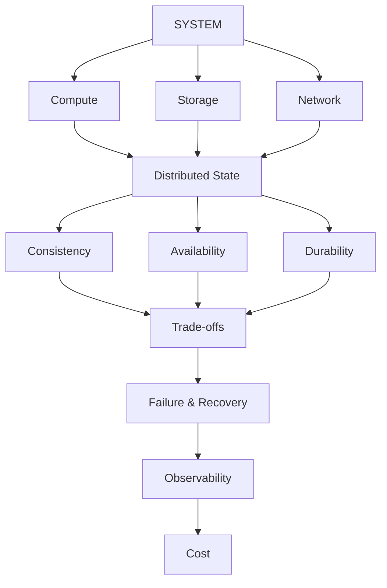

The essence of system design:

> **Design a system not just to work correctly, but to behave acceptably under load, during network problems, while a dependency is down, as data grows, and while you're deploying new code.**

---

## Part 1 — Functional vs. Non-Functional Requirements

Every system design question starts by separating two very different classes of requirement.

### 1.1 Functional Requirements — *what does the system do?*

Example, a Twitter-like system:

- A user can create a tweet.
- A user can read tweets.
- A user can follow other users.
- A user can view a timeline.

These are features.

### 1.2 Non-Functional Requirements — *how well must it do it?*

Example:

- 100M users
- 10M DAU
- 100K requests/sec
- p99 < 200 ms
- 99.99% availability
- zero tolerable data loss

These numbers are what actually shape the architecture.

**Core principle:**

> Functional requirement: *"What are we doing?"*
> Non-functional requirement: *"How well are we required to do it?"*

Most system design decisions are driven by the second group, not the first.

---

## Part 2 — The Quality Attribute Map

| Concept | Core question |
|---|---|
| Availability | How much of the time is the system usable? |
| Reliability | How confidently does it do the *correct* thing? |
| Scalability | Can the system grow as load grows? |
| Elasticity | Can resources auto-adjust to changing load? |
| Latency | How long does one operation take? |
| Throughput | How much work happens per unit time? |
| Durability | Does committed data ever get lost? |
| Consistency | What state do different readers see? |
| Freshness | How current is the data? |
| Fault Tolerance | Does it keep working when a component fails? |
| Resilience | Can it recover after a failure? |
| Recoverability | How fast does it come back after failure? |
| Partition Tolerance | How does it behave during a network partition? |
| Maintainability | How easy is it to change? |
| Operability | How easy is it to run in production? |
| Security | How resistant is it to malicious behavior? |
| Cost Efficiency | How expensive is this behavior? |

Don't learn these in isolation — think about how each one **pulls against** the others.

---

## Part 3 — Availability & Reliability

### 3.1 What is availability?

> Can the system accept a request and return a usable response when needed?

```text
Availability = Uptime / Total Time
```

### 3.2 The "nines"

| Availability | Downtime / year |
|---|---:|
| 99% | ~3.65 days |
| 99.9% | ~8.76 hours |
| 99.99% | ~52.6 minutes |
| 99.999% | ~5.26 minutes |

Each additional "nine" gets exponentially more expensive.

### 3.3 How availability is improved

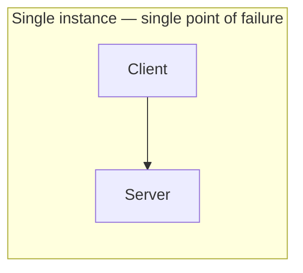

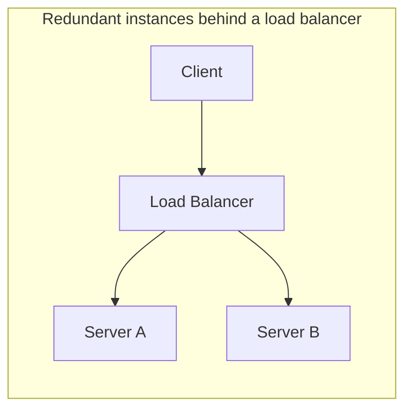

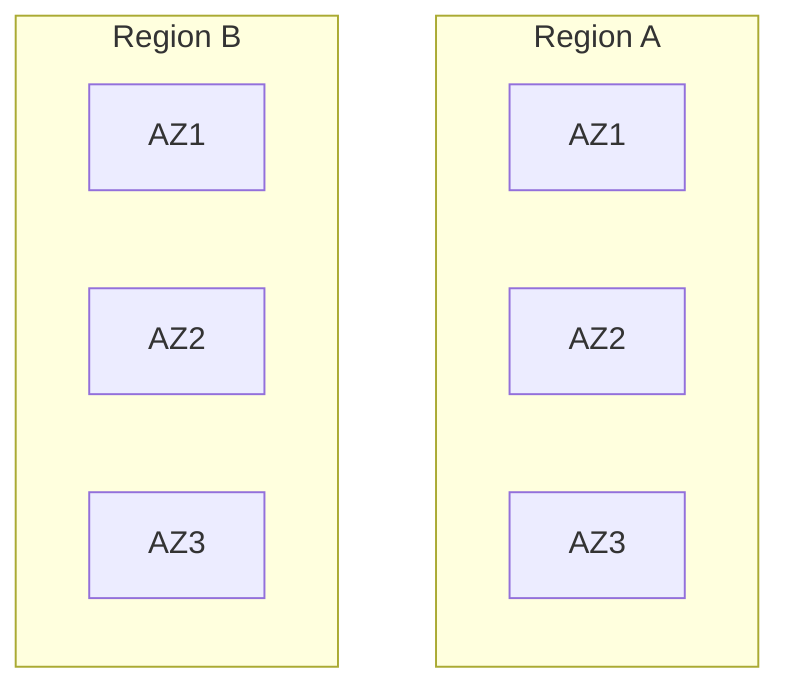

### 3.4 Availability is a property of the dependency graph, not a single number

Two redundant app servers mean nothing if they both point at one single database:

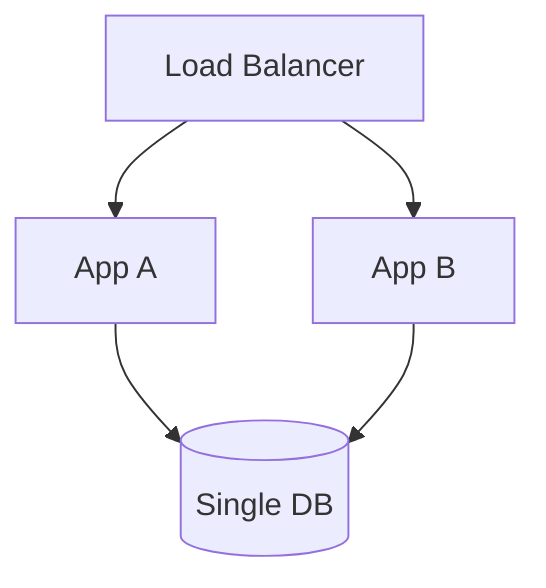

If `DB` dies, the whole system dies — regardless of how many app replicas exist.

> **Availability is a property of the dependency graph, not of any one component.**

### 3.5 Reliability ≠ Availability

- **Availability**: "Can I reach it right now?"
- **Reliability**: "Is it doing the *correct* thing?"

A system can return `HTTP 200` while double-charging a payment. It's *available* but not *reliable*.

Reliability examples:
- No duplicate payments
- No lost messages
- Orders never land in an invalid state
- Transactions are atomic

---

## Part 4 — Scalability & Elasticity

### 4.1 Vertical scaling

`4 CPU / 16 GB → 32 CPU / 128 GB`

- ✅ Simple, low distributed complexity
- ❌ Hardware ceiling, single-machine failure, expensive at the top end

### 4.2 Horizontal scaling

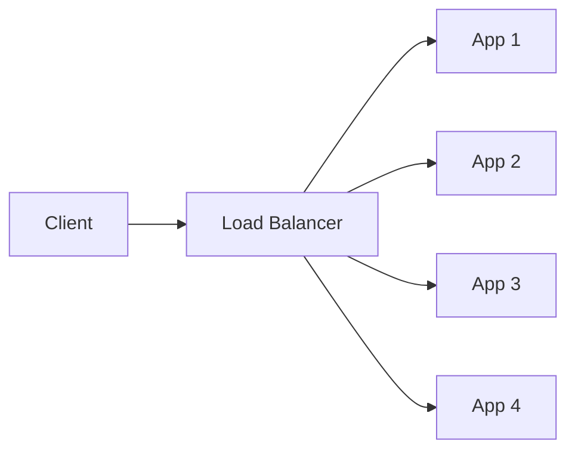

- ✅ Large capacity, failure isolation, elastic scaling
- ❌ Distributed state, coordination, network calls, consistency problems

### 4.3 Elasticity

Scalability asks *"can I grow?"* Elasticity asks *"can resources shrink and grow automatically with load?"*

```text
02:00 → 5 pods
12:00 → 50 pods
18:00 → 100 pods
03:00 → 5 pods
```

Elasticity matters most for highly variable workloads.

---

## Part 5 — Latency & Throughput

### 5.1 Latency

The time between an operation starting and completing. A single average number is not enough — you need **percentiles**.

### 5.2 Percentiles: p50, p95, p99, p99.9

Out of 1M requests:

```text
p50   = 50 ms
p95   = 120 ms
p99   = 500 ms
p99.9 = 2 sec
```

p99 means 99% of requests are faster than 500ms — but the remaining 1% (10,000 requests out of 1M) are slower.

**Why average is dangerous:**

```text
99 requests = 10 ms
1  request  = 10 sec
average     ≈ 109.9 ms   (looks fine)
p99         = 10 sec     (the real user experience)
```

### 5.3 Latency budget

If an endpoint must meet `p99 < 300ms`, break it down across dependencies:

| Component | Cost |
|---|---:|
| API processing | 50ms |
| DB | 100ms |
| Redis | 20ms |
| Downstream call | 80ms |
| Network | 30ms |
| **Total** | **280ms** |

Only 20ms of budget is left. **Latency requirements must be split into a per-dependency budget.**

### 5.4 Tail latency & fan-out

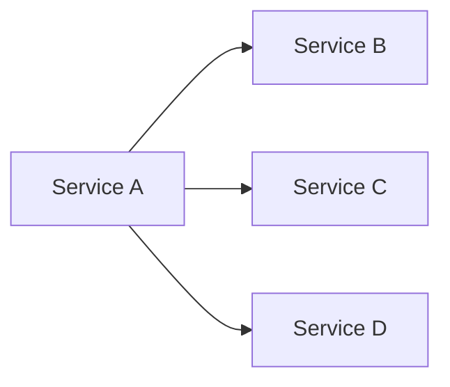

If A waits on all three: `Latency(A) ≈ max(Latency(B), Latency(C), Latency(D))`.

The more parallel dependencies, the higher the risk that *one* slow one determines the whole request's latency — this is why **fan-out increases tail-latency risk**.

### 5.5 Throughput

The amount of work done per unit time (e.g., 10,000 requests/sec). Latency and throughput are **not the same thing**:

> Latency = how long one customer waits for their food.
> Throughput = how many customers the restaurant serves per hour.

### 5.6 Little's Law

```text
L = λW
```

- `L` = average concurrent work in the system
- `λ` = throughput
- `W` = average latency

Example: `λ = 1,000 req/s`, `W = 0.2s` → `L = 200 concurrent requests`.

This relation is invaluable for sizing connection pools, worker pools, queues, and concurrency limits.

---

## Part 6 — Durability & Disaster Recovery

### 6.1 Durability

> Once data is successfully written, it must not be lost later — even across a crash.

### 6.2 How durability is achieved

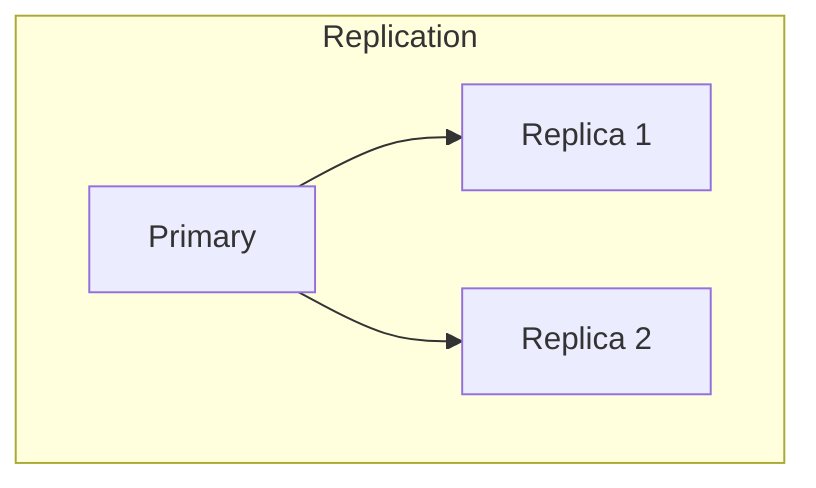

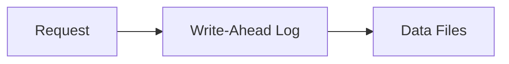

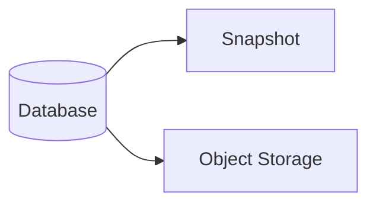

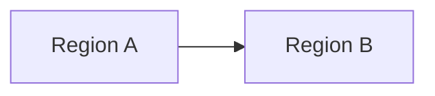

### 6.3 RPO and RTO — the two DR numbers

| Metric | Question | Example |
|---|---|---|
| **RPO** — Recovery Point Objective | How much data can we afford to lose? | 5 minutes |
| **RTO** — Recovery Time Objective | How fast must the system come back? | 10 minutes |

**Trade-off:**

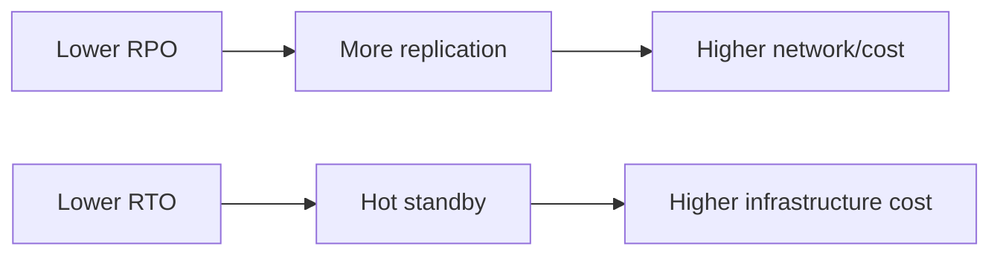

### 6.4 Backup strategy

Full backup, incremental backup, snapshot, WAL/archive log, cross-region copy. But:

> **Having a backup is not enough — restore must be tested.** "We have a backup" and "we can restore in 15 minutes" are not the same statement.

### 6.5 Multi-AZ vs. Multi-Region

| | Multi-AZ | Multi-Region |
|---|---|---|
| Typically gives | High availability, lower latency | Disaster tolerance, geo-latency optimization |
| Complexity cost | Lower | Much higher: consistency, replication, routing, failover, data residency, cost |

**Active-Passive vs. Active-Active:**

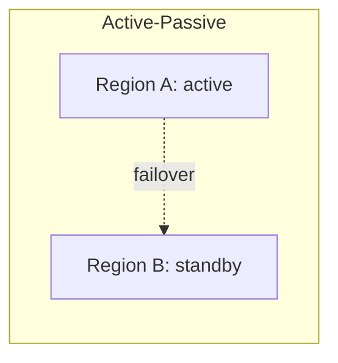

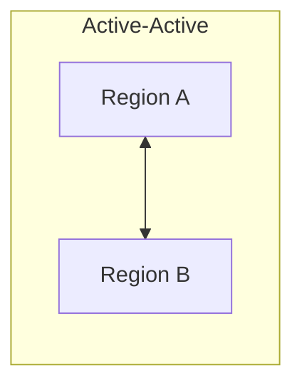

Active-Passive is simple but wastes standby capacity. Active-Active uses resources better but requires conflict resolution, global consistency, and duplicate-processing handling.

### 6.6 DNS failover

`api.example.com → DNS → Region A / Region B` — but DNS caching means failover isn't instant.

> **DNS TTL ≠ failover time.**

---

## Part 7 — Consistency Models

### 7.1 What is consistency?

> When data is replicated, what version of the state do different readers see at different times?

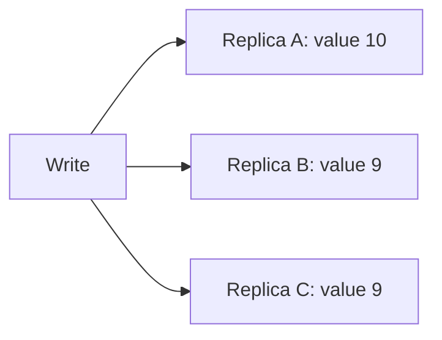

If replication lags, one user might read `10` while another reads `9`.

### 7.2 Strong Consistency

A read after a successful write always sees the new value.

- ✅ Simpler mental model; often necessary for financial operations
- ❌ Requires coordination, adds latency, can reduce availability, gets harder during partitions

### 7.3 Eventual Consistency

Replicas may briefly diverge after a write, then converge.

- ✅ Higher availability, lower write latency, less coordination
- ❌ Stale reads, more complex application semantics
- Typical use cases: like counts, view counts, social feeds, search indexes, analytics

### 7.4 Read-Your-Writes Consistency

A user must immediately see their *own* write. Solutions: primary reads, session stickiness, version tokens, read-after-write routing.

### 7.5 Monotonic Reads

Once a user has seen a value, they should never see an older one afterward — important for replica routing.

---

## Part 8 — CAP and PACELC

### 8.1 CAP Theorem

- **C**onsistency
- **A**vailability
- **P**artition Tolerance

> **During a network partition, you cannot fully preserve both strong consistency and availability at the same time.**

### 8.2 A common misunderstanding

CAP does *not* mean "pick either consistency or availability, always." More precisely:

> **The C-vs-A trade-off only kicks in during a network partition** — and in a real distributed system, partitions are unavoidable, so this trade-off can't be ignored.

### 8.3 PACELC — the fuller picture

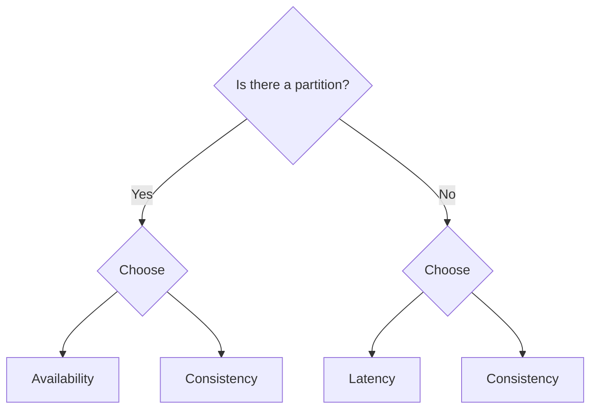

`If Partition: choose Availability vs Consistency. Else: choose Latency vs Consistency.`

This is one of the most important mental models in system design.

### 8.4 Quorum

Given `N` replicas, write quorum `W`, and read quorum `R`:

```text
If W + R > N → read and write quorums are guaranteed to overlap
```

Example: `N=3, W=2, R=2 → 2+2 > 3` ✅. This is the basic arithmetic behind most tunable-consistency systems (Cassandra, Dynamo-style stores, etc.).

### 8.5 Replication: sync vs. async

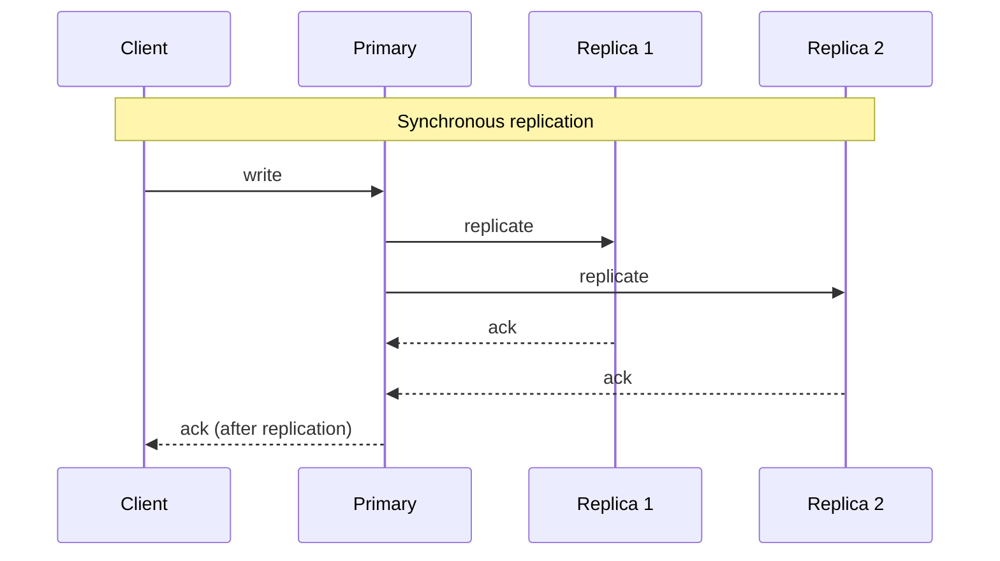

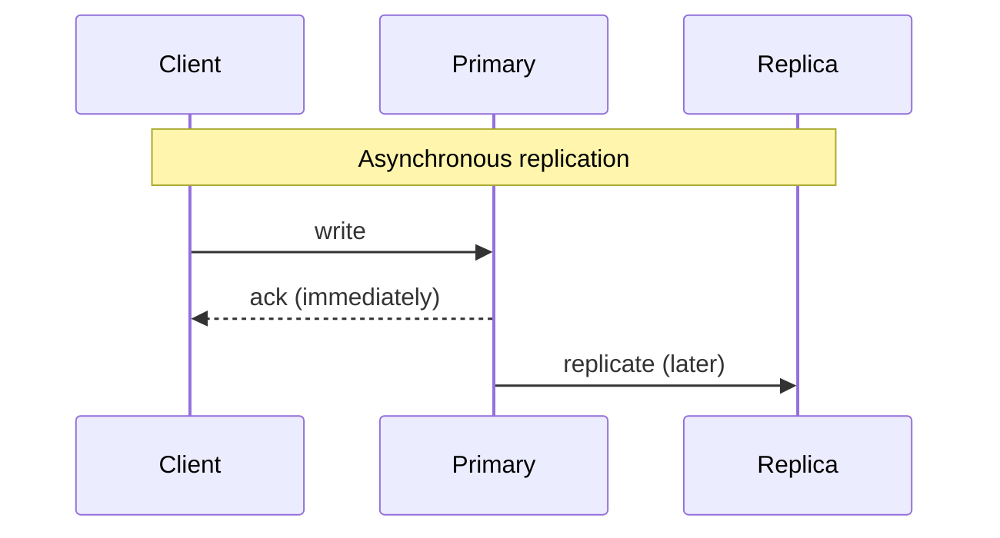

Synchronous replication is more durable/consistent but slower. Asynchronous is faster, but a primary crash right after an ack can lose the not-yet-replicated write.

---

## Part 9 — Partitioning: Sharding & Consistent Hashing

### 9.1 Sharding

> Splitting a dataset across multiple nodes — e.g. by range (`user_id 0–999 → shard A`) or by hash (`shard = hash(user_id) % N`).

**Why shard?** Dataset doesn't fit on one node, write throughput is insufficient, storage keeps growing, or you want to spread out a hotspot.

**Trade-offs:**

| Gain | Cost |
|---|---|
| Capacity ↑, write throughput ↑, parallelism ↑ | Cross-shard queries/transactions, rebalancing, hot shards, operational complexity |

### 9.2 Consistent Hashing

Plain `hash(key) % N` causes massive key movement whenever `N` changes (e.g., going from 3 nodes to 4 reshuffles most keys).

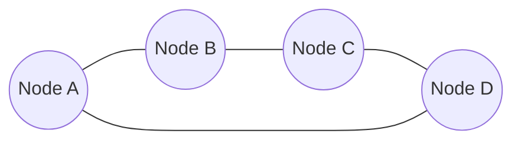

Nodes sit on a ring; a key is assigned to the first node clockwise from its hash. Adding/removing a node only affects a limited key range — not the whole dataset.

**Virtual nodes:** each physical node owns many points on the ring (`vnode 1, 2, 3…`) for better distribution, less hotspotting, and easier handling of uneven node capacity.

### 9.3 Hotspots

Even with theoretically even distribution, real traffic can skew badly:

```text
user A = 80% of traffic
user B = 0.001%
```

One shard runs at 100% CPU while others sit at 10%. Fixes: better partition key, key salting, replication, request coalescing, caching, load-aware routing.

---

## Part 10 — Caching

### 10.1 The basic flow

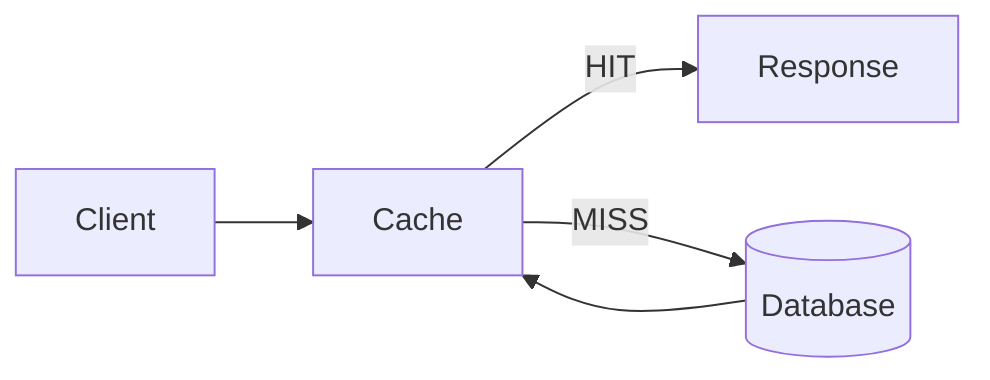

**Hit ratio** = cache hits / total requests. This single number has an outsized effect on architecture.

### 10.2 Invalidation strategies

```mermaid
flowchart TD
    subgraph AsideR["Cache-Aside — Read"]
        R1[Read] --> R2{In cache?}
        R2 -- Hit --> R3[Return cached value]
        R2 -- Miss --> R4[Read DB] --> R5[Populate cache]
    end
```

```mermaid
flowchart LR
    subgraph AsideW["Cache-Aside — Write"]
        W1[Update DB] --> W2[Delete cache entry]
    end
    subgraph WT["Write-Through"]
        WT1[Write] --> WT2[Cache] --> WT3[(DB)]
    end
    subgraph WB["Write-Behind"]
        WB1[Write] --> WB2[Cache] --> WB3[Ack immediately] -.later.-> WB4[(DB)]
    end
```

Write-behind can be faster but introduces durability complexity: an ack was given before the DB was actually updated.

### 10.3 Three classic cache failure modes

| Problem | What happens | Mitigation |
|---|---|---|
| **Cache stampede** | A hot key expires; thousands of requests miss simultaneously and hammer the DB | Request coalescing / singleflight, locking, early refresh, jittered TTL, stale-while-revalidate |
| **Cache penetration** | Queries for keys that don't exist repeatedly bypass the cache and hit the DB | Negative caching, Bloom filters |
| **Cache avalanche** | Millions of keys expire at the same moment, causing a traffic spike on the DB | TTL + random jitter |

### 10.4 Bloom Filter

A probabilistic structure that quickly answers *"definitely not present"* or *"maybe present."* False positives are possible; false negatives must not be.

```mermaid
flowchart LR
    Req[Request] --> BF{Bloom Filter}
    BF -- Definitely absent --> Reject
    BF -- Maybe present --> DB[(Check DB)]
```

---

## Part 11 — Queues, Backpressure, Load Shedding, Bulkheads

### 11.1 Why a queue?

`Producer → Queue → Consumer` — an asynchronous buffer that gives traffic smoothing, decoupling, retryability, and backpressure.

### 11.2 Queues do not solve scalability — they postpone it

If `incoming = 10k/sec` and `processing = 5k/sec`, the backlog grows by `+5k/sec` forever.

> **A queue does not fix a throughput problem; it just spreads the problem out in time.**

### 11.3 Backpressure & Load Shedding

```mermaid
flowchart TD
    P[Producer] --> Q[Queue] --> Cons[Consumer]
    Cons -- too slow --> Signal[Backpressure signal]
    Signal --> Options{Producer response}
    Options --> SlowDown[Slow down]
    Options --> Block[Block]
    Options --> Reject[Reject]
    Options --> Shed[Shed load]
```

**Load shedding**: when capacity is exceeded, deliberately reject *some* requests (`429`/`503`) instead of trying to serve every one and collapsing entirely.

> The goal is to sacrifice a controlled portion of traffic instead of killing the whole system.

### 11.4 Bulkhead pattern

> Isolate resources so that one failure can't spread across the whole system.

```mermaid
flowchart TD
    API --> Payments[Payments service]
    API --> Search[Search service]
    Payments --> PoolA[Payments pool]
    Search --> PoolB[Search pool]
```

If Search overloads, it must not consume Payments' worker/connection pool.

Don't confuse **semaphore** (limits concurrent operations, but the caller-side goroutines/threads may already be created), **worker pool** (bounds concurrency by design), and **bulkhead** (a broader pattern of isolating resources per workload — semaphores/worker pools are just implementation tools for it).

---

## Part 12 — Rate Limiting

| Algorithm | Behavior |
|---|---|
| Fixed Window | Simple, but has a boundary-burst problem |
| Sliding Window | Smoother than fixed window |
| Token Bucket | Bucket refills with tokens; each request consumes one; empty bucket → reject/wait. Allows bursts while controlling average rate |
| Leaky Bucket | Enforces a constant output rate |

---

## Part 13 — Idempotency & Delivery Semantics

### 13.1 Idempotency

> Repeating an operation must not create a duplicate side effect.

```text
POST /payment
Idempotency-Key: abc123
```

If the client times out and retries with the same key, the server recognizes `abc123` was already processed and does not charge again.

### 13.2 Why it matters

Networks are unreliable:

```mermaid
sequenceDiagram
    participant C as Client
    participant S as Server
    C->>S: charge request
    S-->>S: payment succeeds
    S--xC: response lost
    C->>S: retry ("didn't get a response")
```

Without idempotency, this produces `charge #1` and `charge #2`.

### 13.3 "Exactly once" — be careful

True end-to-end exactly-once delivery is extremely hard given network failures, retries, crashes, and timeouts. Most real systems instead use:

> **at-least-once delivery + an idempotent consumer.**

### 13.4 Delivery semantics

| Semantics | Behavior | Trade-off |
|---|---|---|
| At-most-once | Send once, no retry | No duplicates, but messages can be lost |
| At-least-once | Retries on failure | Message loss is reduced, but duplicates are possible |
| Exactly-once | Effect applied exactly one time | Requires heavy coordination + idempotency to approximate |

---

## Part 14 — Ordering & Distributed Transactions

### 14.1 Ordering

Order matters when operations aren't commutative (e.g., `withdraw 50` then `deposit 20` vs. the reverse). Define the ordering **scope** explicitly:

`global ordering` / `partition ordering` / `per-user ordering` / `per-account ordering`

In most systems, **key-based ordering** (e.g., partition by `account_id`) scales far better than global ordering — but forcing everything into one partition for global order kills throughput. This is a direct trade-off between ordering strength and scalability.

### 14.2 Distributed transactions

When a transaction spans multiple services (Order, Payment, Inventory), you can't use a single local DB transaction. Approaches: **Two-Phase Commit**, **Saga**, **Outbox**, event-driven workflows, compensation.

### 14.3 Two-Phase Commit (2PC)

```mermaid
sequenceDiagram
    participant Co as Coordinator
    participant A as DB A
    participant B as DB B
    Co->>A: prepare
    Co->>B: prepare
    A-->>Co: ready
    B-->>Co: ready
    Co->>A: commit
    Co->>B: commit
```

Strong atomicity, but expensive: coordination cost, blocking, complex failure handling, and reduced availability.

### 14.4 Saga

Break a distributed transaction into a chain of local transactions, with compensating actions on failure.

```mermaid
flowchart TD
    S1[Create Order] --> S2[Reserve Inventory] --> S3[Charge Payment] --> S4[Confirm Order]
    S3 -- fails --> Comp[Refund / Compensate] --> Cancel[Cancel Order]
```

> A Saga treats a distributed transaction as a business-level state machine.

### 14.5 Outbox Pattern

**Problem:** a DB transaction and a message publish are not atomic together.

```mermaid
flowchart LR
    Bad1[DB commit succeeds] --> Bad2[Kafka publish fails]
    Bad2 --> Bad3[State changed but event was never sent]
```

**Solution:** write the event into an `outbox` table in the *same* DB transaction, then a separate publisher relays it.

```mermaid
sequenceDiagram
    participant App
    participant DB as Database (single transaction)
    participant Pub as Publisher
    participant Bus as Event Bus
    App->>DB: BEGIN
    App->>DB: UPDATE orders
    App->>DB: INSERT INTO outbox
    App->>DB: COMMIT
    Pub->>DB: poll outbox
    Pub->>Bus: publish event
```

This guarantees the DB state and the event *intent* become durable together.

### 14.6 Inbox / Deduplication

On the consumer side, track `message_id` in a `processed_messages` table so at-least-once delivery doesn't create duplicate side effects.

---

## Part 15 — Coordination in Distributed Systems

### 15.1 Leader Election & Consensus

A distributed system often needs one coordinating node:

```mermaid
flowchart LR
    A[Node A — leader] --> B[Node B — follower]
    A --> C[Node C — follower]
    A -.dies.-> X[✗]
    B -.becomes.-> B2[Node B — new leader]
```

**Consensus** lets multiple nodes agree on state despite crashes, delays, partitions, message loss, duplication, and reordering. Key algorithms: **Raft**, **Paxos**.

**Raft, briefly:** a leader receives a log entry, replicates it to followers, and commits once a **majority** acknowledges it (3 nodes → 2, 5 nodes → 3, 7 nodes → 4).

### 15.2 Failure detectors

> Do you know for certain that a node is dead, or just that the network is delayed?

Usually you *cannot* know for certain — which is why timeouts, heartbeats, leases, and health checks are used instead. A timeout means *"it didn't respond in the time I expected,"* not *"it is definitely dead."* This distinction matters enormously.

### 15.3 Split brain & fencing tokens

If two nodes each believe they're the leader, both may accept writes — **split brain**. Solutions: quorum, fencing, leases, consensus, epoch/term numbers.

```mermaid
sequenceDiagram
    participant L1 as Leader A (token 10)
    participant L2 as Leader B (token 11)
    participant St as Storage
    L2->>St: write (token 11)
    St-->>L2: accepted (latest token)
    L1->>St: stale write (token 10)
    St-->>L1: rejected (token < 11)
```

Storage rejects writes from any leader whose token is lower than the latest known token — a strong defense against stale leaders.

### 15.4 Time in distributed systems

Clocks drift between nodes, so relying purely on wall-clock timestamps for ordering is risky. Alternatives: logical clocks, **Lamport clocks** (`counter = max(local, received) + 1`), **vector clocks** (per-node counters, useful for detecting concurrency but growing with node count), sequence numbers, consensus terms.

---

## Part 16 — Networking Reality & Resilience Patterns

### 16.1 The fundamental assumption

> **The network is not reliable.**

Packet loss, delay, duplication, reordering, connection resets, partial failures, DNS/TLS/load-balancer failures — a network call is a *"remote operation under uncertainty,"* not a plain function call.

### 16.2 Timeout → Retry → Backoff → Jitter → Circuit Breaker

```mermaid
flowchart TD
    Req[Request] --> TO{Timeout?}
    TO -- Yes --> Retry[Retry with backoff]
    Retry --> TO2{Still failing?}
    TO2 -- Yes --> CB[Circuit opens]
    CB --> FF[Fail fast]
    TO2 -- No --> OK[Success]
    TO -- No --> OK
```

- **Timeout**: every network dependency needs one. `wait forever` is always wrong; a hard `deadline` is required. Too-short timeouts, though, cause false timeouts and retry storms.
- **Retry**: retrying is an *amplification mechanism* — 100 failing requests with 3 retries each become 300 requests, which can worsen an already struggling downstream.
- **Exponential backoff**: retry intervals grow (`100ms → 200ms → 400ms → 800ms → 1600ms`).
- **Jitter**: without it, everyone retries in lockstep and causes a thundering herd; jitter = `base delay + random component`.

### 16.3 Circuit Breaker

```mermaid
stateDiagram-v2
    [*] --> Closed
    Closed --> Open: failures exceed threshold
    Open --> HalfOpen: after wait period
    HalfOpen --> Closed: test requests succeed
    HalfOpen --> Open: test requests fail
```

`OPEN` = fail fast without even trying the dependency. `HALF-OPEN` = send a few test requests to see if the dependency recovered.

### 16.4 Retry storms & deadline propagation

```mermaid
flowchart LR
    R1[Requests] --> T1[Timeout] --> Re1[Retry] --> More[More load] --> T2[More timeouts] --> Re2[More retries]
```

A positive-feedback failure loop. Mitigations: exponential backoff, jitter, **retry budgets**, circuit breakers, load shedding, **deadline propagation** (each hop knows the *remaining* time budget, not an independently chosen timeout — `deadline 500ms → A: 450ms left → B: 300ms left → DB: 150ms left`).

### 16.5 Hedged requests

If tail latency is the specific problem, send the same request to a second replica after a short delay and take whichever answer returns first — at the cost of extra traffic. Use only when tail latency, specifically, is the problem.

### 16.6 Graceful degradation & fail-open vs. fail-closed

- **Graceful degradation**: if the Recommendation service is down, the feed still works — just without recommendations. This is an availability-vs-feature-completeness trade-off.
- **Fail-closed** (deny on failure): safer, typical for security/validation.
- **Fail-open** (allow on failure): higher availability, but riskier for security. Which is correct depends entirely on the domain.

### 16.7 Health checks

- **Liveness**: is the process alive?
- **Readiness**: is it ready to receive traffic?

A process can be alive (`liveness = OK`) while its DB connection is broken (`readiness = FAIL`) — this distinction is critical during deployments.

---

## Part 17 — Autoscaling, Pools, and Saturation

### 17.1 Autoscaling signals

CPU, memory, requests/sec, queue depth, latency, custom business metrics. CPU is *not always* the right signal — an async worker can show `CPU = 20%` while `queue = 1,000,000`; queue depth is the better signal there.

```mermaid
flowchart LR
    QD[Queue depth] --> DW[Desired worker count]
```

Example thresholds: `0–100 jobs → 2 workers`, `100–1000 → 10 workers`, `1000–10000 → 50 workers` — but a maximum worker cap must exist, or downstream systems get overloaded.

### 17.2 Connection pools

Too small → requests wait. Too large → the DB gets overloaded.

> **More connections do not automatically mean more throughput.**

### 17.3 Saturation

```mermaid
flowchart LR
    U[Utilization ↑] --> Q[Queueing ↑] --> L[Latency ↑↑]
```

As a resource (CPU, DB, connection pool, worker pool, network) approaches saturation, latency typically rises sharply. **Targeting 100% utilization is usually a bad idea for latency-sensitive systems.**

### 17.4 Resource isolation

If critical and bulk traffic share one resource pool, bulk traffic can starve critical traffic — solved with separate pools (the bulkhead idea again).

---

## Part 18 — API Design & Data Access Patterns

### 18.1 API design is more than an endpoint list

Consider: resource model, idempotency, pagination, filtering, sorting, versioning, error model, rate limiting, authN/authZ, timeout semantics, retry semantics.

### 18.2 Offset vs. cursor pagination

| | Offset (`?page=100`) | Cursor (`?cursor=abc`) |
|---|---|---|
| Simplicity | + | − |
| Stable pagination | − | + |
| Large datasets | − | + |
| Random-access page jumps | + | − |
| Mutable underlying data | can duplicate/skip rows | more stable |

### 18.3 Indexes

An index makes reads faster at the cost of slower writes and more storage. **Not every column should be indexed.**

Most relational indexes are B-Trees:

```mermaid
flowchart TD
    Root --> N1[Node]
    Root --> N2[Node]
    N1 --> D1[Data]
    N1 --> D2[Data]
    N2 --> D3[Data]
    N2 --> D4[Data]
```

Good for equality lookups, range queries, and ordering. **Composite indexes** — e.g., `(tenant_id, created_at)` for a query filtering on both and ordering by `created_at` — column *order* matters.

### 18.4 N+1 queries

`SELECT users` then, per user, `SELECT orders WHERE user_id = ?` → 100 users become 101 queries. Fix with joins, batch queries, preloading, DataLoader-style batching, or denormalization.

### 18.5 Normalization vs. denormalization

```mermaid
flowchart LR
    Norm[Normalization: less duplication, more joins] <-->|trade-off| Denorm[Denormalization: more duplication, faster reads]
```

### 18.6 SQL vs. NoSQL

Wrong question: *"Which is better?"*
Right question: *"Which fits this workload's access patterns and consistency needs?"*

---

## Part 19 — Source of Truth, CQRS & Event-Driven Architecture

### 19.1 Single source of truth

If a state has multiple "authoritative" copies that disagree (`DB A=10, DB B=11, Cache=9, Search=10`), the architecture must explicitly declare which one is authoritative:

```mermaid
flowchart LR
    PG[(Postgres — source of truth)] --> K[Kafka — event transport]
    K --> R[Redis — cache]
    K --> ES[Elasticsearch — read model / index]
```

### 19.2 CQRS

```mermaid
flowchart LR
    Writes --> WM[Write Model] --> Events --> RM[Read Model] --> Queries
```

Useful for read-heavy workloads, but adds eventual consistency, extra storage, and operational complexity.

### 19.3 Event-Driven Architecture

```mermaid
flowchart LR
    A[Service A] -->|publish| Bus[Event Bus]
    Bus --> B[Service B]
    Bus --> C[Service C]
```

- ✅ Loose coupling, async processing, independent consumers, replayability
- ❌ Harder debugging, ordering issues, duplicate events, eventual consistency, schema evolution

**Schema evolution** must be backward compatible: adding a `country` field to an existing event must not break consumers that only know the old schema.

### 19.4 At-least-once + idempotency (recap in practice)

`Producer → Queue → Consumer → process → ack`. If a consumer crashes right before acking, the message gets redelivered — so `message_id → deduplication → idempotent side effect` is required.

### 19.5 Distributed locks & leader leases

Distributed locks are risky (lease expiration, clock issues, partitions, stale owners, crashed holders). A safer pattern is usually **lease + fencing token** rather than a bare lock.

---

## Part 20 — Security & Observability

### 20.1 Security is a system property, not a bolt-on

Authentication, authorization, encryption, secrets, network isolation, rate limiting, audit logging, input validation, abuse prevention, data minimization.

**Authentication** = "who are you?" **Authorization** = "are you allowed to do this?" A valid JWT is authentication; `user A accessing user B's payment` is an authorization failure.

### 20.2 Observability's three pillars

| Pillar | Answers |
|---|---|
| Logs | "What happened?" |
| Metrics | "How often / how much?" |
| Traces | "Where did the request go?" |

### 20.3 RED and USE methods

- **RED** (request-driven systems): **R**ate, **E**rrors, **D**uration — e.g. `RPS=20k, error rate=0.5%, p99=800ms`.
- **USE** (resource-oriented systems): **U**tilization, **S**aturation, **E**rrors — e.g. `CPU util=70%, connection saturation=95%, errors=0.1%`.

### 20.4 SLI, SLO, SLA, and error budgets

| Term | Meaning |
|---|---|
| SLI | The thing you actually measure (e.g., request success rate) |
| SLO | Your internal target (e.g., 99.95% successful requests) |
| SLA | The contractual commitment made to a customer |

If the SLO is `99.9%`, you have a `0.1%` **error budget** — a tool for balancing engineering velocity against reliability.

**Monitoring vs. observability**: monitoring detects failures you already anticipated; observability lets you understand internal state from external outputs — e.g., debugging an unknown latency regression using traces + metrics + logs together.

---

## Part 21 — CDN & Data Locality

A **CDN** serves cacheable content from an edge location near the user:

```mermaid
flowchart LR
    User --> Edge{Edge cache}
    Edge -- HIT --> User
    Edge -- MISS --> Origin[Origin server] --> Edge
```

The cache key typically depends on scheme + host + path + query + selected headers. **Getting the cache key wrong** (e.g. caching a personalized response without varying by user) is a serious security bug — one user's private response could be served to another.

**Data locality**: placing data near the user reduces latency but adds global-replication consistency complexity.

---

## Part 22 — Fan-out, Fan-in & Capacity Estimation

### 22.1 Fan-out and fan-in

```mermaid
flowchart LR
    A --> B
    A --> C
    A --> D
    A --> E
```

More fan-out → higher latency risk, higher failure probability, more connection usage, more retry amplification.

```mermaid
flowchart LR
    P1[Producer A] --> DB[(DB)]
    P2[Producer B] --> DB
    P3[Producer C] --> DB
    P4[Producer D] --> DB
```

Fan-in concentrates load onto one dependency — scaling only the *producers* can make a fan-in bottleneck worse, not better.

### 22.2 Bottleneck thinking

Always ask: *"where's the weakest link?"* Scaling 100 app servers doesn't help if they all share only 10 DB connections.

### 22.3 Back-of-the-envelope estimation

```mermaid
flowchart LR
    Users[100M users] --> DAU[10% DAU = 10M]
    DAU --> Req[10 req/user/day = 100M req/day]
    Req --> AvgRPS["100M / 86,400 ≈ 1,157 RPS"]
    AvgRPS --> PeakRPS["×10 peak ≈ 11.6k RPS"]
```

**Storage**: `10M events/day × 1KB = 10GB/day → ~3.65TB/year → ~10.95TB/year with 3x replication` (before indexes/metadata overhead).

**Bandwidth**: `RPS × response size`, e.g. `10k RPS × 100KB = 1GB/s` — at this scale, think CDN, compression, pagination, smaller payloads, binary protocols.

**Compression trade-off**: reduces bandwidth/storage but increases CPU — not automatically the right call on CPU-constrained systems.

**Serialization**: JSON is readable and easy but larger; binary formats are smaller/faster but add schema-management complexity.

---

## Part 23 — Synchronous vs. Asynchronous Communication

```mermaid
flowchart LR
    subgraph Sync["Synchronous"]
        SR[Request] --> SD[Dependency] --> SRes[Response]
    end
    subgraph Async["Asynchronous"]
        AR[Request] --> AQ[Queue] --> AW[Worker]
    end
```

Synchronous is simple but couples latency and propagates failure. Async decouples and absorbs bursts, but adds eventual consistency and operational complexity.

**When to go async:** the caller doesn't need to wait for the result, the operation is long-running, retries are needed, or the workload bursts. Example: `POST /video → 202 Accepted, job_id=123` then `GET /jobs/123`.

**Polling vs. push:** polling is simple but wasteful; push (WebSocket, SSE, long polling) is more efficient but adds connection-state, load-balancing, draining, reconnect, and backpressure concerns.

**Stateless vs. stateful:** stateless apps (state externalized to DB/Redis) scale easily; stateful apps need sticky sessions, which trade simplicity for uneven load, harder failover, and scaling limits.

**Load balancing algorithms:** round robin, least connections, weighted, consistent hashing (useful for session/cache locality).

---

## Part 24 — Failure Domains, Blast Radius & Cell Architecture

### 24.1 Failure domains

Think in layers: process, instance, host, rack, AZ, region, provider, network, database, operator, data. Consider redundancy at every level.

### 24.2 Blast radius

```mermaid
flowchart TD
    W[One worker dies] --> WImpact[Impacts one request]
    D[One DB dies] --> DImpact[Impacts the whole service]
    R[One region dies] --> RImpact[Impacts global users]
```

The goal is to shrink blast radius — bulkheads, sharding, and multi-AZ all serve this purpose.

### 24.3 Cell architecture

```mermaid
flowchart TD
    Cell1["Cell 1 — users A–D"]
    Cell2["Cell 2 — users E–H"]
    Cell3["Cell 3 — users I–L"]
```

If Cell 1 fails, only its user segment is affected — not the entire system. A powerful pattern for blast-radius reduction.

### 24.4 Retry vs. duplicate side effects (recap)

`GET` is naturally idempotent; `POST /charge` is not — an idempotency key is required whenever retries touch a non-idempotent operation.

---

## Part 25 — Business Invariants, Source of Truth & Rebuildability

### 25.1 Technical consistency ≠ business consistency

DB replicas can be technically consistent while a business invariant is violated (e.g., `inventory = -1`).

> Distributed system design must consider **business invariants**, not just technical consistency.

Examples: `balance >= 0`, an order cannot be both `CANCELLED` and `SHIPPED`, a payment cannot be charged twice.

Before designing, list: *"what must never go wrong?"* — this list shapes the architecture.

### 25.2 Source of truth + derived state

```mermaid
flowchart LR
    PG[(Postgres — source of truth)] --> K[Kafka]
    K --> ES[Elasticsearch — derived]
    K --> R[Redis — derived]
    K --> An[Analytics — derived]
```

Derived state can be destroyed and rebuilt from the source of truth — a very strong design property (**rebuildability**).

### 25.3 Replay & retention

If the event log is durable, a consumer can replay events `1 → 5` for recovery, new projections, debugging, or backfill. But storage isn't infinite — a **retention policy** (7 days / 30 days / 1 year) trades off cost, compliance, recovery, and replay capability.

---

## Part 26 — Cost & Complexity as Design Constraints

### 26.1 Cost is a first-class requirement

Ask *"can we afford it?"* as seriously as *"can we build it?"* Cost drivers: compute, storage, network egress, replication, managed services, logging, monitoring, cross-region traffic.

| More of… | Gain | Cost |
|---|---|---|
| Replicas | Availability ↑ | Cost ↑ |
| Cache | Latency ↓, DB load ↓ | Memory cost ↑, consistency complexity ↑ |
| Indexes | Read latency ↓ | Write cost ↑, storage ↑ |
| Retention | Recovery/replay ↑ | Storage cost ↑ |

### 26.2 Complexity budget

Ten microservices, five queues, three databases, two caches, multi-region, CQRS, Saga, and an event bus don't make an architecture *good* by existing — every component adds operational burden, its own failure modes, observability surface, and on-call complexity.

> **Complexity is a cost.**

### 26.3 The distributed system tax

The moment something becomes distributed, you inherit: network calls, timeouts, partial failures, consistency problems, coordination, retries, ordering, observability overhead.

> "Let's use microservices" is not a solution — it's a trade-off.

---

## Part 27 — Microservices, Service Boundaries & Gateways

| | Monolith | Microservices |
|---|---|---|
| Gains | Simple deployment, simple transactions, simple local calls | Independent scaling, team autonomy, failure isolation |
| Costs | Shared scaling unit, team coupling, large blast radius | Network calls, distributed transactions, observability, deployment complexity |

**Choosing service boundaries:** the best boundary is usually a **business capability** (Payment, Inventory, Shipping, Identity) — not a mechanical split by database table.

**Shared database problem:** if two services share one DB, they become tightly coupled to its schema — one service's migration can break another. Owning a private database per service is cleaner, though not automatically correct in every case.

**API Gateway:** centralizes auth, rate limiting, routing, TLS termination, and request shaping — but must not become a single bottleneck / SPOF itself.

**Service discovery:** dynamic instances need to be found via DNS, a registry, or platform-native discovery.

**Retryable vs. non-retryable errors:** retry `timeout`, `temporary unavailable`, `connection reset` — never retry `invalid input`, `permission denied`, or `business rule violations`. Retrying everything blindly is a production bug.

**HTTP status semantics:**

| Code | Meaning |
|---|---|
| 400 | Malformed/invalid request |
| 401 | Unauthenticated |
| 403 | Authenticated but forbidden |
| 404 | Resource not found |
| 409 | State conflict |
| 429 | Rate limited |
| 500 | Internal failure |
| 502 | Bad upstream response |
| 503 | Service unavailable |
| 504 | Upstream timeout |

---

## Part 28 — Deployment, Rollout & Graceful Shutdown

### 28.1 Graceful shutdown

```mermaid
flowchart TD
    Sig[SIGTERM] --> Stop[Stop accepting new traffic] --> Finish[Finish in-flight requests] --> StopW[Stop workers] --> Close[Close DB/clients] --> Exit
```

Critical in container/Kubernetes environments.

### 28.2 Deploy strategies

| Strategy | Behavior |
|---|---|
| Rolling deploy | Instances replaced gradually |
| Blue/green | Traffic switched wholesale from "blue" (current) to "green" (new) |
| Canary | Traffic ramped gradually: `1% → 5% → 25% → 50% → 100%`, evaluated against error rate, latency, and business metrics |

### 28.3 Feature flags

Separate **deploy** (code exists) from **release** (feature enabled). Enables safer rollout, quick disable, and experimentation — but stale flags become technical debt and must be cleaned up.

---

## Part 29 — Trade-off Thinking

### 29.1 The 8 questions for every architecture decision

1. What do I gain?
2. What do I lose?
3. What new failure mode appears?
4. Effect on latency?
5. Effect on availability?
6. Effect on consistency?
7. Effect on cost?
8. Effect on operational complexity?

### 29.2 Trade-off matrix

| Decision | Gain | Cost |
|---|---|---|
| Cache | Latency ↓ | Staleness / invalidation |
| Replica | Availability ↑ | Consistency / cost |
| Sharding | Capacity ↑ | Query complexity |
| Async queue | Decoupling | Eventual consistency |
| Strong consistency | Correctness | Latency / availability |
| Multi-region | DR / availability | Complexity / cost |
| More retries | Transient-failure recovery | Load amplification |
| Compression | Bandwidth ↓ | CPU ↑ |
| Denormalization | Read speed ↑ | Write complexity |
| More indexes | Read speed ↑ | Write/storage cost |
| Bigger pool | Concurrency ↑ | Downstream pressure |
| Load shedding | System survival | Some requests rejected |

### 29.3 The "Why This, Not That?" rule

For every component you add — Redis? Kafka? SQL? NoSQL? replica? shard? async? microservice? multi-region? cache? strong consistency? — build the chain explicitly:

```mermaid
flowchart LR
    Req[Requirement] --> Prob[Problem] --> Sol[Solution] --> TO[Trade-off]
```

---

## Part 30 — The Problem-Solving Algorithm

### 30.1 The full decision flow

```mermaid
flowchart TD
    Start([Requirements]) --> Clarify[Phase 1 — Clarify:<br/>users, traffic, ratios, latency, availability,<br/>data size, retention, consistency, geography, security, cost]
    Clarify --> Func[Phase 2 — Functional requirements<br/>only the critical features]
    Func --> NonFunc[Phase 3 — Non-functional requirements<br/>concrete numbers]
    NonFunc --> Estimate[Phase 4 — Back-of-the-envelope<br/>RPS, storage, bandwidth, connections]
    Estimate --> Access[Phase 5 — Access patterns<br/>hottest / most expensive queries]
    Access --> SoT[Phase 6 — Define source of truth]
    SoT --> Simple[Phase 7 — Start with the simplest architecture]
    Simple --> Loop{Bottleneck or<br/>requirement unmet?}
    Loop -- Yes --> Identify[Identify the bottleneck]
    Identify --> Reads{Reads?}
    Identify --> Writes{Writes?}
    Identify --> Burst{Burst?}
    Identify --> Latency{Latency?}
    Identify --> Avail{Availability?}
    Identify --> Durab{Durability?}
    Identify --> Hot{Hotspot?}
    Reads -- yes --> C1[Consider cache / read replica] --> Loop
    Writes -- yes --> C2[Consider sharding / batching] --> Loop
    Burst -- yes --> C3[Consider queue / backpressure] --> Loop
    Latency -- yes --> C4[Consider cache / parallelism / locality] --> Loop
    Avail -- yes --> C5[Consider redundancy / failover] --> Loop
    Durab -- yes --> C6[Consider replication / WAL / backup] --> Loop
    Hot -- yes --> C7[Consider partitioning / caching / key redesign] --> Loop
    Loop -- No --> Consistency[Define consistency per data type]
    Consistency --> Failure[Design failure handling]
    Failure --> Observ[Define observability]
    Observ --> Sec[Define security]
    Sec --> DR[Define disaster recovery]
    DR --> Cost[Estimate cost]
    Cost --> Review[Review trade-offs]
    Review --> Done([Architecture])
```

### 30.2 Failure analysis checklist (per dependency)

For every dependency, ask: what if it's slow? What if it's down? What if the response is lost? What if the request is duplicated? What if the data is stale? What if the network partitions?

| Dependency | Failure | Response |
|---|---|---|
| Redis | Down | DB fallback |
| DB | Down | Read cache / fail |
| Queue | Down | Reject / degrade |
| Payment | Timeout | Retry + idempotency |
| Search | Down | Fallback to DB |
| Recommendation | Down | Omit the feature |

### 30.3 Golden rule

> **Don't optimize if there's no bottleneck.**
>
> "Let's cache everything." "Let's use Kafka." "Let's go microservices." "Let's go multi-region." — if these aren't derived from a real requirement, they're architecture decoration, not engineering.

### 30.4 The design decision record

Document important decisions in a consistent format:

```text
Decision:  Use Redis cache.
Why:       DB read latency is too high.
Benefit:   Lower latency and DB load.
Cost:      Stale data and invalidation complexity.
Failure:   Redis unavailable.
Fallback:  Read from DB.
Consistency: Eventual, acceptable for this data.
Operational: Monitor hit ratio and memory.
Alternative: DB read replicas.
```

### 30.5 Consistency decisions belong to individual data types, not the whole system

```text
Payment status  → strong
Inventory       → strong-ish / transactional
Like count      → eventual
Search index    → eventual
Analytics       → eventual
```

"The system is eventually consistent" is too generic a statement — **consistency is a per-data-type decision.**

---

## Part 31 — Worked Examples I

### 31.1 Read-heavy endpoint: "100k reads/sec, p99 < 100ms"

```mermaid
flowchart TD
    Req[100k RPS + tight latency] --> Direct[Direct DB reads: likely too expensive]
    Direct --> Cache[Add cache]
    Cache --> Q1{Cache failure?}
    Cache --> Q2{Stale data?}
    Cache --> Q3{Hot keys?}
    Cache --> Q4{Cache stampede?}
```

Architecture is derived from the requirement, then stress-tested against each of these follow-up questions.

### 31.2 Payment system: "payments must never duplicate"

This requirement implies **idempotency + durability + strong business invariants** — not caching.

```mermaid
flowchart LR
    Client -->|Idempotency-Key| PaySvc[Payment Service] --> Tx[DB transaction] --> Outbox --> Bus[Event Bus]
```

On retry with the same key, the service returns the *existing* result rather than reprocessing.

### 31.3 Notification system: "10M notifications, bursty, delivery can be delayed"

This implies **async + queue + worker pool + rate limiting + retry**:

```mermaid
flowchart TD
    API --> Queue --> Pool[Worker pool]
    Pool --> Email[Email pool]
    Pool --> SMS[SMS pool]
    Pool --> Push[Push pool]
```

Each provider gets its own bulkhead pool so one slow channel doesn't starve the others.

### 31.4 Social feed: "read-heavy, low latency, huge user base"

**Fan-out on write** — push a new post into every follower's feed at write time:

- ✅ reads are fast
- ❌ a celebrity with 50M followers causes a write explosion

**Fan-out on read** — merge followed users' posts at read time:

- ✅ writes are cheap
- ❌ reads are expensive

```mermaid
flowchart LR
    subgraph FOW["Fan-out on write"]
        Post1[New post] --> Followers1[Push to every follower's feed]
    end
    subgraph FOR["Fan-out on read"]
        Read1[Read timeline] --> Merge[Merge followed users' posts on demand]
    end
```

A **hybrid** (fan-out on write for normal users, fan-out on read for celebrities) is usually the realistic answer.

### 31.5 How to explain a trade-off well

Don't say: *"I'd use Redis."*
Say something like: *"This endpoint is read-heavy with a tight p99 target. Hitting the DB on every request would create unnecessary load, so I'd use cache-aside Redis. In exchange, I take on cache invalidation and stale-read risk. Since this data isn't business-critical, eventual consistency is acceptable — and I'd design a DB fallback for when Redis is unavailable, rather than making the cache a hidden source of truth."*

That is what system design thinking sounds like.

---

## Part 32 — Cheat Sheet, Common Mistakes & Architecture Smells

### 32.1 Cheat sheet

| Category | Checklist |
|---|---|
| Traffic | RPS, peak RPS, read/write ratio, payload size |
| Storage | records/day, bytes/record, retention, replication factor, indexes |
| Performance | p50, p95, p99, throughput, queue depth |
| Reliability | availability, RPO, RTO, failure domains |
| Consistency | strong, eventual, read-your-writes, monotonic reads, ordering |
| Scaling | vertical, horizontal, partitioning, sharding, caching, replicas |
| Resilience | timeout, retry, backoff, jitter, circuit breaker, bulkhead, load shedding, idempotency |
| Data | transactions, indexes, normalization/denormalization, CQRS, outbox, saga |
| Async | queue, stream, consumer groups, backpressure, DLQ, replay |
| Operations | logs, metrics, traces, alerts, deploy, rollback, DR |
| Security | authN, authZ, TLS, secrets, rate limit, audit, tenant isolation |

### 32.2 The most common system design mistakes

1. Adding Kafka before there's any real traffic.
2. Caching everything.
3. "We need multi-region because we need high availability" (without a real requirement behind it).
4. "Microservices are more scalable" (stated as a universal truth).
5. "I added retries, so failure handling is done."
6. "I added a DB replica, so availability is solved."
7. "I added a queue, so scalability is solved."
8. Claiming "exactly once" without qualification.
9. Using average latency instead of p99.
10. Treating consistency as one system-wide setting instead of a per-domain decision.
11. "We have backups, so DR is done" (without testing restores).
12. "Observability can be added later."
13. "I'll just horizontally scale everything" (while the DB stays the real bottleneck).

### 32.3 Architecture smell checklist

| Smell | Risk |
|---|---|
| Retry without a timeout | Retry storm |
| Queue without a max depth | Unbounded memory/storage growth |
| Worker pool without a downstream limit | Downstream overload |
| Cache without an invalidation strategy | Stale data |
| Replicas without a consistency model | Confusing reads |
| Multi-region without a conflict strategy | Distributed write conflicts |
| DB without indexes | Latency growth |
| Too many indexes | Write amplification |
| Global ordering | Scalability bottleneck |
| Shared database between services | Tight coupling |
| Synchronous fan-out | Tail-latency amplification |
| No idempotency on payment flows | Duplicate side effects |

---

## Part 33 — The Ultimate Framework

### 33.1 System design as an optimization problem

```text
minimize:
    cost
    complexity
    latency
    failure impact

subject to:
    availability  >= target
    durability    >= target
    throughput    >= target
    consistency   >= requirement
    security      >= requirement
```

> No system design maximizes everything at once. There is no perfect architecture — only the trade-off best suited to the requirements (Pareto thinking).

### 33.2 A typical priority order (adjust per domain)

1. Correctness
2. Business invariants
3. Safety
4. Reliability
5. Availability
6. Performance
7. Scalability
8. Cost optimization
9. Complexity reduction

(Payments weight correctness far above cost; analytics often weights latency/cost far above strict correctness.)

### 33.3 The 16-step ultimate framework

```mermaid
flowchart TD
    R1[1. Requirements — functional + non-functional]
    R2[2. Scale — RPS, storage, bandwidth]
    R3[3. Invariants — what must never go wrong]
    R4[4. Access patterns — read/write/query]
    R5[5. Source of truth — where is authoritative state]
    R6[6. Simple design — minimum viable architecture]
    R7[7. Bottlenecks — CPU / DB / network / storage / hotkey]
    R8[8. Scale-out — cache / replica / shard / queue]
    R9[9. Consistency — strong / eventual / ordering]
    R10[10. Failure — timeout / retry / breaker / bulkhead]
    R11[11. Data correctness — idempotency / transaction / outbox]
    R12[12. Observability — logs / metrics / traces]
    R13[13. Security — auth / isolation / abuse]
    R14[14. DR — RPO / RTO / backup / failover]
    R15[15. Cost — infra + operational]
    R16[16. Trade-offs — why this, not that]
    R1-->R2-->R3-->R4-->R5-->R6-->R7-->R8-->R9-->R10-->R11-->R12-->R13-->R14-->R15-->R16
```

### 33.4 30-second mental checklist

| Question | Covers |
|---|---|
| WHO? | users / tenants |
| WHAT? | functional requirements |
| HOW MUCH? | RPS / storage / bandwidth |
| HOW FAST? | latency / throughput |
| HOW CORRECT? | consistency / invariants |
| HOW AVAILABLE? | redundancy / failover |
| HOW DURABLE? | replication / WAL / backup |
| HOW SCALE? | cache / replicas / shards / queues |
| WHAT FAILS? | dependency / network / DB / region |
| WHAT HAPPENS THEN? | timeout / retry / fallback / degradation |
| HOW DO WE KNOW? | metrics / logs / traces |
| HOW DO WE RECOVER? | RPO / RTO / restore |
| HOW MUCH DOES IT COST? | compute / storage / network / complexity |
| WHY THIS DESIGN? | explicit trade-offs |

### 33.5 A 5-minute interview flow

```mermaid
flowchart LR
    M1["Min 0–1:<br/>Requirements<br/>(functional, traffic, latency,<br/>availability, consistency)"]
    M2["Min 1–2:<br/>Capacity estimation<br/>(RPS, storage, bandwidth)"]
    M3["Min 2–3:<br/>High-level architecture<br/>(LB, App, Cache, DB, Queue)"]
    M4["Min 3–4:<br/>Deep dive<br/>(scaling, consistency,<br/>failure, data model)"]
    M5["Min 4–5:<br/>Trade-offs<br/>(why cache? why async?<br/>why SQL? why shard?<br/>what if DB fails?<br/>what if traffic 10x?)"]
    M1-->M2-->M3-->M4-->M5
```

### 33.6 Deeper review for real production systems

Beyond an interview, also consider: deployment, migration, rollback, capacity limits, alerts, on-call, runbooks, compliance, cost, ownership, dependency contracts, schema evolution, backward compatibility.

### 33.7 The final mental model

```mermaid
flowchart TD
    Req[Requirements] --> WL[Workload] --> BN[Bottlenecks] --> St[State]
    St --> Cons[Consistency]
    St --> Avail[Availability]
    Cons --> Scale[Scaling]
    Avail --> Scale
    Scale --> Sync[Sync: low latency]
    Scale --> Async[Async: buffering]
    Sync --> Fail[Failure]
    Async --> Fail
    Fail --> TOut[timeout]
    Fail --> Retry[retry]
    Fail --> Fallback[fallback]
    TOut --> Obs[Observability]
    Retry --> Obs
    Fallback --> Obs
    Obs --> Rec[Recovery]
    Rec --> Cost[Cost]
    Cost --> TradeOff[Trade-off]
```

> **System design = design the simplest system that satisfies the requirements, then add complexity only as real bottlenecks and failure modes actually appear.**

---

## Part 34 — Self-Test Question Bank

Before calling a design done, make sure you can answer these:

**Availability** — Where's the single point of failure? What happens if an AZ dies? A region? How does failover actually happen?

**Scalability** — Which resource grows fastest? Where does horizontal scaling apply? What's the shard key? Could there be a hot key?

**Latency** — Why is p99 elevated? What's the critical path? How many fan-out dependencies? Where does tail latency come from?

**Durability** — When is the ack given? Where is the data at that moment? What's lost on a crash? What's the RPO?

**Consistency** — Which data must be strong? Which can be eventual? Are stale reads acceptable? Is ordering required?

**Failure** — What if a dependency times out? Is retrying safe? Circuit breaker? Fallback? Load shedding?

**Data** — What's the source of truth? Transaction boundary? Indexes? Partition key? Retention?

**Async** — Why does the queue exist? What's its capacity? Backpressure? Duplicate messages? Ordering? DLQ? Replay?

**Operations** — How do we deploy? Roll back? Observe? Alert? Restore?

**Cost** — What's the most expensive component? Network egress? Replication? Storage? Idle capacity?

---

## Part 35 — Recommended Learning Order

Don't try to memorize all of this at once. A sensible progression:

```mermaid
flowchart TD
    L1["Level 1 — Foundations<br/>latency · throughput · availability<br/>reliability · scalability · durability"]
    L2["Level 2 — Data<br/>transactions · indexes · replication<br/>partitioning · sharding · consistency"]
    L3["Level 3 — Performance<br/>caching · CDN · batching<br/>connection pools · queues"]
    L4["Level 4 — Distributed Systems<br/>CAP · PACELC · quorum · consensus<br/>leader election · ordering · clocks"]
    L5["Level 5 — Resilience<br/>timeout · retry · backoff · jitter<br/>circuit breaker · bulkhead<br/>load shedding · idempotency"]
    L6["Level 6 — Data Workflows<br/>outbox · saga · CQRS<br/>event sourcing · replay"]
    L7["Level 7 — Production<br/>observability · SLO/SLA · DR<br/>deployment · security · cost"]
    L1-->L2-->L3-->L4-->L5-->L6-->L7
```

---

## Part 36 — Database Replication Topologies

Replication was introduced earlier as a durability/availability tool. Here's the deeper picture of *how* nodes are actually wired together, since the topology changes your failure modes.

### 36.1 Single-leader (leader-follower)

```mermaid
flowchart TD
    Client -->|writes| Leader[(Leader)]
    Leader -->|replicate| F1[(Follower 1)]
    Leader -->|replicate| F2[(Follower 2)]
    Client2[Client — reads] --> F1
    Client2 --> F2
```

All writes go through one leader; followers can serve reads. Simple to reason about, but the leader is a write bottleneck and a failover target. This is the default topology for Postgres, MySQL, MongoDB (single primary), and most managed relational databases.

**Failover mental model:** when the leader dies, a follower must be promoted. This requires a failure detector (heartbeat/timeout) and, ideally, a fencing mechanism so the old leader can't resurface and accept writes (see Part 15.3 — split brain).

### 36.2 Multi-leader

```mermaid
flowchart LR
    C1[Client — Region A] --> L1[(Leader A)]
    C2[Client — Region B] --> L2[(Leader B)]
    L1 <-->|replicate both ways| L2
```

Each region accepts local writes, improving write latency for geographically distributed users. The cost: **write conflicts**. If the same record is modified in both regions concurrently, the system needs a conflict-resolution strategy:

| Strategy | Idea |
|---|---|
| Last-write-wins (LWW) | Highest timestamp wins — simple, but silently drops updates |
| Application-level merge | Domain logic decides how to combine (e.g. shopping-cart union) |
| CRDTs | Data structures mathematically guaranteed to converge regardless of order |
| Manual/flagged resolution | Conflicting writes are surfaced for a human or business rule to resolve |

### 36.3 Leaderless (quorum-based)

```mermaid
flowchart TD
    Client -->|write to W nodes| N1[(Node 1)]
    Client -->|write to W nodes| N2[(Node 2)]
    Client -->|write to W nodes| N3[(Node 3)]
    Client2[Client] -->|read from R nodes| N1
    Client2 -->|read from R nodes| N2
```

No single leader; the client (or a coordinator) writes to `W` nodes and reads from `R` nodes, relying on the quorum math from Part 8.4 (`W + R > N`). Used by Dynamo-style stores (Cassandra, Riak, DynamoDB internals). Trades a simple mental model for tunable availability/consistency and no single-node write bottleneck.

### 36.4 Choosing a topology

| Need | Lean toward |
|---|---|
| Simple correctness, moderate write volume | Single-leader |
| Multi-region low-latency writes, conflicts tolerable | Multi-leader + CRDT/merge strategy |
| Very high write availability, tunable consistency | Leaderless / quorum |

---

## Part 37 — Message Queue & Log Internals

Part 11 covered queues at a conceptual level. Real systems (Kafka, Kinesis, Pulsar, SQS/SNS) differ in important ways that affect ordering, scaling, and failure handling.

### 37.1 Partitioned log vs. classic queue

```mermaid
flowchart TD
    subgraph Log["Partitioned log (Kafka-style)"]
        P0[Partition 0: msg1, msg2, msg3 ...]
        P1[Partition 1: msg1, msg2, msg3 ...]
        P2[Partition 2: msg1, msg2, msg3 ...]
    end
```

A partitioned log keeps messages **in order within a partition**, and multiple consumers can each own a partition — this is why the choice of **partition key** determines your ordering guarantee (recall Part 14.2: per-key ordering scales, global ordering doesn't).

A classic queue (SQS-style) has no inherent per-partition ordering guarantee unless you explicitly use FIFO/grouped queues, but it's simpler operationally and doesn't require you to think about partition count up front.

### 37.2 Consumer groups & rebalancing

```mermaid
flowchart LR
    P0[Partition 0] --> C1[Consumer 1]
    P1[Partition 1] --> C1
    P2[Partition 2] --> C2[Consumer 2]
    P3[Partition 3] --> C2
```

Each partition is owned by exactly one consumer within a group at a time. Adding/removing consumers triggers a **rebalance** — partitions get reassigned, which can cause a brief processing pause. Rule of thumb: **you can't have more useful consumers than partitions** — extra consumers just sit idle.

### 37.3 Offset management

```text
committed offset = 42
   |
consumer crashes after processing 43, 44
   |
restarts, resumes from 42
   |
43 and 44 are reprocessed (at-least-once)
```

This is exactly why Part 13/19.4's idempotent-consumer pattern exists — offset commits and processing are not atomic together unless you go out of your way to make them so (e.g., committing the offset in the same transaction as the side effect, where supported).

### 37.4 Dead-letter queues (DLQ) & poison messages

```mermaid
flowchart LR
    Q[Main Queue] --> C[Consumer]
    C -- fails N times --> DLQ[Dead Letter Queue]
    DLQ --> Investigate[Manual inspection / reprocessing]
```

A message that fails processing repeatedly (a "poison message") shouldn't block the whole partition/queue forever — route it to a DLQ after a bounded number of attempts, and alert on DLQ growth. Without this, a single malformed message can stall an entire pipeline.

### 37.5 Ordering vs. parallelism trade-off, revisited

| Partition count | Ordering scope | Max parallel consumers |
|---|---|---|
| 1 | Fully global | 1 |
| N | Per-key (within partition) | N |

More partitions buy parallelism but only preserve ordering *within* a partition — this is the same trade-off from Part 14.2, just made concrete for real queueing systems.

---

## Part 38 — Testing, Chaos Engineering & Validation

A design isn't validated just because it looks correct on a whiteboard. Production behavior has to be tested deliberately.

### 38.1 Layers of testing for distributed systems

```mermaid
flowchart TD
    Unit[Unit tests — logic correctness] --> Integration[Integration tests — service + real dependencies]
    Integration --> Load[Load / stress testing — capacity limits]
    Load --> Chaos[Chaos engineering — failure injection]
    Chaos --> GameDay[Game days — full incident simulation]
```

### 38.2 Load testing

Answers: *"At what RPS does p99 latency start climbing? At what point do we start shedding load or erroring?"* Look for the **saturation knee** (Part 17.3) — the point where latency stops growing linearly and starts growing sharply.

```mermaid
flowchart LR
    Low[Low load: flat latency] --> Mid[Moderate load: latency creeps up] --> Knee[Saturation knee] --> High[Overload: latency and errors spike]
```

### 38.3 Chaos engineering

Deliberately injecting failure into a running system to verify that the resilience mechanisms you designed (Part 16) actually work:

| Injected failure | What you're validating |
|---|---|
| Kill a random instance | Failover, load balancer health checks |
| Add artificial network latency | Timeouts, deadline propagation |
| Drop a percentage of packets | Retry logic, idempotency |
| Fill a disk | Alerting, graceful degradation |
| Kill the "leader" node | Leader election, fencing |
| Saturate a downstream dependency | Circuit breaker, load shedding, bulkheads |

> The goal isn't to break things randomly — it's to verify that a *specific, designed* resilience mechanism behaves the way you assumed it would under a *specific* failure.

### 38.4 Game days

A scheduled, humans-in-the-loop simulation of a real incident (e.g., "region B is down, go") used to validate runbooks, alerting, and on-call response — not just the software.

### 38.5 Validating capacity estimates

Compare your back-of-the-envelope numbers (Part 22.3) against real load-test results periodically — traffic patterns and payload sizes drift over time, and a capacity model from a year ago can be dangerously stale.

---

## Part 39 — Security Deep Dive: Threat Modeling

Part 20 introduced security as a system property. Here's a lightweight way to actually apply that during design.

### 39.1 STRIDE — a simple threat-modeling lens

| Threat | Question to ask |
|---|---|
| **S**poofing | Can someone pretend to be another user or service? |
| **T**ampering | Can someone modify data or messages in transit or at rest? |
| **R**epudiation | Can a user deny having performed an action, with no audit trail to contradict them? |
| **I**nformation disclosure | Can data be exposed to someone who shouldn't see it? |
| **D**enial of service | Can someone make the system unavailable? |
| **E**levation of privilege | Can someone gain access beyond what they're authorized for? |

### 39.2 Applying it to a design

```mermaid
flowchart TD
    Comp[Component / data flow] --> S{Spoofing possible?}
    Comp --> T{Tampering possible?}
    Comp --> R{Repudiation possible?}
    Comp --> I{Info disclosure possible?}
    Comp --> D{DoS possible?}
    Comp --> E{Privilege escalation possible?}
```

Walk every trust boundary in your architecture diagram (client → gateway, gateway → service, service → DB, service → service) through these six questions.

### 39.3 Defense in depth

No single control should be the only thing standing between an attacker and sensitive data:

```mermaid
flowchart LR
    Edge[Edge: WAF, rate limiting, TLS] --> Gateway[Gateway: authN, authZ]
    Gateway --> Service[Service: input validation, least privilege]
    Service --> Data[Data: encryption at rest, access control, audit log]
```

### 39.4 Tenant isolation (multi-tenant systems)

If one system serves many customers/tenants, ask explicitly: can Tenant A's request ever read or write Tenant B's data? Common controls: tenant ID scoping on every query, row-level security, per-tenant encryption keys, and — for the most sensitive workloads — physically separate infrastructure per tenant (recall **cell architecture**, Part 24.3, which doubles as a security and blast-radius tool).

### 39.5 Secrets & credential handling

Secrets (API keys, DB passwords, signing keys) belong in a secrets manager with rotation support — never in code, config files, or logs. A leaked secret should be revocable without a full redeploy.

---

## Part 40 — Worked Examples II

### 40.1 URL Shortener — full walkthrough

**Requirements:** create a short URL, redirect on access; 100M URLs, 10M DAU, 100k redirects/sec peak, p99 < 100ms, 99.99% availability.

```mermaid
flowchart TD
    Client -->|POST /shorten| API[API service]
    API --> IDGen[ID generator: base62 counter or hash]
    IDGen --> DB[(Primary DB: short_code → long_url)]
    Client2[Client] -->|GET /abc123| Cache{Cache}
    Cache -- hit --> Redirect[302 redirect]
    Cache -- miss --> DB --> Cache
```

**Key decisions:**
- **ID generation**: base62-encoded counter (simple, no collisions, but a single counter can become a bottleneck — shard the counter range per node) vs. hash of the URL (risk of collisions, needs a check).
- **Read path dominates** (redirects ≫ creations) → this is a textbook cache-aside candidate (Part 10.2).
- **Consistency**: `short_code → long_url` mapping is written once and never changes — an ideal candidate for aggressive caching and even a CDN in front of the redirect endpoint (Part 21).
- **Failure mode to check**: cache down → fall back to DB directly; DB down → creation fails but redirects can still be served from cache for already-resolved codes.

### 40.2 Rate Limiter Service — full walkthrough

**Requirement:** limit each API key to `N` requests per time window, shared across many stateless app servers.

```mermaid
flowchart TD
    Req[Incoming request] --> RL{Rate limiter}
    RL -->|check + decrement token| Store[(Shared counter store — Redis)]
    Store -- allowed --> App[Forward to service]
    Store -- denied --> Reject[429 Too Many Requests]
```

**Key decisions:**
- Counters must live in a **shared** store (Redis), not in-process — otherwise each app instance enforces its own separate limit.
- **Algorithm choice** (Part 12): token bucket is the usual default because it allows short bursts while enforcing an average rate.
- **Atomicity**: the "check and decrement" must be a single atomic operation (e.g. a Lua script in Redis) to avoid a race where two concurrent requests both read "1 token left" and both proceed.
- **Failure mode**: if the rate-limiter store is down, choose explicitly between fail-open (allow traffic, risk overload) and fail-closed (reject everything, guaranteed safe) — see Part 16.6.

### 40.3 Real-Time Chat System — full walkthrough

**Requirement:** many users, real-time delivery, messages must not be lost, reasonable ordering within a conversation.

```mermaid
flowchart TD
    ClientA[Client A] <-->|WebSocket| GW1[Connection Gateway 1]
    ClientB[Client B] <-->|WebSocket| GW2[Connection Gateway 2]
    GW1 --> Bus[Message Bus / pub-sub]
    GW2 --> Bus
    Bus --> Store[(Message store — durable, per-conversation ordered)]
```

**Key decisions:**
- **Connection state** is inherently stateful (Part 23) — a gateway layer holds long-lived WebSocket connections and must support connection draining during deploys (Part 28.1).
- **Routing**: since a recipient's connection might be on a *different* gateway instance than the sender, a pub-sub layer (or a presence-registry lookup) is needed to route messages between gateway instances.
- **Ordering scope**: per-conversation ordering (Part 14.1), not global — so partition the message bus and message store by conversation ID.
- **Durability**: the message store is the source of truth; delivery over WebSocket is a *notification*, not the durability guarantee — a client that reconnects should be able to fetch any messages it missed from the store.

### 40.4 Ticket / Inventory Reservation — preventing overselling

**Requirement:** N tickets available; must never sell more than N; high concurrent demand at on-sale time.

```mermaid
flowchart TD
    Req[Reservation request] --> Tx["DB transaction:<br/>UPDATE inventory SET available = available - 1<br/>WHERE available > 0"]
    Tx -- rows affected = 1 --> Confirm[Reservation confirmed]
    Tx -- rows affected = 0 --> Reject[Sold out / rejected]
```

**Key decisions:**
- This is fundamentally a **business invariant** problem (Part 25.1: `available >= 0`), not a caching problem — the check-and-decrement must be atomic at the database level (a conditional update, not a separate read-then-write).
- **Hot row problem**: every buyer hits the same inventory row, which becomes a serialization point and a potential hotspot (Part 9.3) — mitigations include splitting inventory into smaller shards (e.g. per-section ticket pools) or using a short-lived reservation + queue to smooth the burst (Part 11.1).
- **Timeout on reservations**: an unconfirmed reservation (user abandoned checkout) must expire and release the ticket back to the pool — otherwise inventory silently leaks away.

---

## Part 41 — Glossary (A–Z)

| Term | Short definition |
|---|---|
| **Active-Active** | Multiple regions/nodes all serving live traffic simultaneously |
| **Active-Passive** | One region/node serves traffic; another stands by for failover |
| **Backpressure** | Signaling upstream to slow down when downstream can't keep up |
| **Blast Radius** | How much of the system is affected when one part fails |
| **Bloom Filter** | Probabilistic structure for fast "definitely not present" checks |
| **Bulkhead** | Isolating resources so one failure can't spread system-wide |
| **CAP Theorem** | During a partition, you can't have both full consistency and availability |
| **Circuit Breaker** | Stops calling a failing dependency to avoid piling on further load |
| **Consistent Hashing** | Hashing scheme that minimizes key movement when nodes change |
| **CQRS** | Separating write models from read models |
| **Deadline Propagation** | Passing the remaining time budget through each hop of a call chain |
| **DLQ** | Dead Letter Queue — holds messages that repeatedly fail processing |
| **Eventual Consistency** | Replicas converge to the same value after some delay |
| **Fencing Token** | Monotonically increasing token that invalidates stale leaders' writes |
| **Idempotency** | Repeating an operation produces no extra side effect |
| **Jitter** | Randomizing retry timing to avoid synchronized retries |
| **Little's Law** | `L = λW` — relates concurrency, throughput, and latency |
| **Outbox Pattern** | Writing an event to the DB in the same transaction as the state change |
| **PACELC** | Extension of CAP: also trades off latency vs. consistency absent a partition |
| **Quorum** | Minimum number of nodes that must agree for a read/write to be valid |
| **RPO** | Recovery Point Objective — how much data loss is tolerable |
| **RTO** | Recovery Time Objective — how fast the system must recover |
| **Saga** | Distributed transaction modeled as a chain of local transactions + compensations |
| **Sharding** | Splitting a dataset across multiple nodes |
| **SLA / SLO / SLI** | Contract / internal target / the measured indicator |
| **Split Brain** | Two nodes both believe they are the leader |
| **Tail Latency** | The latency of the slowest fraction of requests (p99, p99.9) |
| **Two-Phase Commit** | Coordinator-driven atomic commit across multiple databases |
| **Vector Clock** | Per-node logical clock used to detect concurrent events |
| **WAL** | Write-Ahead Log — durability mechanism writing intent before applying it |

---

## Part 42 — Interview Question → Concept Map

A quick lookup for which parts of this document are most relevant to common prompts.

| Prompt | Core concepts to reach for |
|---|---|
| "Design a URL shortener" | Caching, ID generation, read-heavy scaling (Parts 9, 10, 40.1) |
| "Design a rate limiter" | Token bucket, shared state, atomicity (Parts 12, 40.2) |
| "Design a chat system" | WebSockets, pub-sub routing, per-conversation ordering (Parts 14, 23, 40.3) |
| "Design a social feed / timeline" | Fan-out on read vs. write, caching, hybrid strategy (Part 31.4) |
| "Design a payment system" | Idempotency, outbox, business invariants (Parts 13, 14.5, 25, 31.2) |
| "Design a ticket booking system" | Atomic inventory decrement, hot-row mitigation (Part 40.4) |
| "Design a notification system" | Async, queues, bulkheads per channel (Part 31.3) |
| "Design a distributed cache" | Consistent hashing, replication, eviction, hotspots (Parts 9, 10) |
| "Design a search autocomplete" | Read-heavy caching, denormalization, CDN (Parts 10, 18.5, 21) |
| "Design a distributed job scheduler" | Leader election, idempotent execution, at-least-once delivery (Parts 15, 13) |
| "Design a metrics/monitoring system" | Time-series ingestion, downsampling/retention, RED/USE (Parts 20, 25.3) |
| "How would you scale this to 10x traffic?" | Bottleneck thinking, capacity estimation, horizontal scaling (Parts 4, 22) |
| "What happens if the database goes down?" | Failure analysis matrix, fallback strategy, DR (Parts 6, 30.2) |

---

## Part 43 — Design Self-Review Rubric

Before you consider a design "done," score it honestly against each row. A strong design doesn't need a "yes" everywhere — but it needs a *deliberate, stated* answer everywhere.

| Dimension | Ask yourself | Weak answer | Strong answer |
|---|---|---|---|
| Requirements | Did I quantify traffic, latency, and availability targets? | "It should be fast and reliable" | "p99 < 150ms, 99.95% availability, 50k RPS peak" |
| Bottleneck | Did I identify the actual constrained resource? | "We'll just scale horizontally" | "DB writes are the bottleneck; sharding by tenant_id" |
| Consistency | Is the consistency model explicit per data type? | "Eventually consistent system" | "Payments strong, feed eventual, search eventual" |
| Failure | Did I walk every dependency through failure? | "We'll add retries" | Explicit dependency-failure matrix (Part 30.2) |
| Data correctness | Are business invariants named and enforced atomically? | "The DB should handle that" | "Inventory decrement is one atomic conditional update" |
| Observability | Could an on-call engineer diagnose an incident from this design? | "We'll add logging" | Named metrics, traces, and alert thresholds |
| Cost | Do I know the most expensive part of this design? | Not discussed | "Cross-region replication is the biggest cost driver" |
| Trade-offs | Can I say *why this, not that* for each major component? | "I chose Kafka" | "Chosen over SQS because ordering-per-key matters here" |

---

## Part 44 — Conclusion: You'll Stop Memorizing the Question

A good system designer never just says:

> "I'd use Kafka for Twitter."

Instead, they reason through the whole chain, requirement by requirement:

```text
Requirement:  100M users
Workload:     read-heavy
Latency:      p99 < 200ms
Problem:      timeline reads are expensive

Option A:     fan-out on read
Option B:     fan-out on write
Problem:      celebrity accounts cause write amplification
Decision:     hybrid fan-out

New failure:  feed cache goes stale
Decision:     eventual consistency is acceptable here

New problem:  cache stampede
Decision:     request coalescing + jitter

New problem:  queue backlog
Decision:     bounded workers + autoscaling + load shedding

New requirement: 99.99% availability
Decision:     multi-AZ + replicas

New requirement: regional disaster tolerance
Decision:     DR / multi-region strategy

Trade-off:    complexity and cost both increased
```

This is the thinking pattern the whole document is aiming for.

**Drawing the architecture is the last step.** The real skill is the chain:

```mermaid
flowchart LR
    Req[Requirement] --> Con[Constraint] --> BN[Bottleneck] --> FM[Failure mode] --> TO[Trade-off] --> Dec[Decision] --> Val[Validation]
```

If you can apply this chain to *any* problem, you can solve a system design question you've never seen before.
